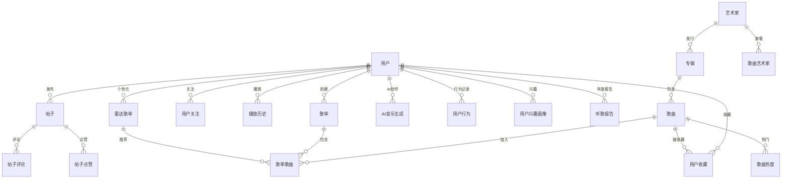

# Fly Music 数据库 ER 图

> 使用 Mermaid 渲染，可在支持 Mermaid 的编辑器中查看

## ER 图

## 表清单

### 1. 音乐播放与创作

| 表名 | 说明 |
|------|------|
| 歌曲 | 歌曲表 |
| 艺术家 | 歌手表 |
| 专辑 | 专辑表 |
| 歌曲艺术家 | 歌曲-歌手关联 |
| 播放历史 | 用户播放记录 |
| 用户行为 | 用户行为分析 |

### 2. 心动歌单

| 表名 | 说明 |
|------|------|
| 歌单 | 播放列表（含心动类型） |
| 歌单歌曲 | 歌单-歌曲关联 |

### 3. 雷达歌单

| 表名 | 说明 |
|------|------|
| 雷达歌单 | 用户个性化推荐歌单 |
| 歌单歌曲 | 推荐的歌曲 |

### 4. 热门推荐

| 表名 | 说明 |
|------|------|
| 歌曲热度 | 热度分数 |
| 热门榜单 | 热榜排名 |

### 5. AI生成音乐

| 表名 | 说明 |
|------|------|
| AI音乐生成 | AI创作记录 |

### 6. AI曲风识别

| 表名 | 说明 |
|------|------|
| 用户兴趣画像 | 音乐风格偏好 |

### 7. 用户社交

| 表名 | 说明 |
|------|------|
| 用户 | 用户表 |
| 用户收藏 | 收藏表 |
| 用户关注 | 关注表 |
| 帖子 | 动态帖子 |
| 帖子评论 | 评论 |
| 帖子点赞 | 点赞 |

### 8. 年度报告

| 表名 | 说明 |
|------|------|
| 听歌报告 | 年度听歌报告 |

---

**共约 20 张核心表**
