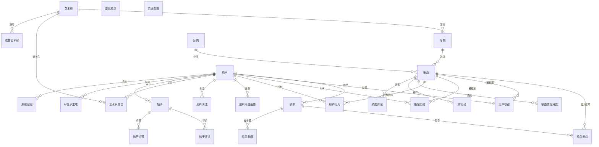
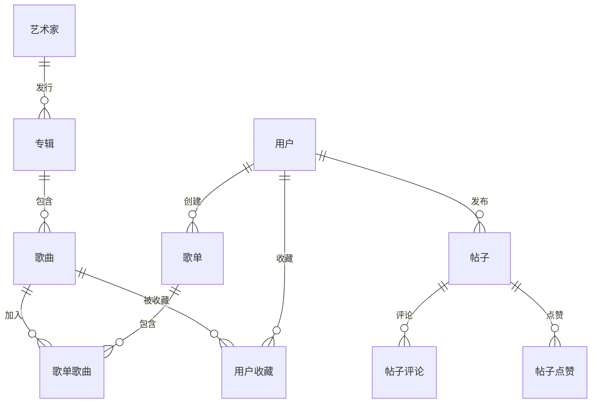

# Fly Music 数据库 ER 图

> 使用 Mermaid 渲染，可在支持 Mermaid 的编辑器中查看

## 完整 ER 图

```mermaid
erDiagram
    艺术家 {
    }

    艺术家 ||--o{ 专辑 : 发行
    艺术家 ||--o{ 艺术家关注 : 被关注
    艺术家 ||--o{ 歌曲艺术家 : 演唱

    专辑 {
    }

    专辑 ||--o{ 歌曲 : 包含

    歌曲 {
    }

    歌曲 ||--o{ 歌单歌曲 : 加入歌单
    歌曲 ||--o{ 用户收藏 : 被收藏
    歌曲 ||--o{ 播放历史 : 被播放
    歌曲 ||--o{ 用户行为 : 行为目标
    歌曲 ||--o{ 歌曲热度分数 : 热度
    歌曲 ||--o{ 排行榜 : 排行
    歌曲 ||--o{ 歌曲评论 : 评论

    分类 {
    }

    分类 ||--o{ 歌曲 : 分类

    歌单 {
    }

    歌单 ||--o{ 歌单歌曲 : 包含
    歌单 ||--o{ 歌单收藏 : 被收藏

    用户 {
    }

    用户 ||--o{ 歌单 : 创建
    用户 ||--o{ 用户收藏 : 收藏
    用户 ||--o{ 播放历史 : 记录
    用户 ||--o{ 用户行为 : 行为
    用户 ||--o{ 用户兴趣画像 : 画像
    用户 ||--o{ 用户关注 : 关注
    用户 ||--o{ 艺术家关注 : 关注
    用户 ||--o{ 帖子 : 发布
    用户 ||--o{ AI音乐生成 : 生成
    用户 ||--o{ 系统日志 : 日志

    帖子 {
    }

    帖子 ||--o{ 帖子评论 : 评论
    帖子 ||--o{ 帖子点赞 : 点赞

    播放历史 { }
    用户收藏 { }
    歌单收藏 { }
    艺术家关注 { }
    用户关注 { }
    用户行为 { }
    用户兴趣画像 { }
    歌曲热度分数 { }
    排行榜 { }
    雷达歌单 { }
    AI音乐生成 { }
    帖子评论 { }
    帖子点赞 { }
    歌曲评论 { }
    系统配置 { }
    系统日志 { }
    歌单歌曲 { }
    歌曲艺术家 { }
```

## 核心实体 ER 图（简化版）

```mermaid
erDiagram
    艺术家 ||--o{ 专辑 : 发行

    专辑 ||--o{ 歌曲 : 包含

    歌曲 ||--o{ 歌单歌曲 : 加入

    歌单 ||--o{ 歌单歌曲 : 包含

    用户 ||--o{ 歌单 : 创建

    歌曲 ||--o{ 用户收藏 : 被收藏
    用户 ||--o{ 用户收藏 : 收藏

    用户 ||--o{ 帖子 : 发布

    帖子 ||--o{ 帖子评论 : 评论
    帖子 ||--o{ 帖子点赞 : 点赞

    用户 { }
    歌曲 { }
    艺术家 { }
    专辑 { }
    歌单 { }
    帖子 { }
    歌单歌曲 { }
    用户收藏 { }
    帖子评论 { }
    帖子点赞 { }
```
