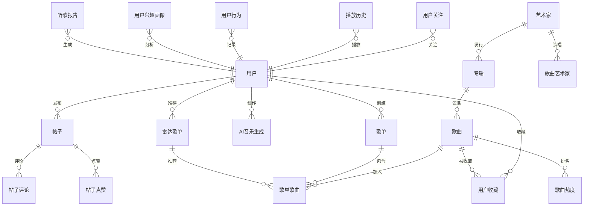

# Fly Music 数据库 ER 图

> 使用 Mermaid 渲染，可在支持 Mermaid 的编辑器中查看

## ER 图

## 表清单

### 1. 音乐播放与创作
- 歌曲、艺术家、专辑、歌曲艺术家、播放历史、用户行为

### 2. 心动歌单
- 歌单、歌单歌曲

### 3. 雷达歌单
- 雷达歌单、歌单歌曲

### 4. 热门推荐
- 歌曲热度

### 5. AI生成音乐
- AI音乐生成

### 6. AI曲风识别
- 用户兴趣画像

### 7. 用户社交
- 用户、用户收藏、用户关注、帖子、帖子评论、帖子点赞

### 8. 年度报告
- 听歌报告

**共约 20 张核心表**
