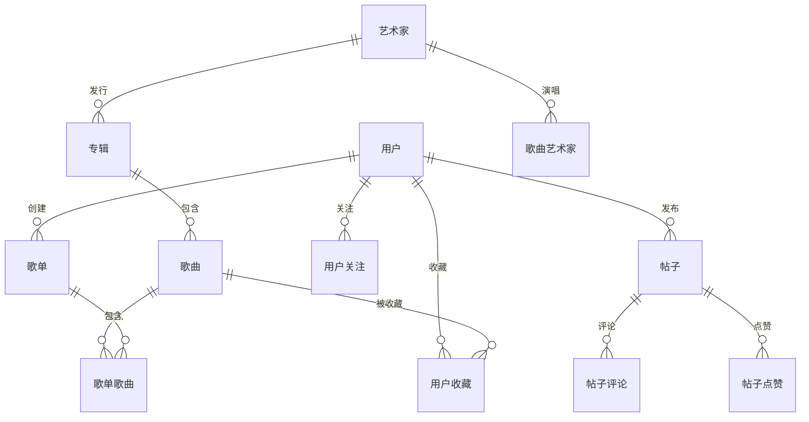

# Fly Music 数据库 ER 图

> 使用 Mermaid 渲染，可在支持 Mermaid 的编辑器中查看

## ER 图

## 表清单

| 分类 | 表名 | 说明 |
|-----|------|------|
| 用户 | 用户 | 用户表 |
| 音乐 | 歌曲 | 歌曲表 |
| 音乐 | 专辑 | 专辑表 |
| 音乐 | 艺术家 | 歌手表 |
| 音乐 | 歌曲艺术家 | 歌曲-歌手关联 |
| 播放列表 | 歌单 | 播放列表 |
| 播放列表 | 歌单歌曲 | 播放列表-歌曲 |
| 用户行为 | 用户收藏 | 收藏表 |
| 用户行为 | 用户关注 | 关注表 |
| 社交 | 帖子 | 帖子表 |
| 社交 | 帖子评论 | 帖子评论 |
| 社交 | 帖子点赞 | 帖子点赞 |

**共 12 张核心表**
