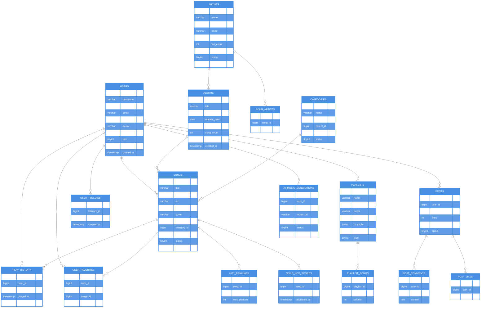

# Fly Music 数据库 ER 图

> 完整版见 [ER图-详细版.md](ER图-详细版.md)

## 精简 ER 图

## 快速查看（表清单）

| 分类 | 表名 | 说明 | 字段数 |
|-----|------|------|--------|
| 用户 | users | 用户表 | 17 |
| 音乐 | songs | 歌曲表 | 16 |
| 音乐 | albums | 专辑表 | 11 |
| 音乐 | artists | 歌手表 | 13 |
| 音乐 | categories | 分类表 | 9 |
| 音乐 | song_artists | 歌曲-歌手关联 | 3 |
| 播放列表 | playlists | 播放列表 | 12 |
| 播放列表 | playlist_songs | 播放列表-歌曲 | 5 |
| 行为 | play_history | 播放历史 | 6 |
| 行为 | user_favorites | 用户收藏 | 6 |
| 行为 | user_follows | 用户关注 | 4 |
| 社交 | posts | 帖子 | 11 |
| 社交 | post_comments | 帖子评论 | 9 |
| 社交 | post_likes | 帖子点赞 | 4 |
| 热榜 | hot_rankings | 热榜 | 5 |
| 热榜 | song_hot_scores | 热度分数 | 12 |
| AI | ai_music_generations | AI音乐生成 | 12 |

**共 31 张表**

---

> 查看完整详细版（含所有字段、中文注释、关系图）：[ER图-详细版.md](ER图-详细版.md)
