# Fly Music 类图与时序图

> 使用 Mermaid 渲染，可在支持 Mermaid 的编辑器中查看

---

## 1. 用户模块

### 1.1 类图

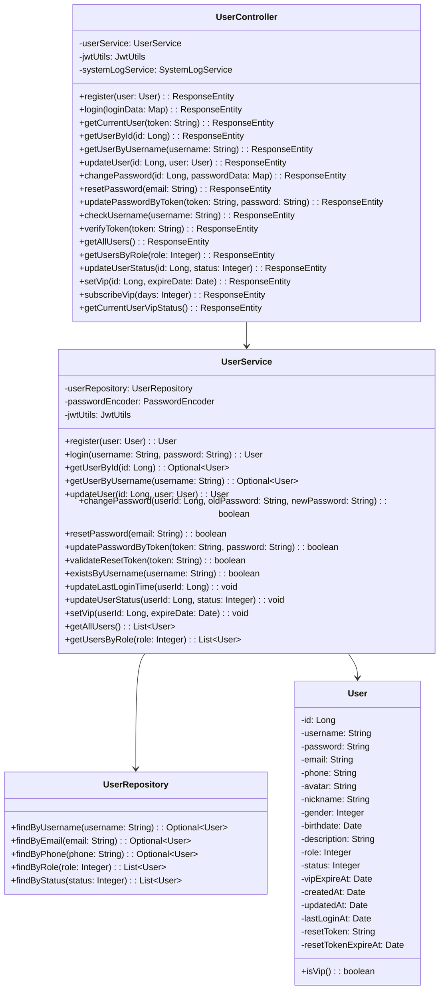
```mermaid
classDiagram
    class UserController {
        -userService: UserService
        -jwtUtils: JwtUtils
        -systemLogService: SystemLogService
        +register(user: User): ResponseEntity
        +login(loginData: Map): ResponseEntity
        +getCurrentUser(token: String): ResponseEntity
        +getUserById(id: Long): ResponseEntity
        +getUserByUsername(username: String): ResponseEntity
        +updateUser(id: Long, user: User): ResponseEntity
        +changePassword(id: Long, passwordData: Map): ResponseEntity
        +resetPassword(email: String): ResponseEntity
        +updatePasswordByToken(token: String, password: String): ResponseEntity
        +checkUsername(username: String): ResponseEntity
        +verifyToken(token: String): ResponseEntity
        +getAllUsers(): ResponseEntity
        +getUsersByRole(role: Integer): ResponseEntity
        +updateUserStatus(id: Long, status: Integer): ResponseEntity
        +setVip(id: Long, expireDate: Date): ResponseEntity
        +subscribeVip(days: Integer): ResponseEntity
        +getCurrentUserVipStatus(): ResponseEntity
    }

    class UserService {
        -userRepository: UserRepository
        -passwordEncoder: PasswordEncoder
        -jwtUtils: JwtUtils
        +register(user: User): User
        +login(username: String, password: String): User
        +getUserById(id: Long): Optional~User~
        +getUserByUsername(username: String): Optional~User~
        +updateUser(id: Long, user: User): User
        +changePassword(userId: Long, oldPassword: String, newPassword: String): boolean
        +resetPassword(email: String): boolean
        +updatePasswordByToken(token: String, password: String): boolean
        +validateResetToken(token: String): boolean
        +existsByUsername(username: String): boolean
        +updateLastLoginTime(userId: Long): void
        +updateUserStatus(userId: Long, status: Integer): void
        +setVip(userId: Long, expireDate: Date): void
        +getAllUsers(): List~User~
        +getUsersByRole(role: Integer): List~User~
    }

    class UserRepository {
        +findByUsername(username: String): Optional~User~
        +findByEmail(email: String): Optional~User~
        +findByPhone(phone: String): Optional~User~
        +findByRole(role: Integer): List~User~
        +findByStatus(status: Integer): List~User~
    }

    class User {
        -id: Long
        -username: String
        -password: String
        -email: String
        -phone: String
        -avatar: String
        -nickname: String
        -gender: Integer
        -birthdate: Date
        -description: String
        -role: Integer
        -status: Integer
        -vipExpireAt: Date
        -createdAt: Date
        -updatedAt: Date
        -lastLoginAt: Date
        -resetToken: String
        -resetTokenExpireAt: Date
        +isVip(): boolean
    }

    UserController --> UserService
    UserService --> UserRepository
    UserService --> User
```

### 1.2 时序图 - 用户注册

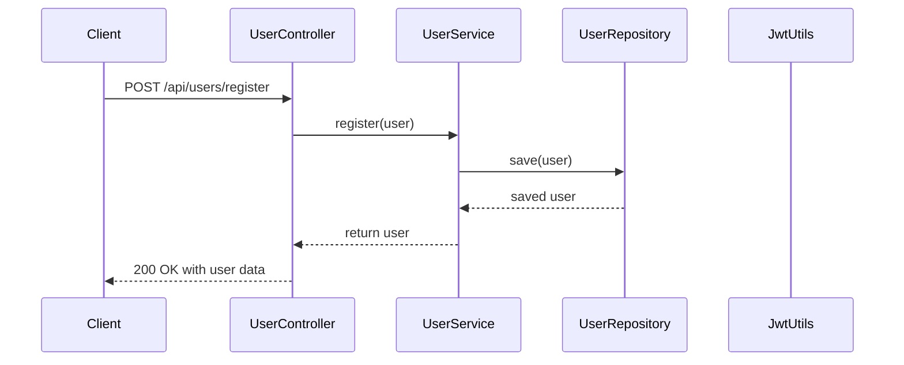
```mermaid
sequenceDiagram
    participant Client
    participant UserController
    participant UserService
    participant UserRepository
    participant JwtUtils

    Client->>UserController: POST /api/users/register
    UserController->>UserService: register(user)
    UserService->>UserRepository: save(user)
    UserRepository-->>UserService: saved user
    UserService-->>UserController: return user
    UserController-->>Client: 200 OK with user data
```

### 1.3 时序图 - 用户登录

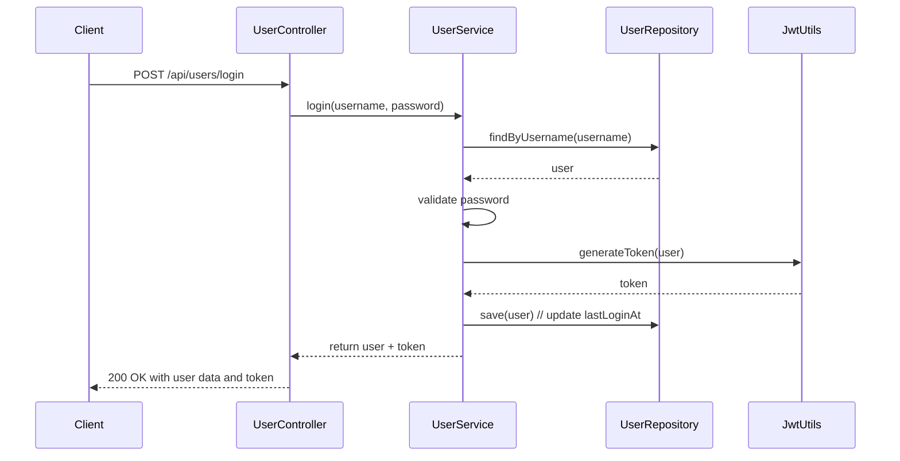
```mermaid
sequenceDiagram
    participant Client
    participant UserController
    participant UserService
    participant UserRepository
    participant JwtUtils

    Client->>UserController: POST /api/users/login
    UserController->>UserService: login(username, password)
    UserService->>UserRepository: findByUsername(username)
    UserRepository-->>UserService: user
    UserService->>UserService: validate password
    UserService->>JwtUtils: generateToken(user)
    JwtUtils-->>UserService: token
    UserService->>UserRepository: save(user) // update lastLoginAt
    UserService-->>UserController: return user + token
    UserController-->>Client: 200 OK with user data and token
```

---

## 2. 歌曲模块

### 2.1 类图

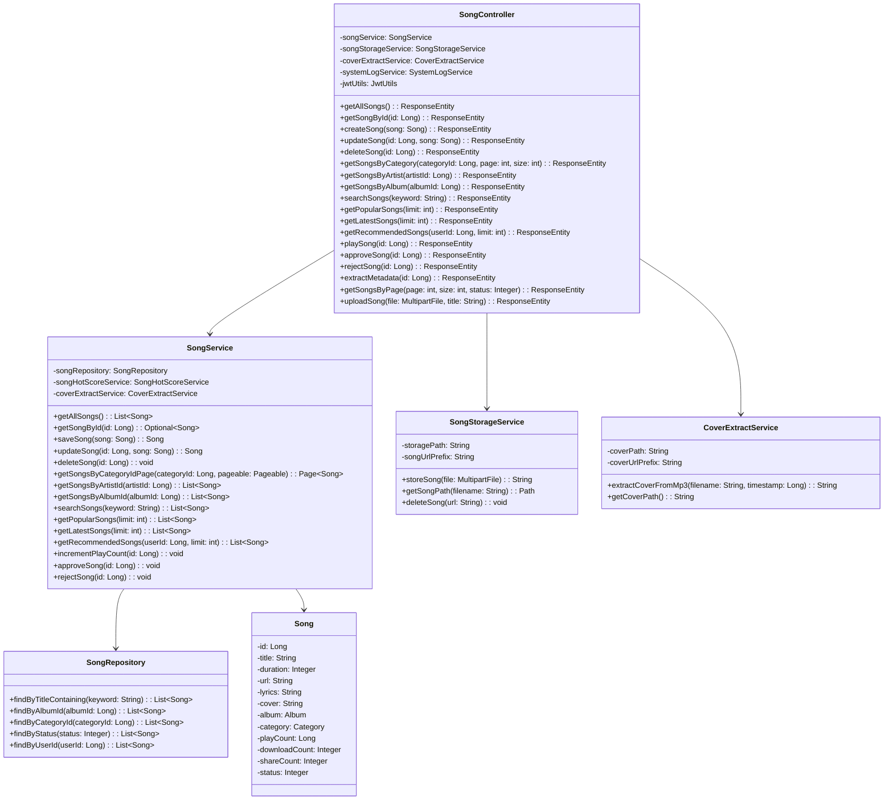
```mermaid
classDiagram
    class SongController {
        -songService: SongService
        -songStorageService: SongStorageService
        -coverExtractService: CoverExtractService
        -systemLogService: SystemLogService
        -jwtUtils: JwtUtils
        +getAllSongs(): ResponseEntity
        +getSongById(id: Long): ResponseEntity
        +createSong(song: Song): ResponseEntity
        +updateSong(id: Long, song: Song): ResponseEntity
        +deleteSong(id: Long): ResponseEntity
        +getSongsByCategory(categoryId: Long, page: int, size: int): ResponseEntity
        +getSongsByArtist(artistId: Long): ResponseEntity
        +getSongsByAlbum(albumId: Long): ResponseEntity
        +searchSongs(keyword: String): ResponseEntity
        +getPopularSongs(limit: int): ResponseEntity
        +getLatestSongs(limit: int): ResponseEntity
        +getRecommendedSongs(userId: Long, limit: int): ResponseEntity
        +playSong(id: Long): ResponseEntity
        +approveSong(id: Long): ResponseEntity
        +rejectSong(id: Long): ResponseEntity
        +extractMetadata(id: Long): ResponseEntity
        +getSongsByPage(page: int, size: int, status: Integer): ResponseEntity
        +uploadSong(file: MultipartFile, title: String): ResponseEntity
    }

    class SongService {
        -songRepository: SongRepository
        -songHotScoreService: SongHotScoreService
        -coverExtractService: CoverExtractService
        +getAllSongs(): List~Song~
        +getSongById(id: Long): Optional~Song~
        +saveSong(song: Song): Song
        +updateSong(id: Long, song: Song): Song
        +deleteSong(id: Long): void
        +getSongsByCategoryIdPage(categoryId: Long, pageable: Pageable): Page~Song~
        +getSongsByArtistId(artistId: Long): List~Song~
        +getSongsByAlbumId(albumId: Long): List~Song~
        +searchSongs(keyword: String): List~Song~
        +getPopularSongs(limit: int): List~Song~
        +getLatestSongs(limit: int): List~Song~
        +getRecommendedSongs(userId: Long, limit: int): List~Song~
        +incrementPlayCount(id: Long): void
        +approveSong(id: Long): void
        +rejectSong(id: Long): void
    }

    class SongStorageService {
        -storagePath: String
        -songUrlPrefix: String
        +storeSong(file: MultipartFile): String
        +getSongPath(filename: String): Path
        +deleteSong(url: String): void
    }

    class CoverExtractService {
        -coverPath: String
        -coverUrlPrefix: String
        +extractCoverFromMp3(filename: String, timestamp: Long): String
        +getCoverPath(): String
    }

    class SongRepository {
        +findByTitleContaining(keyword: String): List~Song~
        +findByAlbumId(albumId: Long): List~Song~
        +findByCategoryId(categoryId: Long): List~Song~
        +findByStatus(status: Integer): List~Song~
        +findByUserId(userId: Long): List~Song~
    }

    class Song {
        -id: Long
        -title: String
        -duration: Integer
        -url: String
        -lyrics: String
        -cover: String
        -album: Album
        -category: Category
        -playCount: Long
        -downloadCount: Integer
        -shareCount: Integer
        -status: Integer
    }

    SongController --> SongService
    SongController --> SongStorageService
    SongController --> CoverExtractService
    SongService --> SongRepository
    SongService --> Song
```

### 2.2 时序图 - 歌曲上传

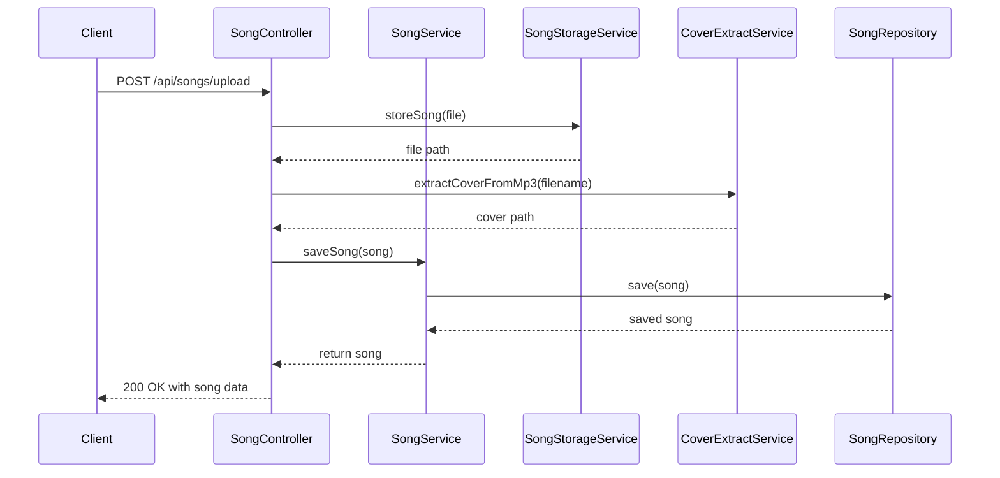
```mermaid
sequenceDiagram
    participant Client
    participant SongController
    participant SongService
    participant SongStorageService
    participant CoverExtractService
    participant SongRepository

    Client->>SongController: POST /api/songs/upload
    SongController->>SongStorageService: storeSong(file)
    SongStorageService-->>SongController: file path
    SongController->>CoverExtractService: extractCoverFromMp3(filename)
    CoverExtractService-->>SongController: cover path
    SongController->>SongService: saveSong(song)
    SongService->>SongRepository: save(song)
    SongRepository-->>SongService: saved song
    SongService-->>SongController: return song
    SongController-->>Client: 200 OK with song data
```

---

## 3. 歌单模块

### 3.1 类图

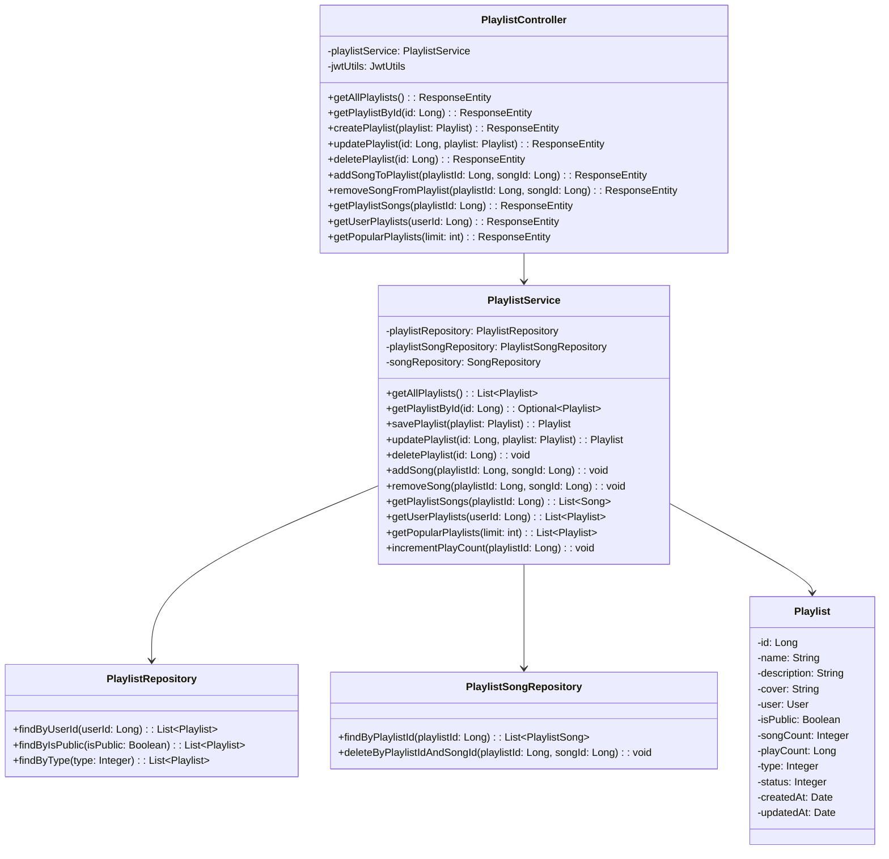
```mermaid
classDiagram
    class PlaylistController {
        -playlistService: PlaylistService
        -jwtUtils: JwtUtils
        +getAllPlaylists(): ResponseEntity
        +getPlaylistById(id: Long): ResponseEntity
        +createPlaylist(playlist: Playlist): ResponseEntity
        +updatePlaylist(id: Long, playlist: Playlist): ResponseEntity
        +deletePlaylist(id: Long): ResponseEntity
        +addSongToPlaylist(playlistId: Long, songId: Long): ResponseEntity
        +removeSongFromPlaylist(playlistId: Long, songId: Long): ResponseEntity
        +getPlaylistSongs(playlistId: Long): ResponseEntity
        +getUserPlaylists(userId: Long): ResponseEntity
        +getPopularPlaylists(limit: int): ResponseEntity
    }

    class PlaylistService {
        -playlistRepository: PlaylistRepository
        -playlistSongRepository: PlaylistSongRepository
        -songRepository: SongRepository
        +getAllPlaylists(): List~Playlist~
        +getPlaylistById(id: Long): Optional~Playlist~
        +savePlaylist(playlist: Playlist): Playlist
        +updatePlaylist(id: Long, playlist: Playlist): Playlist
        +deletePlaylist(id: Long): void
        +addSong(playlistId: Long, songId: Long): void
        +removeSong(playlistId: Long, songId: Long): void
        +getPlaylistSongs(playlistId: Long): List~Song~
        +getUserPlaylists(userId: Long): List~Playlist~
        +getPopularPlaylists(limit: int): List~Playlist~
        +incrementPlayCount(playlistId: Long): void
    }

    class PlaylistRepository {
        +findByUserId(userId: Long): List~Playlist~
        +findByIsPublic(isPublic: Boolean): List~Playlist~
        +findByType(type: Integer): List~Playlist~
    }

    class PlaylistSongRepository {
        +findByPlaylistId(playlistId: Long): List~PlaylistSong~
        +deleteByPlaylistIdAndSongId(playlistId: Long, songId: Long): void
    }

    class Playlist {
        -id: Long
        -name: String
        -description: String
        -cover: String
        -user: User
        -isPublic: Boolean
        -songCount: Integer
        -playCount: Long
        -type: Integer
        -status: Integer
        -createdAt: Date
        -updatedAt: Date
    }

    PlaylistController --> PlaylistService
    PlaylistService --> PlaylistRepository
    PlaylistService --> PlaylistSongRepository
    PlaylistService --> Playlist
```

### 3.2 时序图 - 添加歌曲到歌单

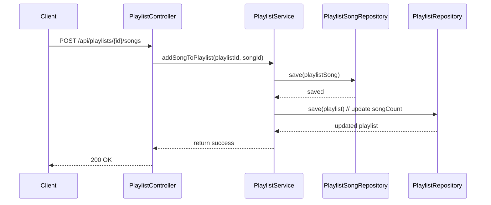
```mermaid
sequenceDiagram
    participant Client
    participant PlaylistController
    participant PlaylistService
    participant PlaylistSongRepository
    participant PlaylistRepository

    Client->>PlaylistController: POST /api/playlists/{id}/songs
    PlaylistController->>PlaylistService: addSongToPlaylist(playlistId, songId)
    PlaylistService->>PlaylistSongRepository: save(playlistSong)
    PlaylistSongRepository-->>PlaylistService: saved
    PlaylistService->>PlaylistRepository: save(playlist) // update songCount
    PlaylistRepository-->>PlaylistService: updated playlist
    PlaylistService-->>PlaylistController: return success
    PlaylistController-->>Client: 200 OK
```

---

## 4. 推荐模块

### 4.1 类图

```mermaid
classDiagram
    class RecommendationController {
        -recommendationService: RecommendationService
        +recordBehavior(userId: Long, songId: Long, behaviorType: Integer): ResponseEntity
        +getUserInterestProfile(userId: Long): ResponseEntity
        +getRadarPlaylist(userId: Long): ResponseEntity
        +getHotRecommendations(limit: int): ResponseEntity
        +getNewSongRecommendations(limit: int): ResponseEntity
        +getSimilarSongs(songId: Long, limit: int): ResponseEntity
        +getCategoryRecommendations(categoryId: Long, limit: int): ResponseEntity
    }

    class RecommendationServiceImpl {
        -userBehaviorRepository: UserBehaviorRepository
        -userInterestProfileRepository: UserInterestProfileRepository
        -radarPlaylistRepository: RadarPlaylistRepository
        -songRepository: SongRepository
        -userRepository: UserRepository
        -objectMapper: ObjectMapper
        +recordBehavior(userId: Long, songId: Long, behaviorType: Integer): void
        +getUserInterestProfile(userId: Long): UserInterestDTO
        +getRadarPlaylist(userId: Long): RadarPlaylistDTO
        +calculateUserInterestProfile(userId: Long): void
        +generateRadarPlaylist(userId: Long): void
        +dailyRadarGeneration(): void
        -saveUserInterestProfile(userId: Long, interests: Map~String, Double~): void
        -getUserInterests(userId: Long): Map~String, Double~
        -getDefaultInterests(): Map~String, Double~
        -convertToDTO(radar: RadarPlaylist): RadarPlaylistDTO
        -selectSongsByInterests(interests: Map~String, Double~): List~Song~
    }

    class UserBehaviorRepository {
        +save(behavior: UserBehavior): UserBehavior
        +findByUserId(userId: Long): List~UserBehavior~
        +findBySongId(songId: Long): List~UserBehavior~
        +calculateSongScores(userId: Long, startDate: Date): List~Object[]~
    }

    class UserInterestProfileRepository {
        +findByUserId(userId: Long): Optional~UserInterestProfile~
        +save(profile: UserInterestProfile): UserInterestProfile
    }

    class RadarPlaylistRepository {
        +findByUserIdAndExpiresAtAfter(userId: Long, date: Date): Optional~RadarPlaylist~
        +save(radar: RadarPlaylist): RadarPlaylist
        +deleteExpired(date: Date): void
        +countByExpiresAtAfter(date: Date): long
    }

    class SongRepository {
        +findById(id: Long): Optional~Song~
        +findByIdIn(ids: List~Long~): List~Song~
        +findByCategoryIdOrderByPlayCountDesc(categoryId: Long): List~Song~
    }

    class UserInterestProfile {
        -id: Long
        -userId: Long
        -interestData: String
        -lastUpdated: Date
    }

    class RadarPlaylist {
        -id: Long
        -userId: Long
        -songIds: String
        -interestSummary: String
        -createdAt: Date
        -expiresAt: Date
    }

    class UserBehavior {
        -id: Long
        -userId: Long
        -songId: Long
        -behaviorType: Integer
        -weight: Integer
        -createdAt: Date
    }

    class RadarPlaylistDTO {
        -id: Long
        -userId: Long
        -songs: List~SongDTO~
        -interestSummary: Map~String, Object~
        -createdAt: Date
        -expiresAt: Date
    }

    class SongDTO {
        -id: Long
        -title: String
        -artist: String
        -cover: String
        -duration: Integer
    }

    class UserInterestDTO {
        -userId: Long
        -topInterests: List~InterestTag~
        -totalBehaviors: Long
        -lastUpdated: Date
    }

    class InterestTag {
        -tag: String
        -score: Double
        -percentage: Double
    }

    RecommendationController --> RecommendationServiceImpl
    RecommendationServiceImpl --> UserBehaviorRepository
    RecommendationServiceImpl --> UserInterestProfileRepository
    RecommendationServiceImpl --> RadarPlaylistRepository
    RecommendationServiceImpl --> SongRepository
    RecommendationServiceImpl --> UserInterestProfile
    RecommendationServiceImpl --> RadarPlaylist
    RecommendationServiceImpl --> UserBehavior
    RecommendationServiceImpl --> RadarPlaylistDTO
    RecommendationServiceImpl --> SongDTO
    RecommendationServiceImpl --> UserInterestDTO
```

### 4.2 时序图 - 记录用户行为

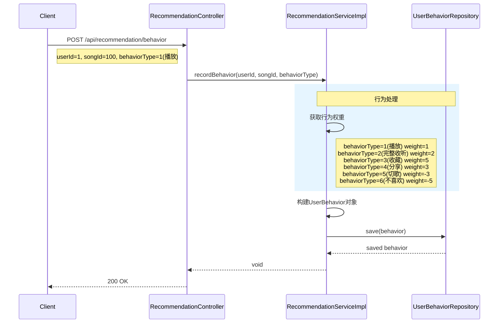
```mermaid
sequenceDiagram
    participant Client
    participant RecommendationController
    participant RecommendationServiceImpl
    participant UserBehaviorRepository

    Client->>RecommendationController: POST /api/recommendation/behavior
    Note right of Client: userId=1, songId=100, behaviorType=1(播放)
    RecommendationController->>RecommendationServiceImpl: recordBehavior(userId, songId, behaviorType)
    
    rect rgb(230, 245, 255)
        Note over RecommendationServiceImpl,UserBehaviorRepository: 行为处理
        RecommendationServiceImpl->>RecommendationServiceImpl: 获取行为权重
        Note right of RecommendationServiceImpl: behaviorType=1(播放) weight=1<br/>behaviorType=2(完整收听) weight=2<br/>behaviorType=3(收藏) weight=5<br/>behaviorType=4(分享) weight=3<br/>behaviorType=5(切歌) weight=-3<br/>behaviorType=6(不喜欢) weight=-5
    end
    
    RecommendationServiceImpl->>RecommendationServiceImpl: 构建UserBehavior对象
    RecommendationServiceImpl->>UserBehaviorRepository: save(behavior)
    UserBehaviorRepository-->>RecommendationServiceImpl: saved behavior
    RecommendationServiceImpl-->>RecommendationController: void
    RecommendationController-->>Client: 200 OK
```

### 4.3 时序图 - 获取心动歌单（雷达歌单）

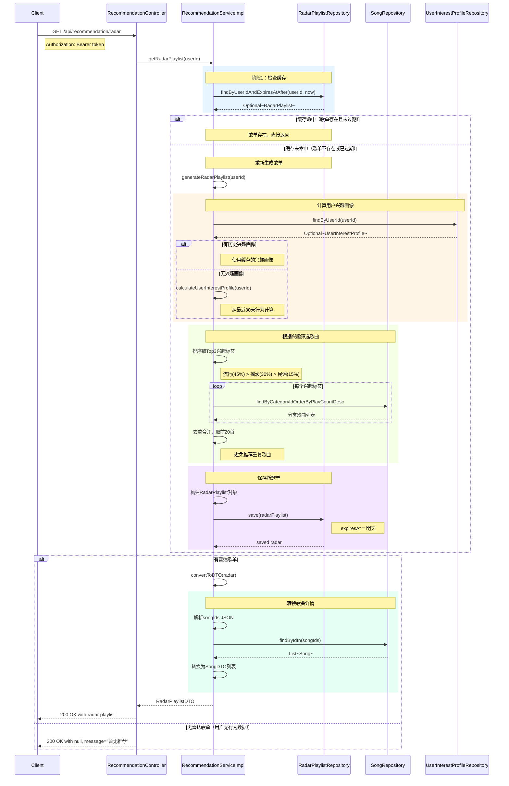
```mermaid
sequenceDiagram
    participant Client
    participant RecommendationController
    participant RecommendationServiceImpl
    participant RadarPlaylistRepository
    participant SongRepository
    participant UserInterestProfileRepository

    Client->>RecommendationController: GET /api/recommendation/radar
    Note right of Client: Authorization: Bearer token
    RecommendationController->>RecommendationServiceImpl: getRadarPlaylist(userId)

    rect rgb(230, 245, 255)
        Note over RecommendationServiceImpl,RadarPlaylistRepository: 阶段1：检查缓存
        RecommendationServiceImpl->>RadarPlaylistRepository: findByUserIdAndExpiresAtAfter(userId, now)
        RadarPlaylistRepository-->>RecommendationServiceImpl: Optional~RadarPlaylist~
    end

    alt 缓存命中（歌单存在且未过期）
        Note over RecommendationServiceImpl,RadarPlaylistRepository: 歌单存在，直接返回
    else 缓存未命中（歌单不存在或已过期）
        Note over RecommendationServiceImpl,RadarPlaylistRepository: 重新生成歌单
        RecommendationServiceImpl->>RecommendationServiceImpl: generateRadarPlaylist(userId)
        
        rect rgb(255, 245, 230)
            Note over RecommendationServiceImpl,UserInterestProfileRepository: 计算用户兴趣画像
            RecommendationServiceImpl->>UserInterestProfileRepository: findByUserId(userId)
            UserInterestProfileRepository-->>RecommendationServiceImpl: Optional~UserInterestProfile~
            
            alt 有历史兴趣画像
                Note right of RecommendationServiceImpl: 使用缓存的兴趣画像
            else 无兴趣画像
                RecommendationServiceImpl->>RecommendationServiceImpl: calculateUserInterestProfile(userId)
                Note right of RecommendationServiceImpl: 从最近30天行为计算
            end
        end
        
        rect rgb(245, 255, 230)
            Note over RecommendationServiceImpl,SongRepository: 根据兴趣筛选歌曲
            RecommendationServiceImpl->>RecommendationServiceImpl: 排序取Top3兴趣标签
            Note right of RecommendationServiceImpl: 流行(45%) > 摇滚(30%) > 民谣(15%)
            
            loop 每个兴趣标签
                RecommendationServiceImpl->>SongRepository: findByCategoryIdOrderByPlayCountDesc
                SongRepository-->>RecommendationServiceImpl: 分类歌曲列表
            end
            
            RecommendationServiceImpl->>RecommendationServiceImpl: 去重合并，取前20首
            Note right of RecommendationServiceImpl: 避免推荐重复歌曲
        end
        
        rect rgb(245, 230, 255)
            Note over RecommendationServiceImpl,RadarPlaylistRepository: 保存新歌单
            RecommendationServiceImpl->>RecommendationServiceImpl: 构建RadarPlaylist对象
            RecommendationServiceImpl->>RadarPlaylistRepository: save(radarPlaylist)
            Note right of RadarPlaylistRepository: expiresAt = 明天
            RadarPlaylistRepository-->>RecommendationServiceImpl: saved radar
        end
    end

    alt 有雷达歌单
        RecommendationServiceImpl->>RecommendationServiceImpl: convertToDTO(radar)
        
        rect rgb(230, 255, 245)
            Note over RecommendationServiceImpl,SongRepository: 转换歌曲详情
            RecommendationServiceImpl->>RecommendationServiceImpl: 解析songIds JSON
            RecommendationServiceImpl->>SongRepository: findByIdIn(songIds)
            SongRepository-->>RecommendationServiceImpl: List~Song~
            RecommendationServiceImpl->>RecommendationServiceImpl: 转换为SongDTO列表
        end
        
        RecommendationServiceImpl-->>RecommendationController: RadarPlaylistDTO
        RecommendationController-->>Client: 200 OK with radar playlist
    else 无雷达歌单（用户无行为数据）
        RecommendationController-->>Client: 200 OK with null, message="暂无推荐"
    end
```

### 4.4 时序图 - 生成心动歌单（详细流程）

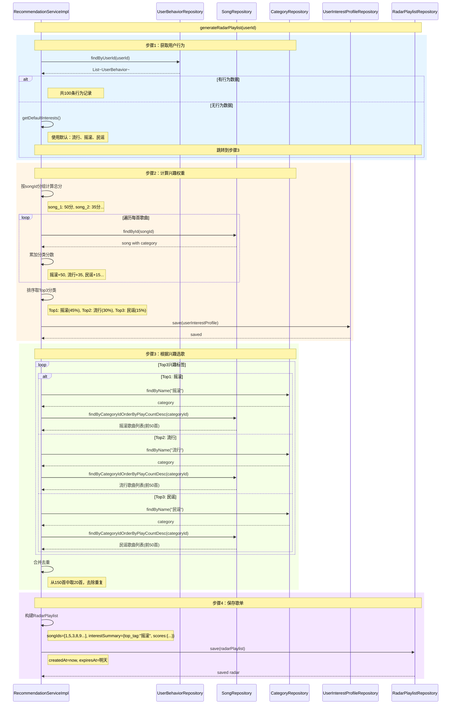
```mermaid
sequenceDiagram
    participant RecommendationServiceImpl
    participant UserBehaviorRepository
    participant SongRepository
    participant CategoryRepository
    participant UserInterestProfileRepository
    participant RadarPlaylistRepository

    Note over RecommendationServiceImpl,RadarPlaylistRepository: generateRadarPlaylist(userId)

    rect rgb(230, 245, 255)
        Note over RecommendationServiceImpl,CategoryRepository: 步骤1：获取用户行为
        RecommendationServiceImpl->>UserBehaviorRepository: findByUserId(userId)
        UserBehaviorRepository-->>RecommendationServiceImpl: List~UserBehavior~
        
        alt 有行为数据
            Note right of RecommendationServiceImpl: 共100条行为记录
        else 无行为数据
            RecommendationServiceImpl->>RecommendationServiceImpl: getDefaultInterests()
            Note right of RecommendationServiceImpl: 使用默认：流行、摇滚、民谣
            Note over RecommendationServiceImpl,RadarPlaylistRepository: 跳转到步骤3
        end
    end

    rect rgb(255, 245, 230)
        Note over RecommendationServiceImpl,CategoryRepository: 步骤2：计算兴趣权重
        RecommendationServiceImpl->>RecommendationServiceImpl: 按songId分组计算总分
        Note right of RecommendationServiceImpl: song_1: 50分, song_2: 35分...
        
        loop 遍历每首歌曲
            RecommendationServiceImpl->>SongRepository: findById(songId)
            SongRepository-->>RecommendationServiceImpl: song with category
            RecommendationServiceImpl->>RecommendationServiceImpl: 累加分类分数
            Note right of RecommendationServiceImpl: 摇滚+50, 流行+35, 民谣+15...
        end
        
        RecommendationServiceImpl->>RecommendationServiceImpl: 排序取Top3分类
        Note right of RecommendationServiceImpl: Top1: 摇滚(45%), Top2: 流行(30%), Top3: 民谣(15%)
        
        RecommendationServiceImpl->>UserInterestProfileRepository: save(userInterestProfile)
        UserInterestProfileRepository-->>RecommendationServiceImpl: saved
    end

    rect rgb(245, 255, 230)
        Note over RecommendationServiceImpl,CategoryRepository: 步骤3：根据兴趣选歌
        loop Top3兴趣标签
            alt Top1: 摇滚
                RecommendationServiceImpl->>CategoryRepository: findByName("摇滚")
                CategoryRepository-->>RecommendationServiceImpl: category
                RecommendationServiceImpl->>SongRepository: findByCategoryIdOrderByPlayCountDesc(categoryId)
                SongRepository-->>RecommendationServiceImpl: 摇滚歌曲列表(前50首)
            else Top2: 流行
                RecommendationServiceImpl->>CategoryRepository: findByName("流行")
                CategoryRepository-->>RecommendationServiceImpl: category
                RecommendationServiceImpl->>SongRepository: findByCategoryIdOrderByPlayCountDesc(categoryId)
                SongRepository-->>RecommendationServiceImpl: 流行歌曲列表(前50首)
            else Top3: 民谣
                RecommendationServiceImpl->>CategoryRepository: findByName("民谣")
                CategoryRepository-->>RecommendationServiceImpl: category
                RecommendationServiceImpl->>SongRepository: findByCategoryIdOrderByPlayCountDesc(categoryId)
                SongRepository-->>RecommendationServiceImpl: 民谣歌曲列表(前50首)
            end
        end
        
        RecommendationServiceImpl->>RecommendationServiceImpl: 合并去重
        Note right of RecommendationServiceImpl: 从150首中取20首，去除重复
    end

    rect rgb(245, 230, 255)
        Note over RecommendationServiceImpl,RadarPlaylistRepository: 步骤4：保存歌单
        RecommendationServiceImpl->>RecommendationServiceImpl: 构建RadarPlaylist
        Note right of RecommendationServiceImpl: songIds=[1,5,3,8,9...], interestSummary={top_tag:"摇滚", scores:{...}}
        RecommendationServiceImpl->>RadarPlaylistRepository: save(radarPlaylist)
        Note right of RecommendationServiceImpl: createdAt=now, expiresAt=明天
        RadarPlaylistRepository-->>RecommendationServiceImpl: saved radar
    end
```

### 4.5 时序图 - 每日定时生成心动歌单

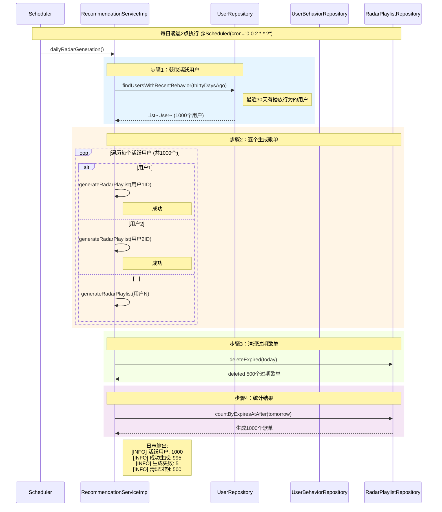
```mermaid
sequenceDiagram
    participant Scheduler
    participant RecommendationServiceImpl
    participant UserRepository
    participant UserBehaviorRepository
    participant RadarPlaylistRepository

    Note over Scheduler,RadarPlaylistRepository: 每日凌晨2点执行 @Scheduled(cron="0 0 2 * * ?")

    Scheduler->>RecommendationServiceImpl: dailyRadarGeneration()

    rect rgb(230, 245, 255)
        Note over RecommendationServiceImpl,UserRepository: 步骤1：获取活跃用户
        RecommendationServiceImpl->>UserRepository: findUsersWithRecentBehavior(thirtyDaysAgo)
        Note right of UserRepository: 最近30天有播放行为的用户
        UserRepository-->>RecommendationServiceImpl: List~User~ (1000个用户)
    end

    rect rgb(255, 245, 230)
        Note over RecommendationServiceImpl,RadarPlaylistRepository: 步骤2：逐个生成歌单
        loop 遍历每个活跃用户 (共1000个)
            alt 用户1
                RecommendationServiceImpl->>RecommendationServiceImpl: generateRadarPlaylist(用户1ID)
                Note right of RecommendationServiceImpl: 成功
            else 用户2
                RecommendationServiceImpl->>RecommendationServiceImpl: generateRadarPlaylist(用户2ID)
                Note right of RecommendationServiceImpl: 成功
            else ...
                RecommendationServiceImpl->>RecommendationServiceImpl: generateRadarPlaylist(用户N)
            end
        end
    end

    rect rgb(245, 255, 230)
        Note over RecommendationServiceImpl,RadarPlaylistRepository: 步骤3：清理过期歌单
        RecommendationServiceImpl->>RadarPlaylistRepository: deleteExpired(today)
        RadarPlaylistRepository-->>RecommendationServiceImpl: deleted 500个过期歌单
    end

    rect rgb(245, 230, 245)
        Note over RecommendationServiceImpl,RadarPlaylistRepository: 步骤4：统计结果
        RecommendationServiceImpl->>RadarPlaylistRepository: countByExpiresAtAfter(tomorrow)
        RadarPlaylistRepository-->>RecommendationServiceImpl: 生成1000个歌单
    end

    Note right of RecommendationServiceImpl: 日志输出:<br/>[INFO] 活跃用户: 1000<br/>[INFO] 成功生成: 995<br/>[INFO] 生成失败: 5<br/>[INFO] 清理过期: 500
```

### 4.6 时序图 - 获取用户兴趣画像

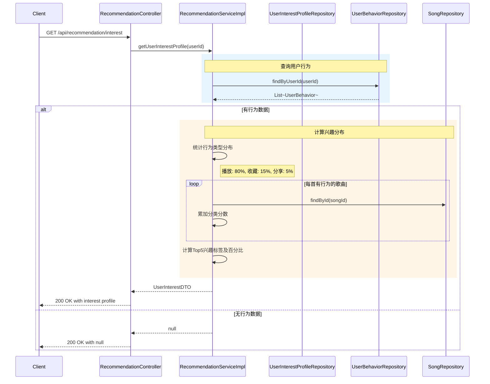
```mermaid
sequenceDiagram
    participant Client
    participant RecommendationController
    participant RecommendationServiceImpl
    participant UserInterestProfileRepository
    participant UserBehaviorRepository
    participant SongRepository

    Client->>RecommendationController: GET /api/recommendation/interest
    RecommendationController->>RecommendationServiceImpl: getUserInterestProfile(userId)

    rect rgb(230, 245, 255)
        Note over RecommendationServiceImpl,UserBehaviorRepository: 查询用户行为
        RecommendationServiceImpl->>UserBehaviorRepository: findByUserId(userId)
        UserBehaviorRepository-->>RecommendationServiceImpl: List~UserBehavior~
    end

    alt 有行为数据
        rect rgb(255, 245, 230)
            Note over RecommendationServiceImpl,SongRepository: 计算兴趣分布
            RecommendationServiceImpl->>RecommendationServiceImpl: 统计行为类型分布
            Note right of RecommendationServiceImpl: 播放: 80%, 收藏: 15%, 分享: 5%
            
            loop 每首有行为的歌曲
                RecommendationServiceImpl->>SongRepository: findById(songId)
                RecommendationServiceImpl->>RecommendationServiceImpl: 累加分类分数
            end
            
            RecommendationServiceImpl->>RecommendationServiceImpl: 计算Top5兴趣标签及百分比
        end
        
        RecommendationServiceImpl-->>RecommendationController: UserInterestDTO
        RecommendationController-->>Client: 200 OK with interest profile
    else 无行为数据
        RecommendationServiceImpl-->>RecommendationController: null
        RecommendationController-->>Client: 200 OK with null
    end
```

---

## 5. AI 音乐模块

### 5.1 类图

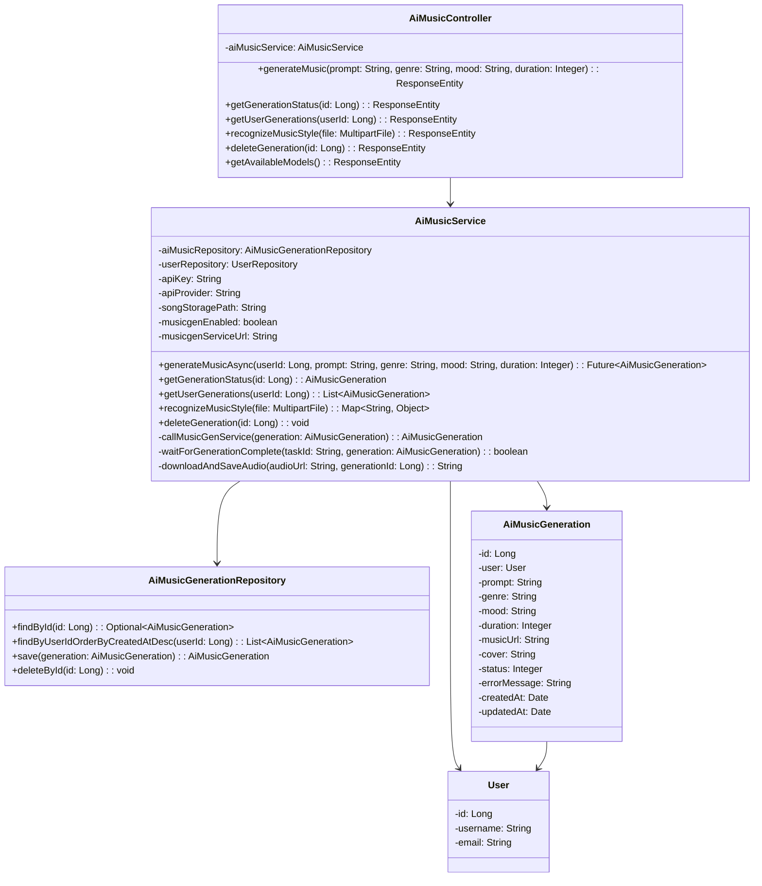
```mermaid
classDiagram
    class AiMusicController {
        -aiMusicService: AiMusicService
        +generateMusic(prompt: String, genre: String, mood: String, duration: Integer): ResponseEntity
        +getGenerationStatus(id: Long): ResponseEntity
        +getUserGenerations(userId: Long): ResponseEntity
        +recognizeMusicStyle(file: MultipartFile): ResponseEntity
        +deleteGeneration(id: Long): ResponseEntity
        +getAvailableModels(): ResponseEntity
    }

    class AiMusicService {
        -aiMusicRepository: AiMusicGenerationRepository
        -userRepository: UserRepository
        -apiKey: String
        -apiProvider: String
        -songStoragePath: String
        -musicgenEnabled: boolean
        -musicgenServiceUrl: String
        +generateMusicAsync(userId: Long, prompt: String, genre: String, mood: String, duration: Integer): Future~AiMusicGeneration~
        +getGenerationStatus(id: Long): AiMusicGeneration
        +getUserGenerations(userId: Long): List~AiMusicGeneration~
        +recognizeMusicStyle(file: MultipartFile): Map~String, Object~
        +deleteGeneration(id: Long): void
        -callMusicGenService(generation: AiMusicGeneration): AiMusicGeneration
        -waitForGenerationComplete(taskId: String, generation: AiMusicGeneration): boolean
        -downloadAndSaveAudio(audioUrl: String, generationId: Long): String
    }

    class AiMusicGenerationRepository {
        +findById(id: Long): Optional~AiMusicGeneration~
        +findByUserIdOrderByCreatedAtDesc(userId: Long): List~AiMusicGeneration~
        +save(generation: AiMusicGeneration): AiMusicGeneration
        +deleteById(id: Long): void
    }

    class AiMusicGeneration {
        -id: Long
        -user: User
        -prompt: String
        -genre: String
        -mood: String
        -duration: Integer
        -musicUrl: String
        -cover: String
        -status: Integer
        -errorMessage: String
        -createdAt: Date
        -updatedAt: Date
    }

    class User {
        -id: Long
        -username: String
        -email: String
    }

    AiMusicController --> AiMusicService
    AiMusicService --> AiMusicGenerationRepository
    AiMusicService --> AiMusicGeneration
    AiMusicService --> User
    AiMusicGeneration --> User
```

### 5.2 时序图 - AI 音乐生成（异步任务）

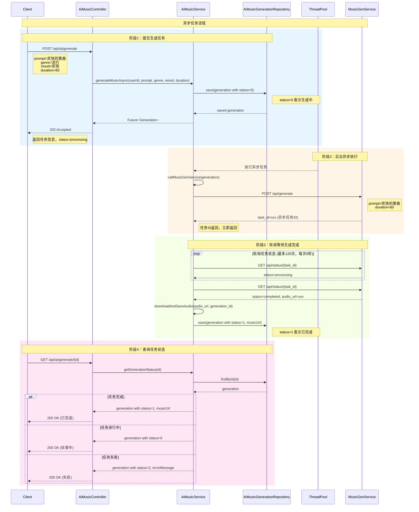
```mermaid
sequenceDiagram
    participant Client
    participant AiMusicController
    participant AiMusicService
    participant AiMusicGenerationRepository
    participant ThreadPool
    participant MusicGenService

    Note over Client,MusicGenService: 异步任务流程

    rect rgb(230, 245, 255)
        Note over Client,AiMusicGenerationRepository: 阶段1：提交生成任务
        Client->>AiMusicController: POST /api/ai/generate
        Note right of Client: prompt=欢快的歌曲<br/>genre=流行<br/>mood=欢快<br/>duration=60
        AiMusicController->>AiMusicService: generateMusicAsync(userId, prompt, genre, mood, duration)
        AiMusicService->>AiMusicGenerationRepository: save(generation with status=0)
        Note right of AiMusicGenerationRepository: status=0 表示生成中
        AiMusicGenerationRepository-->>AiMusicService: saved generation
        AiMusicService-->>AiMusicController: Future~Generation~
        AiMusicController-->>Client: 202 Accepted
        Note right of Client: 返回任务信息，status=processing
    end

    rect rgb(255, 245, 230)
        Note over ThreadPool,MusicGenService: 阶段2：后台异步执行
        ThreadPool-->>AiMusicService: 执行异步任务
        AiMusicService->>AiMusicService: callMusicGenService(generation)
        AiMusicService->>MusicGenService: POST /api/generate
        Note right of MusicGenService: prompt=欢快的歌曲<br/>duration=60
        MusicGenService-->>AiMusicService: task_id=xxx (异步任务ID)
        Note right of AiMusicService: 任务ID返回，立即返回
    end

    rect rgb(245, 255, 230)
        Note over AiMusicService,MusicGenService: 阶段3：轮询等待生成完成
        loop 轮询任务状态 (最多120次，每次5秒)
            AiMusicService->>MusicGenService: GET /api/status/{task_id}
            MusicGenService-->>AiMusicService: status=processing
        end
        AiMusicService->>MusicGenService: GET /api/status/{task_id}
        MusicGenService-->>AiMusicService: status=completed, audio_url=xxx
        AiMusicService->>AiMusicService: downloadAndSaveAudio(audio_url, generation_id)
        AiMusicService->>AiMusicGenerationRepository: save(generation with status=1, musicUrl)
        Note right of AiMusicGenerationRepository: status=1 表示已完成
    end

    rect rgb(255, 230, 245)
        Note over Client,AiMusicGenerationRepository: 阶段4：查询任务状态
        Client->>AiMusicController: GET /api/ai/generate/{id}
        AiMusicController->>AiMusicService: getGenerationStatus(id)
        AiMusicService->>AiMusicGenerationRepository: findById(id)
        AiMusicGenerationRepository-->>AiMusicService: generation
        alt 任务完成
            AiMusicService-->>AiMusicController: generation with status=1, musicUrl
            AiMusicController-->>Client: 200 OK (已完成)
        else 任务进行中
            AiMusicService-->>AiMusicController: generation with status=0
            AiMusicController-->>Client: 200 OK (处理中)
        else 任务失败
            AiMusicService-->>AiMusicController: generation with status=2, errorMessage
            AiMusicController-->>Client: 200 OK (失败)
        end
    end
```

### 5.3 时序图 - 曲风识别

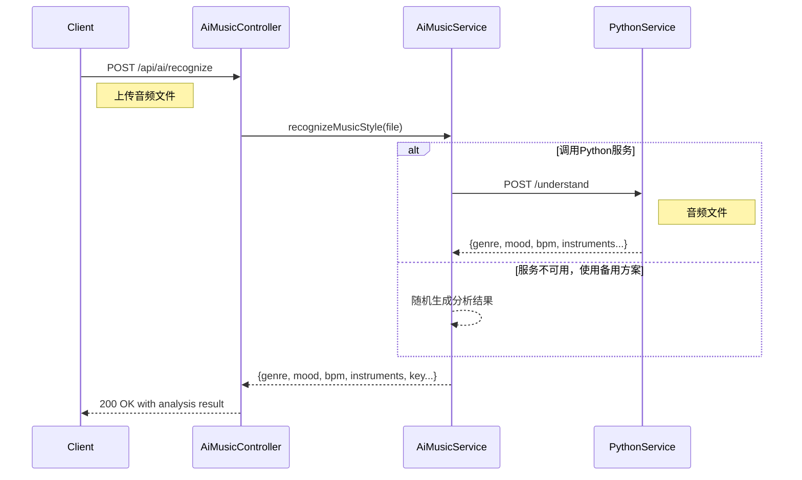
```mermaid
sequenceDiagram
    participant Client
    participant AiMusicController
    participant AiMusicService
    participant PythonService

    Client->>AiMusicController: POST /api/ai/recognize
    Note right of Client: 上传音频文件
    AiMusicController->>AiMusicService: recognizeMusicStyle(file)
    
    alt 调用Python服务
        AiMusicService->>PythonService: POST /understand
        Note right of PythonService: 音频文件
        PythonService-->>AiMusicService: {genre, mood, bpm, instruments...}
    else 服务不可用，使用备用方案
        AiMusicService-->>AiMusicService: 随机生成分析结果
    end
    
    AiMusicService-->>AiMusicController: {genre, mood, bpm, instruments, key...}
    AiMusicController-->>Client: 200 OK with analysis result
```

---

## 6. 社交模块

### 6.1 类图

```mermaid
classDiagram
    class SocialController {
        -postService: PostService
        -commentService: CommentService
        -likeService: LikeService
        -followService: FollowService
        +createPost(post: Post): ResponseEntity
        +getAllPosts(): ResponseEntity
        +getPostById(id: Long): ResponseEntity
        +deletePost(id: Long): ResponseEntity
        +likePost(postId: Long): ResponseEntity
        +unlikePost(postId: Long): ResponseEntity
        +commentPost(postId: Long, comment: Comment): ResponseEntity
        +deleteComment(commentId: Long): ResponseEntity
        +followUser(userId: Long): ResponseEntity
        +unfollowUser(userId: Long): ResponseEntity
        +getFollowing(userId: Long): ResponseEntity
        +getFollowers(userId: Long): ResponseEntity
    }

    class PostService {
        -postRepository: PostRepository
        +createPost(post: Post): Post
        +getAllPosts(): List~Post~
        +getPostById(id: Long): Optional~Post~
        +deletePost(id: Long): void
        +incrementLikes(postId: Long): void
    }

    class CommentService {
        -commentRepository: CommentRepository
        +addComment(comment: Comment): Comment
        +getCommentsByPostId(postId: Long): List~Comment~
        +deleteComment(id: Long): void
    }

    class LikeService {
        -likeRepository: LikeRepository
        +likePost(userId: Long, postId: Long): void
        +unlikePost(userId: Long, postId: Long): void
        +isLiked(userId: Long, postId: Long): boolean
    }

    class FollowService {
        -followRepository: FollowRepository
        +follow(followerId: Long, followingId: Long): void
        +unfollow(followerId: Long, followingId: Long): void
        +getFollowing(userId: Long): List~User~
        +getFollowers(userId: Long): List~User~
    }

    SocialController --> PostService
    SocialController --> CommentService
    SocialController --> LikeService
    SocialController --> FollowService
```

---

## 7. 排行榜模块

### 7.1 类图

```mermaid
classDiagram
    class RankingController {
        -rankingService: RankingService
        +getGlobalRanking(): ResponseEntity
        +getCategoryRanking(categoryId: Long): ResponseEntity
        +getNewSongRanking(): ResponseEntity
        +getSoaringRanking(): ResponseEntity
        +refreshRankings(): ResponseEntity
    }

    class RankingServiceImpl {
        -songRepository: SongRepository
        -songHotScoreRepository: SongHotScoreRepository
        -hotRankingRepository: HotRankingRepository
        -userFavoriteRepository: UserFavoriteRepository
        -commentRepository: CommentRepository
        -categoryRepository: CategoryRepository
        -log: Logger
        +WEIGHT_PLAY: int = 1
        +WEIGHT_FAVORITE: int = 5
        +WEIGHT_SHARE: int = 8
        +WEIGHT_DOWNLOAD: int = 3
        +WEIGHT_COMMENT: int = 4
        +GRAVITY: double = 1.8
        +RANKING_SIZE: int = 100
        +NEW_SONG_DAYS: int = 7
        +TARGET_TYPE_SONG: int = 1
        +getGlobalRanking(): HotRankingDTO
        +getCategoryRanking(categoryId: Long): HotRankingDTO
        +getNewSongRanking(): HotRankingDTO
        +getSoaringRanking(): HotRankingDTO
        +calculateHotScores(): void
        +generateAllRankings(): void
        +dailyCalculateHotScores(): void
        +dailyGenerateGlobalRanking(): void
        +dailyGenerateCategoryRankings(): void
        +dailyGenerateNewSongRanking(): void
        +hourlyUpdateSoaringRanking(): void
        -generateGlobalRanking(): void
        -generateCategoryRankings(): void
        -generateNewSongRanking(): void
        -generateSoaringRanking(): void
        -saveRanking(type: String, categoryId: Long, songId: Long, rank: int, hotScore: Double): void
        -buildHotSongsFromRankings(rankings: List~HotRanking~): List~HotSongDTO~
        -buildHotSongDTO(songId: Long, rank: int, hotScore: Double): HotSongDTO
        -getArtistNames(song: Song): String
        -calculateHotScore(weightedScore: long, createdAt: Date): double
        -getDaysBetween(start: Date, end: Date): long
    }

    class RankingService {
        +getGlobalRanking(): HotRankingDTO
        +getCategoryRanking(categoryId: Long): HotRankingDTO
        +getNewSongRanking(): HotRankingDTO
        +getSoaringRanking(): HotRankingDTO
        +calculateHotScores(): void
        +generateAllRankings(): void
    }

    class HotRankingRepository {
        +findGlobalByRankingType(rankingType: String): List~HotRanking~
        +findByRankingTypeAndCategory(rankingType: String, categoryId: Long): List~HotRanking~
        +deleteByRankingType(rankingType: String): void
        +deleteOldRankings(beforeDate: Date): void
        +countByRankingType(rankingType: String): long
    }

    class SongHotScoreRepository {
        +findBySongId(songId: Long): Optional~SongHotScore~
        +findAllByOrderByHotScoreDesc(pageable: Pageable): List~SongHotScore~
        +findByCategoryIdOrderByHotScoreDesc(categoryId: Long, pageable: Pageable): List~SongHotScore~
        +findNewSongsOrderByHotScoreDesc(startDate: Date, pageable: Pageable): List~SongHotScore~
        +save(entity: SongHotScore): SongHotScore
    }

    class SongRepository {
        +findById(id: Long): Optional~Song~
        +findByStatus(status: Integer): List~Song~
        +findAll(): List~Song~
    }

    class UserFavoriteRepository {
        +countByTargetTypeAndTargetId(targetType: Integer, targetId: Long): long
    }

    class CommentRepository {
        +countByTargetTypeAndTargetId(targetType: Integer, targetId: Long): long
    }

    class CategoryRepository {
        +findById(id: Long): Optional~Category~
        +findAll(): List~Category~
    }

    class HotRanking {
        -id: Long
        -rankingType: String
        -categoryId: Long
        -songId: Long
        -rank: Integer
        -hotScore: Double
        -createdAt: Date
    }

    class HotRankingDTO {
        -rankingType: String
        -title: String
        -updateTime: String
        -songs: List~HotSongDTO~
        +getRankingType(): String
        +setRankingType(type: String): void
        +getTitle(): String
        +setTitle(title: String): void
        +getUpdateTime(): String
        +setUpdateTime(time: String): void
        +getSongs(): List~HotSongDTO~
        +setSongs(songs: List~HotSongDTO~): void
    }

    class HotSongDTO {
        -rank: Integer
        -songId: Long
        -title: String
        -cover: String
        -artist: String
        -playCount: Long
        -hotScore: Double
        -trend: String
        -riseRate: Double
    }

    class RankingType {
        <<enumeration>>
        GLOBAL: "global"
        CATEGORY: "category"
        NEW: "new"
        SOARING: "soaring"
        +getCode(): String
    }

    class Song {
        -id: Long
        -title: String
        -cover: String
        -playCount: Long
        -shareCount: Long
        -downloadCount: Long
        -createdAt: Date
        -artists: Set~Artist~
    }

    class Category {
        -id: Long
        -name: String
    }

    class Artist {
        -id: Long
        -name: String
    }

    RankingController --> RankingService
    RankingService --> RankingServiceImpl
    RankingServiceImpl --> HotRankingRepository
    RankingServiceImpl --> SongHotScoreRepository
    RankingServiceImpl --> SongRepository
    RankingServiceImpl --> UserFavoriteRepository
    RankingServiceImpl --> CommentRepository
    RankingServiceImpl --> CategoryRepository
    RankingServiceImpl --> HotRanking
    RankingServiceImpl --> HotRankingDTO
    RankingServiceImpl --> HotSongDTO
    RankingServiceImpl --> RankingType
    RankingServiceImpl --> Song
    RankingServiceImpl --> Category
    HotRanking --> Song
    HotRankingDTO --> HotSongDTO
    Song --> Artist
```

### 7.2 时序图 - 获取全局热门榜单

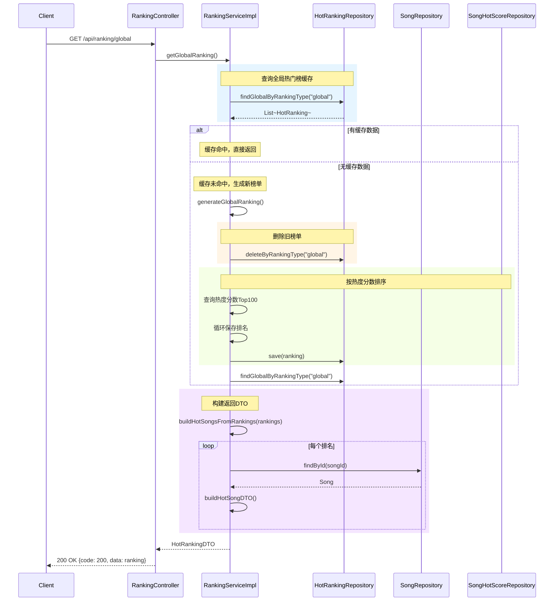
```mermaid
sequenceDiagram
    participant Client
    participant RankingController
    participant RankingServiceImpl
    participant HotRankingRepository
    participant SongRepository

    Client->>RankingController: GET /api/ranking/global
    RankingController->>RankingServiceImpl: getGlobalRanking()

    rect rgb(230, 245, 255)
        Note over RankingServiceImpl,HotRankingRepository: 查询全局热门榜缓存
        RankingServiceImpl->>HotRankingRepository: findGlobalByRankingType("global")
        HotRankingRepository-->>RankingServiceImpl: List~HotRanking~
    end

    alt 有缓存数据
        Note over RankingServiceImpl,RankingServiceImpl: 缓存命中，直接返回
    else 无缓存数据
        Note over RankingServiceImpl,RankingServiceImpl: 缓存未命中，生成新榜单
        RankingServiceImpl->>RankingServiceImpl: generateGlobalRanking()
        
        rect rgb(255, 245, 230)
            Note over RankingServiceImpl,HotRankingRepository: 删除旧榜单
            RankingServiceImpl->>HotRankingRepository: deleteByRankingType("global")
        end
        
        rect rgb(245, 255, 230)
            Note over RankingServiceImpl,SongHotScoreRepository: 按热度分数排序
            RankingServiceImpl->>RankingServiceImpl: 查询热度分数Top100
            RankingServiceImpl->>RankingServiceImpl: 循环保存排名
            RankingServiceImpl->>HotRankingRepository: save(ranking)
        end
        
        RankingServiceImpl->>HotRankingRepository: findGlobalByRankingType("global")
    end

    rect rgb(245, 230, 255)
        Note over RankingServiceImpl,RankingServiceImpl: 构建返回DTO
        RankingServiceImpl->>RankingServiceImpl: buildHotSongsFromRankings(rankings)
        loop 每个排名
            RankingServiceImpl->>SongRepository: findById(songId)
            SongRepository-->>RankingServiceImpl: Song
            RankingServiceImpl->>RankingServiceImpl: buildHotSongDTO()
        end
    end

    RankingServiceImpl-->>RankingController: HotRankingDTO
    RankingController-->>Client: 200 OK {code: 200, data: ranking}
```

### 7.3 时序图 - 获取分类热门榜单

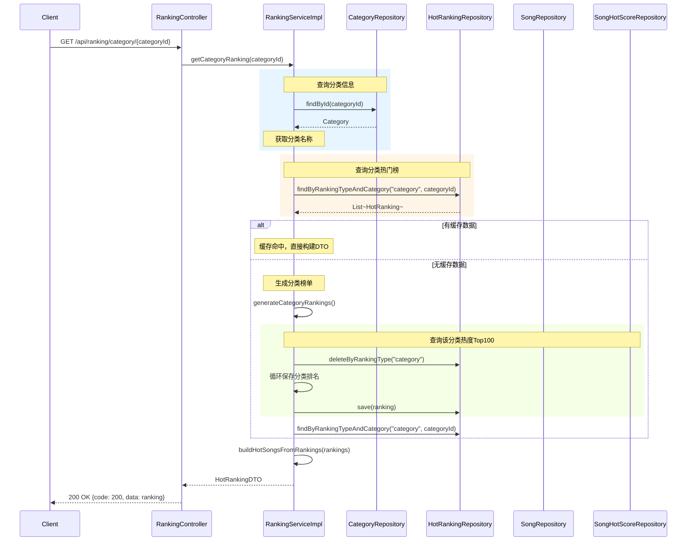
```mermaid
sequenceDiagram
    participant Client
    participant RankingController
    participant RankingServiceImpl
    participant CategoryRepository
    participant HotRankingRepository
    participant SongRepository

    Client->>RankingController: GET /api/ranking/category/{categoryId}
    RankingController->>RankingServiceImpl: getCategoryRanking(categoryId)

    rect rgb(230, 245, 255)
        Note over RankingServiceImpl,CategoryRepository: 查询分类信息
        RankingServiceImpl->>CategoryRepository: findById(categoryId)
        CategoryRepository-->>RankingServiceImpl: Category
        Note over RankingServiceImpl,RankingServiceImpl: 获取分类名称
    end

    rect rgb(255, 245, 230)
        Note over RankingServiceImpl,HotRankingRepository: 查询分类热门榜
        RankingServiceImpl->>HotRankingRepository: findByRankingTypeAndCategory("category", categoryId)
        HotRankingRepository-->>RankingServiceImpl: List~HotRanking~
    end

    alt 有缓存数据
        Note over RankingServiceImpl,RankingServiceImpl: 缓存命中，直接构建DTO
    else 无缓存数据
        Note over RankingServiceImpl,RankingServiceImpl: 生成分类榜单
        RankingServiceImpl->>RankingServiceImpl: generateCategoryRankings()
        
        rect rgb(245, 255, 230)
            Note over RankingServiceImpl,SongHotScoreRepository: 查询该分类热度Top100
            RankingServiceImpl->>HotRankingRepository: deleteByRankingType("category")
            RankingServiceImpl->>RankingServiceImpl: 循环保存分类排名
            RankingServiceImpl->>HotRankingRepository: save(ranking)
        end
        
        RankingServiceImpl->>HotRankingRepository: findByRankingTypeAndCategory("category", categoryId)
    end

    RankingServiceImpl->>RankingServiceImpl: buildHotSongsFromRankings(rankings)
    RankingServiceImpl-->>RankingController: HotRankingDTO
    RankingController-->>Client: 200 OK {code: 200, data: ranking}
```

### 7.3 时序图 - 获取分类热门榜单

```mermaid
sequenceDiagram
    participant Client
    participant RankingController
    participant RankingServiceImpl
    participant CategoryRepository
    participant HotRankingRepository
    participant SongRepository

    Client->>RankingController: GET /api/ranking/category/{categoryId}
    RankingController->>RankingServiceImpl: getCategoryRanking(categoryId)

    rect rgb(230, 245, 255)
        Note over RankingServiceImpl,CategoryRepository: 查询分类信息
        RankingServiceImpl->>CategoryRepository: findById(categoryId)
        CategoryRepository-->>RankingServiceImpl: Category
        Note over RankingServiceImpl,RankingServiceImpl: 获取分类名称
    end

    rect rgb(255, 245, 230)
        Note over RankingServiceImpl,HotRankingRepository: 查询分类热门榜
        RankingServiceImpl->>HotRankingRepository: findByRankingTypeAndCategory("category", categoryId)
        HotRankingRepository-->>RankingServiceImpl: List~HotRanking~
    end

    alt 有缓存数据
        Note over RankingServiceImpl,RankingServiceImpl: 缓存命中，直接构建DTO
    else 无缓存数据
        Note over RankingServiceImpl,RankingServiceImpl: 生成分类榜单
        RankingServiceImpl->>RankingServiceImpl: generateCategoryRankings()
        
        rect rgb(245, 255, 230)
            Note over RankingServiceImpl,SongHotScoreRepository: 查询该分类热度Top100
            RankingServiceImpl->>HotRankingRepository: deleteByRankingType("category")
            RankingServiceImpl->>RankingServiceImpl: 循环保存分类排名
            RankingServiceImpl->>HotRankingRepository: save(ranking)
        end
        
        RankingServiceImpl->>HotRankingRepository: findByRankingTypeAndCategory("category", categoryId)
    end

    RankingServiceImpl->>RankingServiceImpl: buildHotSongsFromRankings(rankings)
    RankingServiceImpl-->>RankingController: HotRankingDTO
    RankingController-->>Client: 200 OK {code: 200, data: ranking}
```

### 7.4 时序图 - 获取飙升榜单

```mermaid
sequenceDiagram
    participant Client
    participant RankingController
    participant RankingServiceImpl
    participant HotRankingRepository

    Client->>RankingController: GET /api/ranking/soaring
    RankingController->>RankingServiceImpl: getSoaringRanking()

    rect rgb(230, 245, 255)
        Note over RankingServiceImpl,HotRankingRepository: 查询飙升榜缓存
        RankingServiceImpl->>HotRankingRepository: findGlobalByRankingType("soaring")
        HotRankingRepository-->>RankingServiceImpl: List~HotRanking~
    end

    alt 有缓存数据
        Note over RankingServiceImpl,RankingServiceImpl: 缓存命中，直接构建DTO
    else 缓存未命中
        Note over RankingServiceImpl,RankingServiceImpl: 生成飙升榜单
        RankingServiceImpl->>RankingServiceImpl: generateSoaringRanking()
        
        rect rgb(255, 245, 230)
            Note over RankingServiceImpl,HotRankingRepository: 飙升榜生成逻辑
            RankingServiceImpl->>HotRankingRepository: deleteByRankingType("soaring")
            RankingServiceImpl->>RankingServiceImpl: 查询热度分数Top100
            RankingServiceImpl->>RankingServiceImpl: 构建飙升榜排名
            RankingServiceImpl->>HotRankingRepository: save(ranking)
        end
        
        RankingServiceImpl->>HotRankingRepository: findGlobalByRankingType("soaring")
    end

    RankingServiceImpl->>RankingServiceImpl: buildHotSongsFromRankings(rankings)
    RankingServiceImpl-->>RankingController: HotRankingDTO
    RankingController-->>Client: 200 OK {code: 200, data: ranking}
```

### 7.5 时序图 - 获取新歌榜单

```mermaid
sequenceDiagram
    participant Client
    participant RankingController
    participant RankingServiceImpl
    participant HotRankingRepository

    Client->>RankingController: GET /api/ranking/new
    RankingController->>RankingServiceImpl: getNewSongRanking()

    rect rgb(230, 245, 255)
        Note over RankingServiceImpl,HotRankingRepository: 查询新歌榜缓存
        RankingServiceImpl->>HotRankingRepository: findGlobalByRankingType("new")
        HotRankingRepository-->>RankingServiceImpl: List~HotRanking~
    end

    alt 有缓存数据
        Note over RankingServiceImpl,RankingServiceImpl: 缓存命中，直接构建DTO
    else 缓存未命中
        Note over RankingServiceImpl,RankingServiceImpl: 生成新歌榜单
        RankingServiceImpl->>RankingServiceImpl: generateNewSongRanking()
        
        rect rgb(255, 245, 230)
            Note over RankingServiceImpl,RankingServiceImpl: 计算7天内的新歌
            RankingServiceImpl->>RankingServiceImpl: Calendar: 获取7天前日期
        end
        
        rect rgb(245, 255, 230)
            Note over RankingServiceImpl,SongHotScoreRepository: 查询新歌热度Top100
            RankingServiceImpl->>HotRankingRepository: deleteByRankingType("new")
            RankingServiceImpl->>RankingServiceImpl: 构建新歌榜排名
            RankingServiceImpl->>HotRankingRepository: save(ranking)
        end
        
        RankingServiceImpl->>HotRankingRepository: findGlobalByRankingType("new")
    end

    RankingServiceImpl->>RankingServiceImpl: buildHotSongsFromRankings(rankings)
    RankingServiceImpl-->>RankingController: HotRankingDTO
    RankingController-->>Client: 200 OK {code: 200, data: ranking}
```

### 7.6 时序图 - 手动刷新榜单

```mermaid
sequenceDiagram
    participant Client
    participant RankingController
    participant RankingServiceImpl
    participant HotRankingRepository

    Client->>RankingController: POST /api/ranking/refresh
    RankingController->>RankingServiceImpl: generateAllRankings()

    rect rgb(230, 245, 255)
        Note over RankingServiceImpl,RankingServiceImpl: 步骤1：计算热度分数
        RankingServiceImpl->>RankingServiceImpl: calculateHotScores()
        Note right of RankingServiceImpl: 遍历所有歌曲<br/>计算播放/收藏/分享/下载/评论分数<br/>应用时间衰减算法
    end

    rect rgb(255, 245, 230)
        Note over RankingServiceImpl,RankingServiceImpl: 步骤2：生成全局热门榜
        RankingServiceImpl->>RankingServiceImpl: generateGlobalRanking()
    end

    rect rgb(245, 255, 230)
        Note over RankingServiceImpl,RankingServiceImpl: 步骤3：生成分类热门榜
        RankingServiceImpl->>RankingServiceImpl: generateCategoryRankings()
        Note right of RankingServiceImpl: 遍历所有分类<br/>每个分类生成独立榜单
    end

    rect rgb(245, 230, 255)
        Note over RankingServiceImpl,RankingServiceImpl: 步骤4：生成新歌榜
        RankingServiceImpl->>RankingServiceImpl: generateNewSongRanking()
    end

    rect rgb(230, 255, 245)
        Note over RankingServiceImpl,RankingServiceImpl: 步骤5：生成飙升榜
        RankingServiceImpl->>RankingServiceImpl: generateSoaringRanking()
    end

    rect rgb(255, 245, 255)
        Note over RankingServiceImpl,RankingServiceImpl: 步骤6：清理过期数据
        RankingServiceImpl->>HotRankingRepository: deleteOldRankings(beforeDate)
    end

    RankingServiceImpl-->>RankingController: void
    RankingController-->>Client: 200 OK {code: 200, message: "榜单刷新成功"}
```

### 7.7 时序图 - 每日定时计算热度分数

```mermaid
sequenceDiagram
    participant Scheduler
    participant RankingServiceImpl
    participant SongRepository
    participant UserFavoriteRepository
    participant CommentRepository
    participant SongHotScoreRepository

    Note over Scheduler,RankingServiceImpl: 每日凌晨2:30执行<br/>@Scheduled(cron = "0 30 2 * * ?")

    Scheduler->>RankingServiceImpl: dailyCalculateHotScores()

    rect rgb(230, 245, 255)
        Note over RankingServiceImpl,SongRepository: 获取所有启用歌曲
        RankingServiceImpl->>SongRepository: findByStatus(1)
        SongRepository-->>RankingServiceImpl: List~Song~
        Note right of RankingServiceImpl: 共 X 首歌曲
    end

    loop 遍历每首歌曲
        rect rgb(255, 245, 230)
            Note over RankingServiceImpl,RankingServiceImpl: 计算各项分数
            RankingServiceImpl->>RankingServiceImpl: playScore = playCount * 1
            RankingServiceImpl->>UserFavoriteRepository: countByTargetTypeAndTargetId(1, songId)
            UserFavoriteRepository-->>RankingServiceImpl: favoriteCount
            RankingServiceImpl->>RankingServiceImpl: favoriteScore = favoriteCount * 5
            
            RankingServiceImpl->>RankingServiceImpl: shareScore = shareCount * 8
            RankingServiceImpl->>RankingServiceImpl: downloadScore = downloadCount * 3
            
            RankingServiceImpl->>CommentRepository: countByTargetTypeAndTargetId(1, songId)
            CommentRepository-->>RankingServiceImpl: commentCount
            RankingServiceImpl->>RankingServiceImpl: commentScore = commentCount * 4
            
            RankingServiceImpl->>RankingServiceImpl: totalScore = playScore + favoriteScore + shareScore + downloadScore + commentScore
        end
        
        rect rgb(245, 255, 230)
            Note over RankingServiceImpl,RankingServiceImpl: 应用时间衰减算法
            RankingServiceImpl->>RankingServiceImpl: calculateHotScore(totalScore, createdAt)
            Note right of RankingServiceImpl: hotScore = totalScore / (daysSinceCreation + 2)^1.8
        end
        
        rect rgb(245, 230, 255)
            Note over RankingServiceImpl,SongHotScoreRepository: 保存热度分数
            RankingServiceImpl->>SongHotScoreRepository: findBySongId(songId)
            SongHotScoreRepository-->>RankingServiceImpl: existingScore (Optional)
            
            alt 存在则更新
                RankingServiceImpl->>RankingServiceImpl: 更新现有记录
            else 不存在则新建
                RankingServiceImpl->>RankingServiceImpl: 创建新记录
            end
            
            RankingServiceImpl->>SongHotScoreRepository: save(hotScoreEntity)
        end
    end

    Note right of RankingServiceImpl: 日志输出:<br/>[INFO] 开始计算歌曲热度得分...<br/>[INFO] 歌曲热度得分计算完成，共 X 首
```

### 7.8 时序图 - 定时更新各类榜单

```mermaid
sequenceDiagram
    participant Scheduler
    participant RankingServiceImpl
    participant HotRankingRepository

    rect rgb(230, 245, 255)
        Note over Scheduler,RankingServiceImpl: 每日凌晨3:00<br/>@Scheduled(cron = "0 0 3 * * ?")
        Scheduler->>RankingServiceImpl: dailyGenerateGlobalRanking()
        RankingServiceImpl->>RankingServiceImpl: generateGlobalRanking()
        
        RankingServiceImpl->>HotRankingRepository: deleteByRankingType("global")
        RankingServiceImpl->>RankingServiceImpl: 查询热度分数Top100
        RankingServiceImpl->>HotRankingRepository: save(ranking) x 100
        
        Note right of RankingServiceImpl: 日志: [INFO] 全局热门榜生成完成
    end

    rect rgb(255, 245, 230)
        Note over Scheduler,RankingServiceImpl: 每日凌晨3:30<br/>@Scheduled(cron = "0 30 3 * * ?")
        Scheduler->>RankingServiceImpl: dailyGenerateCategoryRankings()
        RankingServiceImpl->>RankingServiceImpl: generateCategoryRankings()
        
        RankingServiceImpl->>RankingServiceImpl: 遍历所有分类
        RankingServiceImpl->>HotRankingRepository: deleteByRankingType("category")
        RankingServiceImpl->>RankingServiceImpl: 每个分类取Top100
        RankingServiceImpl->>HotRankingRepository: save(ranking)
        
        Note right of RankingServiceImpl: 日志: [INFO] 分类热门榜生成完成
    end

    rect rgb(245, 255, 230)
        Note over Scheduler,RankingServiceImpl: 每日凌晨4:00<br/>@Scheduled(cron = "0 0 4 * * ?")
        Scheduler->>RankingServiceImpl: dailyGenerateNewSongRanking()
        RankingServiceImpl->>RankingServiceImpl: generateNewSongRanking()
        
        RankingServiceImpl->>HotRankingRepository: deleteByRankingType("new")
        RankingServiceImpl->>RankingServiceImpl: 查询7天内新歌热度Top100
        RankingServiceImpl->>HotRankingRepository: save(ranking)
        
        Note right of RankingServiceImpl: 日志: [INFO] 新歌榜生成完成
    end

    rect rgb(245, 230, 255)
        Note over Scheduler,RankingServiceImpl: 每小时整点<br/>@Scheduled(cron = "0 0 * * * ?")
        Scheduler->>RankingServiceImpl: hourlyUpdateSoaringRanking()
        RankingServiceImpl->>RankingServiceImpl: generateSoaringRanking()
        
        RankingServiceImpl->>HotRankingRepository: deleteByRankingType("soaring")
        RankingServiceImpl->>RankingServiceImpl: 查询热度分数Top100
        RankingServiceImpl->>HotRankingRepository: save(ranking)
        
        Note right of RankingServiceImpl: 日志: [INFO] 飙升榜生成完成
    end

    Note right of Scheduler: 定时任务执行完成<br/>榜单数据已更新
```

---

## 8. 听歌报告模块

```mermaid
sequenceDiagram
    participant Client
    participant RankingController
    participant RankingServiceImpl
    participant HotRankingRepository
    participant SongRepository

    Client->>RankingController: GET /api/ranking/global
    RankingController->>RankingServiceImpl: getGlobalRanking()

    rect rgb(230, 245, 255)
        Note over RankingServiceImpl,HotRankingRepository: 查询榜单缓存
        RankingServiceImpl->>HotRankingRepository: findByRankingTypeOrderByRankAsc("global")
        HotRankingRepository-->>RankingServiceImpl: List~HotRanking~
    end

    alt 有缓存数据
        Note over RankingServiceImpl,RankingServiceImpl: 缓存命中，直接返回
    else 无缓存数据
        Note over RankingServiceImpl,RankingServiceImpl: 缓存未命中，生成新榜单
        RankingServiceImpl->>RankingServiceImpl: generateGlobalRanking()
        
        rect rgb(255, 245, 230)
            Note over RankingServiceImpl,SongHotScoreRepository: 计算热度分数
            RankingServiceImpl->>RankingServiceImpl: calculateHotScores()
        end
        
        rect rgb(245, 255, 230)
            Note over RankingServiceImpl,HotRankingRepository: 保存榜单
            RankingServiceImpl->>RankingServiceImpl: 按hotScore排序取前100
            RankingServiceImpl->>HotRankingRepository: deleteByRankingType("global")
            RankingServiceImpl->>RankingServiceImpl: 构建HotRanking列表
            RankingServiceImpl->>HotRankingRepository: saveAll(rankings)
        end
        
        RankingServiceImpl->>HotRankingRepository: findByRankingTypeOrderByRankAsc("global")
    end

    rect rgb(245, 230, 255)
        Note over RankingServiceImpl,RankingServiceImpl: 转换为DTO
        RankingServiceImpl->>RankingServiceImpl: convertToDTO(rankings)
        RankingServiceImpl->>SongRepository: findByIdIn(songIds)
        SongRepository-->>RankingServiceImpl: List~Song~
        RankingServiceImpl->>RankingServiceImpl: 构建RankingSongDTO列表
    end

    RankingServiceImpl-->>RankingController: HotRankingDTO
    RankingController-->>Client: 200 OK with ranking data
```

### 7.4 时序图 - 获取飙升榜单

```mermaid
sequenceDiagram
    participant Client
    participant RankingController
    participant RankingServiceImpl
    participant HotRankingRepository
    participant SongRepository
    participant PlayHistoryRepository

    Client->>RankingController: GET /api/ranking/soaring
    RankingController->>RankingServiceImpl: getSoaringRanking()

    rect rgb(230, 245, 255)
        Note over RankingServiceImpl,HotRankingRepository: 查询飙升榜缓存
        RankingServiceImpl->>HotRankingRepository: findByRankingTypeOrderByRankAsc("soaring")
        HotRankingRepository-->>RankingServiceImpl: List~HotRanking~
    end

    alt 有缓存数据（未过期）
        Note over RankingServiceImpl,RankingServiceImpl: 缓存命中，直接返回
    else 缓存未命中或已过期
        Note over RankingServiceImpl,RankingServiceImpl: 计算飙升榜单
        RankingServiceImpl->>RankingServiceImpl: generateSoaringRanking()
        
        rect rgb(255, 245, 230)
            Note over RankingServiceImpl,PlayHistoryRepository: 计算播放增量
            RankingServiceImpl->>RankingServiceImpl: 获取昨日和今日播放数据
            Note right of RankingServiceImpl: 计算播放增量 = 今日播放 - 昨日播放
            RankingServiceImpl->>RankingServiceImpl: 按播放增量排序
        end
        
        rect rgb(245, 255, 230)
            Note over RankingServiceImpl,HotRankingRepository: 保存飙升榜
            RankingServiceImpl->>HotRankingRepository: deleteByRankingType("soaring")
            RankingServiceImpl->>HotRankingRepository: saveAll(rankings)
            Note right of HotRankingRepository: 取播放增量Top100
        end
    end

    RankingServiceImpl->>RankingServiceImpl: convertToDTO(rankings)
    RankingServiceImpl-->>RankingController: HotRankingDTO
    RankingController-->>Client: 200 OK with soaring ranking
```

### 7.4 时序图 - 获取新歌榜单

```mermaid
sequenceDiagram
    participant Client
    participant RankingController
    participant RankingServiceImpl
    participant HotRankingRepository
    participant SongRepository

    Client->>RankingController: GET /api/ranking/new
    RankingController->>RankingServiceImpl: getNewSongRanking()

    rect rgb(230, 245, 255)
        Note over RankingServiceImpl,HotRankingRepository: 查询新歌榜缓存
        RankingServiceImpl->>HotRankingRepository: findByRankingTypeOrderByRankAsc("new")
        HotRankingRepository-->>RankingServiceImpl: List~HotRanking~
    end

    alt 有缓存数据
        Note over RankingServiceImpl,RankingServiceImpl: 缓存命中，直接返回
    else 缓存未命中
        Note over RankingServiceImpl,RankingServiceImpl: 生成新歌榜单
        RankingServiceImpl->>RankingServiceImpl: generateNewSongRanking()
        
        rect rgb(255, 245, 230)
            Note over RankingServiceImpl,SongRepository: 查询最近30天新歌
            RankingServiceImpl->>SongRepository: findByCreatedAtAfter(thirtyDaysAgo)
            Note right of SongRepository: 获取30天内发布的新歌
            SongRepository-->>RankingServiceImpl: List~Song~
        end
        
        rect rgb(245, 255, 230)
            Note over RankingServiceImpl,HotRankingRepository: 计算并保存
            RankingServiceImpl->>RankingServiceImpl: 按播放量排序取前100
            RankingServiceImpl->>HotRankingRepository: deleteByRankingType("new")
            RankingServiceImpl->>HotRankingRepository: saveAll(rankings)
        end
    end

    RankingServiceImpl->>RankingServiceImpl: convertToDTO(rankings)
    RankingServiceImpl-->>RankingController: HotRankingDTO
    RankingController-->>Client: 200 OK with new song ranking
```

### 7.5 时序图 - 计算歌曲热度分数

```mermaid
sequenceDiagram
    participant RankingServiceImpl
    participant SongHotScoreRepository
    participant SongRepository
    participant PlayHistoryRepository
    participant UserBehaviorRepository
    participant CommentRepository

    Note over RankingServiceImpl,CommentRepository: calculateHotScores()

    rect rgb(230, 245, 255)
        Note over RankingServiceImpl,SongRepository: 获取所有歌曲
        RankingServiceImpl->>SongRepository: findAll()
        SongRepository-->>RankingServiceImpl: List~Song~
    end

    rect rgb(255, 245, 230)
        Note over RankingServiceImpl,PlayHistoryRepository: 计算播放分数
        loop 每首歌曲
            RankingServiceImpl->>PlayHistoryRepository: countBySongId(songId)
            PlayHistoryRepository-->>RankingServiceImpl: playCount
            RankingServiceImpl->>RankingServiceImpl: playScore = playCount * 1.0
        end
    end

    rect rgb(245, 255, 230)
        Note over RankingServiceImpl,UserBehaviorRepository: 计算收藏分数
        loop 每首歌曲
            RankingServiceImpl->>UserBehaviorRepository: countBySongIdAndBehaviorType(songId, 3)
            UserBehaviorRepository-->>RankingServiceImpl: favoriteCount
            RankingServiceImpl->>RankingServiceImpl: favoriteScore = favoriteCount * 5.0
        end
    end

    rect rgb(245, 230, 255)
        Note over RankingServiceImpl,UserBehaviorRepository: 计算分享分数
        loop 每首歌曲
            RankingServiceImpl->>UserBehaviorRepository: countBySongIdAndBehaviorType(songId, 4)
            UserBehaviorRepository-->>RankingServiceImpl: shareCount
            RankingServiceImpl->>RankingServiceImpl: shareScore = shareCount * 3.0
        end
    end

    rect rgb(230, 255, 245)
        Note over RankingServiceImpl,CommentRepository: 计算评论分数
        loop 每首歌曲
            RankingServiceImpl->>CommentRepository: countBySongId(songId)
            CommentRepository-->>RankingServiceImpl: commentCount
            RankingServiceImpl->>RankingServiceImpl: commentScore = commentCount * 2.0
        end
    end

    rect rgb(255, 245, 255)
        Note over RankingServiceImpl,RankingServiceImpl: 计算综合热度分数
        loop 每首歌曲
            RankingServiceImpl->>RankingServiceImpl: hotScore = playScore + favoriteScore + shareScore + commentScore
            Note right of RankingServiceImpl: 权重：播放*1 + 收藏*5 + 分享*3 + 评论*2
        end
        
        RankingServiceImpl->>SongHotScoreRepository: saveAll(scores)
        SongHotScoreRepository-->>RankingServiceImpl: saved
    end

    Note right of RankingServiceImpl: 热度分数计算完成
```

### 7.6 时序图 - 每日定时更新榜单

```mermaid
sequenceDiagram
    participant Scheduler
    participant RankingServiceImpl
    participant HotRankingRepository

    Note over Scheduler,RankingServiceImpl: 每日凌晨1点执行 @Scheduled(cron="0 0 1 * * ?")

    Scheduler->>RankingServiceImpl: generateAllRankings()

    rect rgb(230, 245, 255)
        Note over RankingServiceImpl,RankingServiceImpl: 步骤1：计算热度分数
        RankingServiceImpl->>RankingServiceImpl: calculateHotScores()
        Note right of RankingServiceImpl: 更新所有歌曲的热度分数
    end

    rect rgb(255, 245, 230)
        Note over RankingServiceImpl,RankingServiceImpl: 步骤2：生成全局热门榜
        RankingServiceImpl->>RankingServiceImpl: generateGlobalRanking()
        Note right of RankingServiceImpl: 取热度分数Top100
    end

    rect rgb(245, 255, 230)
        Note over RankingServiceImpl,RankingServiceImpl: 步骤3：生成飙升榜
        RankingServiceImpl->>RankingServiceImpl: generateSoaringRanking()
        Note right of RankingServiceImpl: 按播放增量排序
    end

    rect rgb(245, 230, 255)
        Note over RankingServiceImpl,RankingServiceImpl: 步骤4：生成新歌榜
        RankingServiceImpl->>RankingServiceImpl: generateNewSongRanking()
        Note right of RankingServiceImpl: 30天内新歌按热度排序
    end

    rect rgb(230, 255, 245)
        Note over RankingServiceImpl,RankingServiceImpl: 步骤5：统计结果
        RankingServiceImpl->>HotRankingRepository: countByRankingType("global")
        HotRankingRepository-->>RankingServiceImpl: globalCount
        RankingServiceImpl->>HotRankingRepository: countByRankingType("soaring")
        HotRankingRepository-->>RankingServiceImpl: soaringCount
        RankingServiceImpl->>HotRankingRepository: countByRankingType("new")
        HotRankingRepository-->>RankingServiceImpl: newCount
    end

    Note right of RankingServiceImpl: 日志输出:<br/>[INFO] 全局热门榜: 100首<br/>[INFO] 飙升榜: 100首<br/>[INFO] 新歌榜: 100首<br/>[INFO] 榜单更新完成
```

### 7.7 时序图 - 获取所有榜单

```mermaid
sequenceDiagram
    participant Client
    participant RankingController
    participant RankingServiceImpl
    participant HotRankingRepository

    Client->>RankingController: GET /api/ranking/all
    RankingController->>RankingServiceImpl: getAllRankings()

    par 并行查询各榜单
        RankingServiceImpl->>HotRankingRepository: findByRankingTypeOrderByRankAsc("global")
        RankingServiceImpl->>HotRankingRepository: findByRankingTypeOrderByRankAsc("soaring")
        RankingServiceImpl->>HotRankingRepository: findByRankingTypeOrderByRankAsc("new")
    end

    HotRankingRepository-->>RankingServiceImpl: globalRanking
    HotRankingRepository-->>RankingServiceImpl: soaringRanking
    HotRankingRepository-->>RankingServiceImpl: newRanking

    rect rgb(230, 245, 255)
        Note over RankingServiceImpl,RankingServiceImpl: 转换为DTO
        RankingServiceImpl->>RankingServiceImpl: convertToDTO(globalRanking)
        RankingServiceImpl->>RankingServiceImpl: convertToDTO(soaringRanking)
        RankingServiceImpl->>RankingServiceImpl: convertToDTO(newRanking)
    end

    RankingServiceImpl-->>RankingController: Map~String, HotRankingDTO~
    RankingController-->>Client: 200 OK with all rankings
```

---

## 8. 听歌报告模块

### 8.1 类图

```mermaid
classDiagram
    class ListeningReportController {
        -listeningReportService: ListeningReportService
        +getYearReport(year: Integer): ResponseEntity
        +getMonthReport(year: Integer, month: Integer): ResponseEntity
        +getRecentReport(): ResponseEntity
        +getPlayStats(): ResponseEntity
    }

    class ListeningReportService {
        -playHistoryRepository: PlayHistoryRepository
        -userBehaviorRepository: UserBehaviorRepository
        -songRepository: SongRepository
        +getYearReport(userId: Long, year: Integer): Map~String, Object~
        +getMonthReport(userId: Long, year: Integer, month: Integer): Map~String, Object~
        +getRecentReport(userId: Long): Map~String, Object~
        +getPlayStats(userId: Long): Map~String, Object~
    }

    ListeningReportController --> ListeningReportService
```

---

## 9. 管理员模块

### 9.1 类图

```mermaid
classDiagram
    class AdminController {
        -userService: UserService
        -songService: SongService
        -statsService: StatsService
        -systemLogService: SystemLogService
        +getAllUsers(): ResponseEntity
        +updateUserStatus(id: Long, status: Integer): ResponseEntity
        +setVip(id: Long, expireDate: Date): ResponseEntity
        +getPendingSongs(): ResponseEntity
        +verifySong(id: Long, status: Integer): ResponseEntity
        +getStats(): ResponseEntity
        +getSystemLogs(): ResponseEntity
        +getConfigs(): ResponseEntity
        +updateConfig(configKey: String, configValue: String): ResponseEntity
    }

    class StatsService {
        +getUserStats(): Map~String, Object~
        +getSongStats(): Map~String, Object~
        +getPlayStats(): Map~String, Object~
        +getRevenueStats(): Map~String, Object~
    }

    AdminController --> UserService
    AdminController --> SongService
    AdminController --> StatsService
    AdminController --> SystemLogService
```

---

**文档版本**：1.0
**更新日期**：2026-04-12