# Fly Music 类图与时序图

> 使用 Mermaid 渲染，可在支持 Mermaid 的编辑器中查看

---

## 1. 用户模块

### 1.1 类图

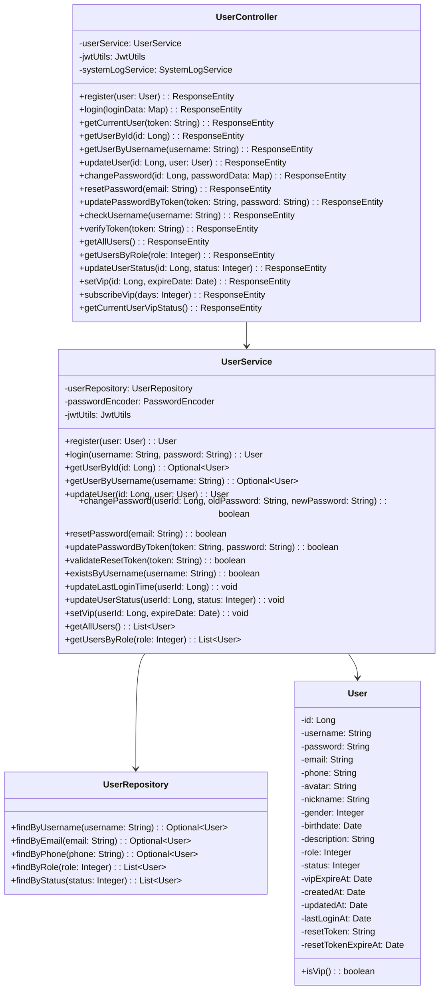
```mermaid
classDiagram
    class UserController {
        -userService: UserService
        -jwtUtils: JwtUtils
        -systemLogService: SystemLogService
        +register(user: User): ResponseEntity
        +login(loginData: Map): ResponseEntity
        +getCurrentUser(token: String): ResponseEntity
        +getUserById(id: Long): ResponseEntity
        +getUserByUsername(username: String): ResponseEntity
        +updateUser(id: Long, user: User): ResponseEntity
        +changePassword(id: Long, passwordData: Map): ResponseEntity
        +resetPassword(email: String): ResponseEntity
        +updatePasswordByToken(token: String, password: String): ResponseEntity
        +checkUsername(username: String): ResponseEntity
        +verifyToken(token: String): ResponseEntity
        +getAllUsers(): ResponseEntity
        +getUsersByRole(role: Integer): ResponseEntity
        +updateUserStatus(id: Long, status: Integer): ResponseEntity
        +setVip(id: Long, expireDate: Date): ResponseEntity
        +subscribeVip(days: Integer): ResponseEntity
        +getCurrentUserVipStatus(): ResponseEntity
    }

    class UserService {
        -userRepository: UserRepository
        -passwordEncoder: PasswordEncoder
        -jwtUtils: JwtUtils
        +register(user: User): User
        +login(username: String, password: String): User
        +getUserById(id: Long): Optional~User~
        +getUserByUsername(username: String): Optional~User~
        +updateUser(id: Long, user: User): User
        +changePassword(userId: Long, oldPassword: String, newPassword: String): boolean
        +resetPassword(email: String): boolean
        +updatePasswordByToken(token: String, password: String): boolean
        +validateResetToken(token: String): boolean
        +existsByUsername(username: String): boolean
        +updateLastLoginTime(userId: Long): void
        +updateUserStatus(userId: Long, status: Integer): void
        +setVip(userId: Long, expireDate: Date): void
        +getAllUsers(): List~User~
        +getUsersByRole(role: Integer): List~User~
    }

    class UserRepository {
        +findByUsername(username: String): Optional~User~
        +findByEmail(email: String): Optional~User~
        +findByPhone(phone: String): Optional~User~
        +findByRole(role: Integer): List~User~
        +findByStatus(status: Integer): List~User~
    }

    class User {
        -id: Long
        -username: String
        -password: String
        -email: String
        -phone: String
        -avatar: String
        -nickname: String
        -gender: Integer
        -birthdate: Date
        -description: String
        -role: Integer
        -status: Integer
        -vipExpireAt: Date
        -createdAt: Date
        -updatedAt: Date
        -lastLoginAt: Date
        -resetToken: String
        -resetTokenExpireAt: Date
        +isVip(): boolean
    }

    UserController --> UserService
    UserService --> UserRepository
    UserService --> User
```

### 1.2 时序图 - 用户注册

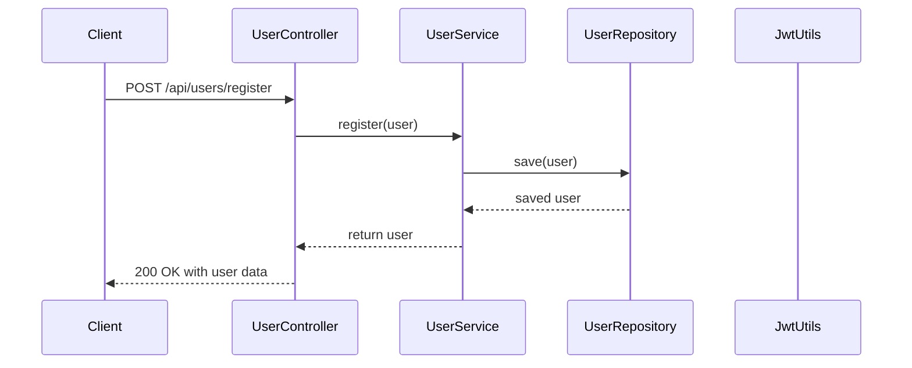
```mermaid
sequenceDiagram
    participant Client
    participant UserController
    participant UserService
    participant UserRepository
    participant JwtUtils

    Client->>UserController: POST /api/users/register
    UserController->>UserService: register(user)
    UserService->>UserRepository: save(user)
    UserRepository-->>UserService: saved user
    UserService-->>UserController: return user
    UserController-->>Client: 200 OK with user data
```

### 1.3 时序图 - 用户登录

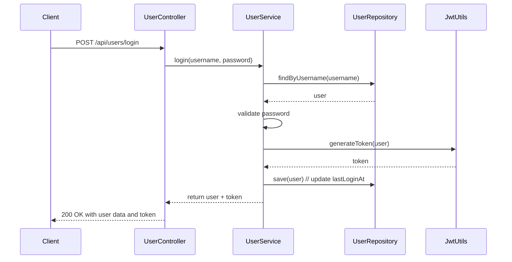
```mermaid
sequenceDiagram
    participant Client
    participant UserController
    participant UserService
    participant UserRepository
    participant JwtUtils

    Client->>UserController: POST /api/users/login
    UserController->>UserService: login(username, password)
    UserService->>UserRepository: findByUsername(username)
    UserRepository-->>UserService: user
    UserService->>UserService: validate password
    UserService->>JwtUtils: generateToken(user)
    JwtUtils-->>UserService: token
    UserService->>UserRepository: save(user) // update lastLoginAt
    UserService-->>UserController: return user + token
    UserController-->>Client: 200 OK with user data and token
```

---

## 2. 歌曲模块

### 2.1 类图

```mermaid
classDiagram
    class SongController {
        -songService: SongService
        -songStorageService: SongStorageService
        -coverExtractService: CoverExtractService
        -systemLogService: SystemLogService
        -jwtUtils: JwtUtils
        +getAllSongs(): ResponseEntity
        +getSongById(id: Long): ResponseEntity
        +createSong(song: Song): ResponseEntity
        +updateSong(id: Long, song: Song): ResponseEntity
        +deleteSong(id: Long): ResponseEntity
        +getSongsByCategory(categoryId: Long, page: int, size: int): ResponseEntity
        +getSongsByArtist(artistId: Long): ResponseEntity
        +getSongsByAlbum(albumId: Long): ResponseEntity
        +searchSongs(keyword: String): ResponseEntity
        +getPopularSongs(limit: int): ResponseEntity
        +getLatestSongs(limit: int): ResponseEntity
        +getRecommendedSongs(userId: Long, limit: int): ResponseEntity
        +playSong(id: Long): ResponseEntity
        +approveSong(id: Long): ResponseEntity
        +rejectSong(id: Long): ResponseEntity
        +extractMetadata(id: Long): ResponseEntity
        +getSongsByPage(page: int, size: int, status: Integer): ResponseEntity
        +uploadSong(file: MultipartFile, title: String): ResponseEntity
    }

    class SongService {
        -songRepository: SongRepository
        -songHotScoreService: SongHotScoreService
        -coverExtractService: CoverExtractService
        +getAllSongs(): List~Song~
        +getSongById(id: Long): Optional~Song~
        +saveSong(song: Song): Song
        +updateSong(id: Long, song: Song): Song
        +deleteSong(id: Long): void
        +getSongsByCategoryIdPage(categoryId: Long, pageable: Pageable): Page~Song~
        +getSongsByArtistId(artistId: Long): List~Song~
        +getSongsByAlbumId(albumId: Long): List~Song~
        +searchSongs(keyword: String): List~Song~
        +getPopularSongs(limit: int): List~Song~
        +getLatestSongs(limit: int): List~Song~
        +getRecommendedSongs(userId: Long, limit: int): List~Song~
        +incrementPlayCount(id: Long): void
        +approveSong(id: Long): void
        +rejectSong(id: Long): void
    }

    class SongStorageService {
        -storagePath: String
        -songUrlPrefix: String
        +storeSong(file: MultipartFile): String
        +getSongPath(filename: String): Path
        +deleteSong(url: String): void
    }

    class CoverExtractService {
        -coverPath: String
        -coverUrlPrefix: String
        +extractCoverFromMp3(filename: String, timestamp: Long): String
        +getCoverPath(): String
    }

    class SongRepository {
        +findByTitleContaining(keyword: String): List~Song~
        +findByAlbumId(albumId: Long): List~Song~
        +findByCategoryId(categoryId: Long): List~Song~
        +findByStatus(status: Integer): List~Song~
        +findByUserId(userId: Long): List~Song~
    }

    class Song {
        -id: Long
        -title: String
        -duration: Integer
        -url: String
        -lyrics: String
        -cover: String
        -album: Album
        -category: Category
        -playCount: Long
        -downloadCount: Integer
        -shareCount: Integer
        -status: Integer
    }

    SongController --> SongService
    SongController --> SongStorageService
    SongController --> CoverExtractService
    SongService --> SongRepository
    SongService --> Song
```

### 2.2 时序图 - 歌曲上传

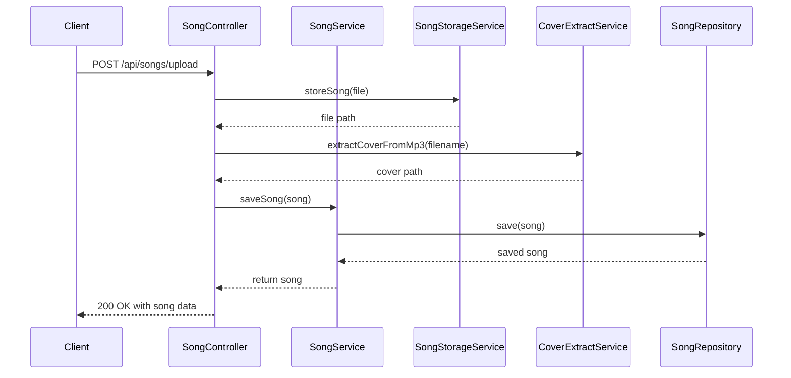
```mermaid
sequenceDiagram
    participant Client
    participant SongController
    participant SongService
    participant SongStorageService
    participant CoverExtractService
    participant SongRepository

    Client->>SongController: POST /api/songs/upload
    SongController->>SongStorageService: storeSong(file)
    SongStorageService-->>SongController: file path
    SongController->>CoverExtractService: extractCoverFromMp3(filename)
    CoverExtractService-->>SongController: cover path
    SongController->>SongService: saveSong(song)
    SongService->>SongRepository: save(song)
    SongRepository-->>SongService: saved song
    SongService-->>SongController: return song
    SongController-->>Client: 200 OK with song data
```

---

## 3. 歌单模块

### 3.1 类图

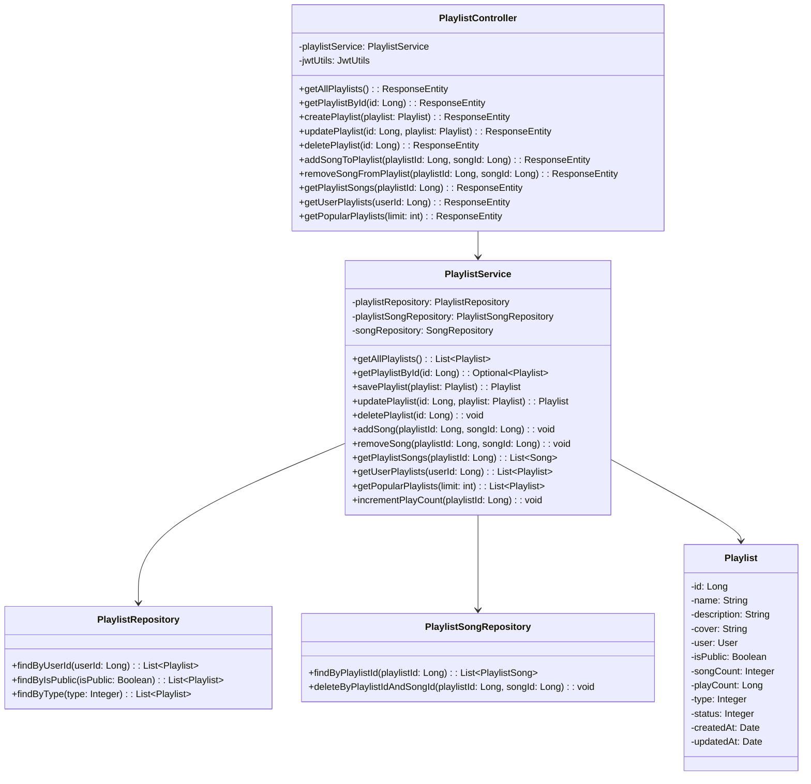
```mermaid
classDiagram
    class PlaylistController {
        -playlistService: PlaylistService
        -jwtUtils: JwtUtils
        +getAllPlaylists(): ResponseEntity
        +getPlaylistById(id: Long): ResponseEntity
        +createPlaylist(playlist: Playlist): ResponseEntity
        +updatePlaylist(id: Long, playlist: Playlist): ResponseEntity
        +deletePlaylist(id: Long): ResponseEntity
        +addSongToPlaylist(playlistId: Long, songId: Long): ResponseEntity
        +removeSongFromPlaylist(playlistId: Long, songId: Long): ResponseEntity
        +getPlaylistSongs(playlistId: Long): ResponseEntity
        +getUserPlaylists(userId: Long): ResponseEntity
        +getPopularPlaylists(limit: int): ResponseEntity
    }

    class PlaylistService {
        -playlistRepository: PlaylistRepository
        -playlistSongRepository: PlaylistSongRepository
        -songRepository: SongRepository
        +getAllPlaylists(): List~Playlist~
        +getPlaylistById(id: Long): Optional~Playlist~
        +savePlaylist(playlist: Playlist): Playlist
        +updatePlaylist(id: Long, playlist: Playlist): Playlist
        +deletePlaylist(id: Long): void
        +addSong(playlistId: Long, songId: Long): void
        +removeSong(playlistId: Long, songId: Long): void
        +getPlaylistSongs(playlistId: Long): List~Song~
        +getUserPlaylists(userId: Long): List~Playlist~
        +getPopularPlaylists(limit: int): List~Playlist~
        +incrementPlayCount(playlistId: Long): void
    }

    class PlaylistRepository {
        +findByUserId(userId: Long): List~Playlist~
        +findByIsPublic(isPublic: Boolean): List~Playlist~
        +findByType(type: Integer): List~Playlist~
    }

    class PlaylistSongRepository {
        +findByPlaylistId(playlistId: Long): List~PlaylistSong~
        +deleteByPlaylistIdAndSongId(playlistId: Long, songId: Long): void
    }

    class Playlist {
        -id: Long
        -name: String
        -description: String
        -cover: String
        -user: User
        -isPublic: Boolean
        -songCount: Integer
        -playCount: Long
        -type: Integer
        -status: Integer
        -createdAt: Date
        -updatedAt: Date
    }

    PlaylistController --> PlaylistService
    PlaylistService --> PlaylistRepository
    PlaylistService --> PlaylistSongRepository
    PlaylistService --> Playlist
```

### 3.2 时序图 - 添加歌曲到歌单

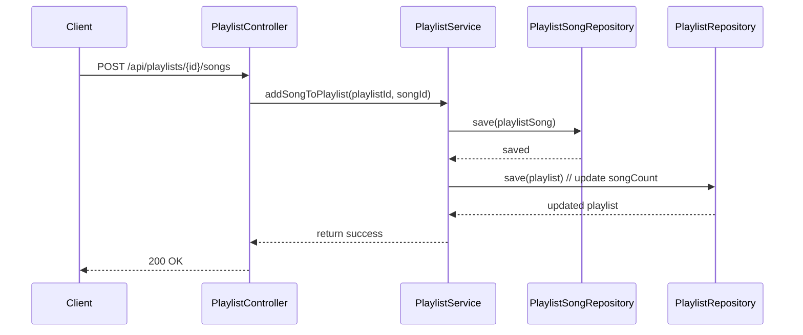
```mermaid
sequenceDiagram
    participant Client
    participant PlaylistController
    participant PlaylistService
    participant PlaylistSongRepository
    participant PlaylistRepository

    Client->>PlaylistController: POST /api/playlists/{id}/songs
    PlaylistController->>PlaylistService: addSongToPlaylist(playlistId, songId)
    PlaylistService->>PlaylistSongRepository: save(playlistSong)
    PlaylistSongRepository-->>PlaylistService: saved
    PlaylistService->>PlaylistRepository: save(playlist) // update songCount
    PlaylistRepository-->>PlaylistService: updated playlist
    PlaylistService-->>PlaylistController: return success
    PlaylistController-->>Client: 200 OK
```

---

## 4. 推荐模块

### 4.1 类图

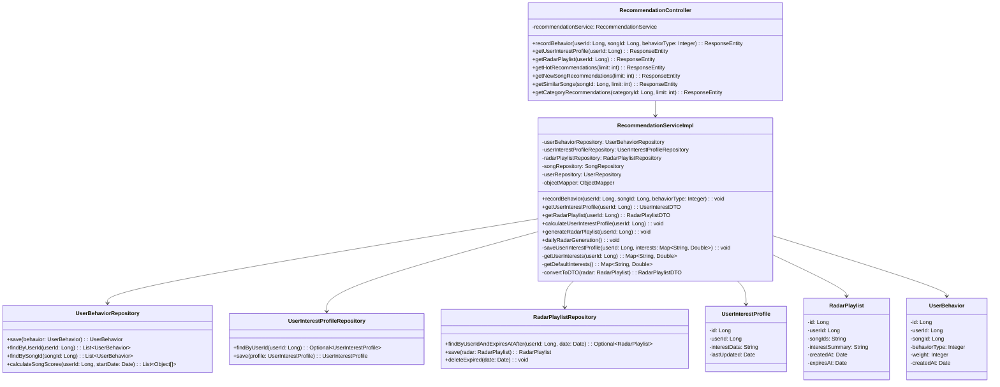
```mermaid
classDiagram
    class RecommendationController {
        -recommendationService: RecommendationService
        +recordBehavior(userId: Long, songId: Long, behaviorType: Integer): ResponseEntity
        +getUserInterestProfile(userId: Long): ResponseEntity
        +getRadarPlaylist(userId: Long): ResponseEntity
        +getHotRecommendations(limit: int): ResponseEntity
        +getNewSongRecommendations(limit: int): ResponseEntity
        +getSimilarSongs(songId: Long, limit: int): ResponseEntity
        +getCategoryRecommendations(categoryId: Long, limit: int): ResponseEntity
    }

    class RecommendationServiceImpl {
        -userBehaviorRepository: UserBehaviorRepository
        -userInterestProfileRepository: UserInterestProfileRepository
        -radarPlaylistRepository: RadarPlaylistRepository
        -songRepository: SongRepository
        -userRepository: UserRepository
        -objectMapper: ObjectMapper
        +recordBehavior(userId: Long, songId: Long, behaviorType: Integer): void
        +getUserInterestProfile(userId: Long): UserInterestDTO
        +getRadarPlaylist(userId: Long): RadarPlaylistDTO
        +calculateUserInterestProfile(userId: Long): void
        +generateRadarPlaylist(userId: Long): void
        +dailyRadarGeneration(): void
        -saveUserInterestProfile(userId: Long, interests: Map~String, Double~): void
        -getUserInterests(userId: Long): Map~String, Double~
        -getDefaultInterests(): Map~String, Double~
        -convertToDTO(radar: RadarPlaylist): RadarPlaylistDTO
    }

    class UserBehaviorRepository {
        +save(behavior: UserBehavior): UserBehavior
        +findByUserId(userId: Long): List~UserBehavior~
        +findBySongId(songId: Long): List~UserBehavior~
        +calculateSongScores(userId: Long, startDate: Date): List~Object[]~
    }

    class UserInterestProfileRepository {
        +findByUserId(userId: Long): Optional~UserInterestProfile~
        +save(profile: UserInterestProfile): UserInterestProfile
    }

    class RadarPlaylistRepository {
        +findByUserIdAndExpiresAtAfter(userId: Long, date: Date): Optional~RadarPlaylist~
        +save(radar: RadarPlaylist): RadarPlaylist
        +deleteExpired(date: Date): void
    }

    class UserInterestProfile {
        -id: Long
        -userId: Long
        -interestData: String
        -lastUpdated: Date
    }

    class RadarPlaylist {
        -id: Long
        -userId: Long
        -songIds: String
        -interestSummary: String
        -createdAt: Date
        -expiresAt: Date
    }

    class UserBehavior {
        -id: Long
        -userId: Long
        -songId: Long
        -behaviorType: Integer
        -weight: Integer
        -createdAt: Date
    }

    RecommendationController --> RecommendationServiceImpl
    RecommendationServiceImpl --> UserBehaviorRepository
    RecommendationServiceImpl --> UserInterestProfileRepository
    RecommendationServiceImpl --> RadarPlaylistRepository
    RecommendationServiceImpl --> UserInterestProfile
    RecommendationServiceImpl --> RadarPlaylist
    RecommendationServiceImpl --> UserBehavior
```

### 4.2 时序图 - 记录用户行为

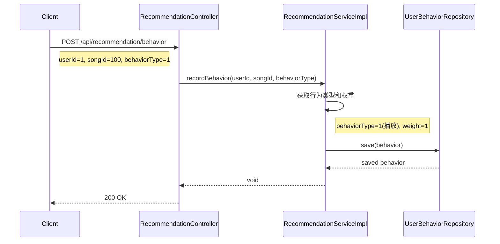
```mermaid
sequenceDiagram
    participant Client
    participant RecommendationController
    participant RecommendationServiceImpl
    participant UserBehaviorRepository

    Client->>RecommendationController: POST /api/recommendation/behavior
    Note right of Client: userId=1, songId=100, behaviorType=1
    RecommendationController->>RecommendationServiceImpl: recordBehavior(userId, songId, behaviorType)
    RecommendationServiceImpl->>RecommendationServiceImpl: 获取行为类型和权重
    Note right of RecommendationServiceImpl: behaviorType=1(播放), weight=1
    RecommendationServiceImpl->>UserBehaviorRepository: save(behavior)
    UserBehaviorRepository-->>RecommendationServiceImpl: saved behavior
    RecommendationServiceImpl-->>RecommendationController: void
    RecommendationController-->>Client: 200 OK
```

### 4.3 时序图 - 获取雷达歌单

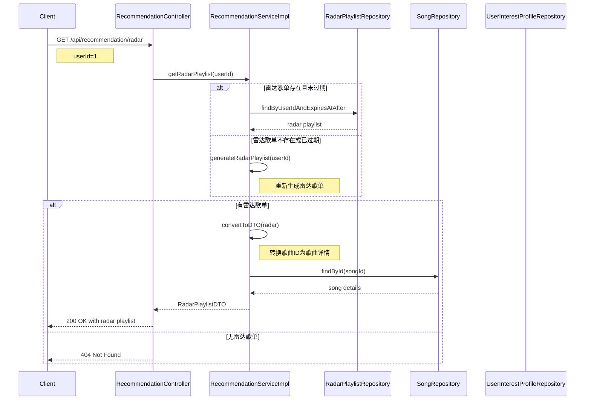
```mermaid
sequenceDiagram
    participant Client
    participant RecommendationController
    participant RecommendationServiceImpl
    participant RadarPlaylistRepository
    participant SongRepository
    participant UserInterestProfileRepository

    Client->>RecommendationController: GET /api/recommendation/radar
    Note right of Client: userId=1
    RecommendationController->>RecommendationServiceImpl: getRadarPlaylist(userId)

    alt 雷达歌单存在且未过期
        RecommendationServiceImpl->>RadarPlaylistRepository: findByUserIdAndExpiresAtAfter
        RadarPlaylistRepository-->>RecommendationServiceImpl: radar playlist
    else 雷达歌单不存在或已过期
        RecommendationServiceImpl->>RecommendationServiceImpl: generateRadarPlaylist(userId)
        Note right of RecommendationServiceImpl: 重新生成雷达歌单
    end

    alt 有雷达歌单
        RecommendationServiceImpl->>RecommendationServiceImpl: convertToDTO(radar)
        Note right of RecommendationServiceImpl: 转换歌曲ID为歌曲详情
        RecommendationServiceImpl->>SongRepository: findById(songId)
        SongRepository-->>RecommendationServiceImpl: song details
        RecommendationServiceImpl-->>RecommendationController: RadarPlaylistDTO
        RecommendationController-->>Client: 200 OK with radar playlist
    else 无雷达歌单
        RecommendationController-->>Client: 404 Not Found
    end
```

### 4.4 时序图 - 计算用户兴趣画像

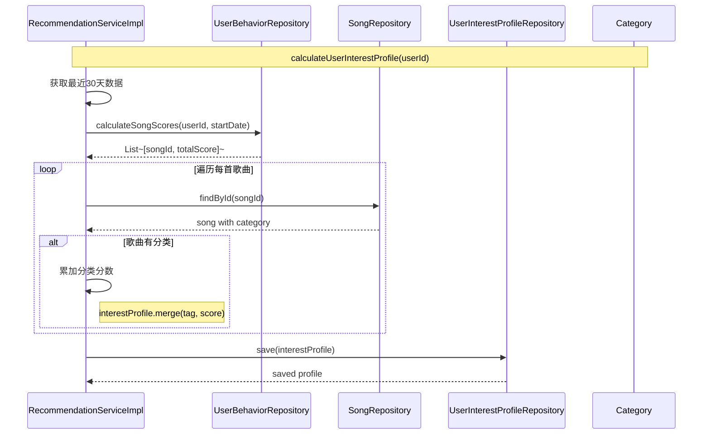
```mermaid
sequenceDiagram
    participant RecommendationServiceImpl
    participant UserBehaviorRepository
    participant SongRepository
    participant UserInterestProfileRepository
    participant Category

    Note over RecommendationServiceImpl,Category: calculateUserInterestProfile(userId)

    RecommendationServiceImpl->>RecommendationServiceImpl: 获取最近30天数据
    RecommendationServiceImpl->>UserBehaviorRepository: calculateSongScores(userId, startDate)
    UserBehaviorRepository-->>RecommendationServiceImpl: List~[songId, totalScore]~

    loop 遍历每首歌曲
        RecommendationServiceImpl->>SongRepository: findById(songId)
        SongRepository-->>RecommendationServiceImpl: song with category
        alt 歌曲有分类
            RecommendationServiceImpl->>RecommendationServiceImpl: 累加分类分数
            Note right of RecommendationServiceImpl: interestProfile.merge(tag, score)
        end
    end

    RecommendationServiceImpl->>UserInterestProfileRepository: save(interestProfile)
    UserInterestProfileRepository-->>RecommendationServiceImpl: saved profile
```

### 4.5 时序图 - 生成雷达歌单

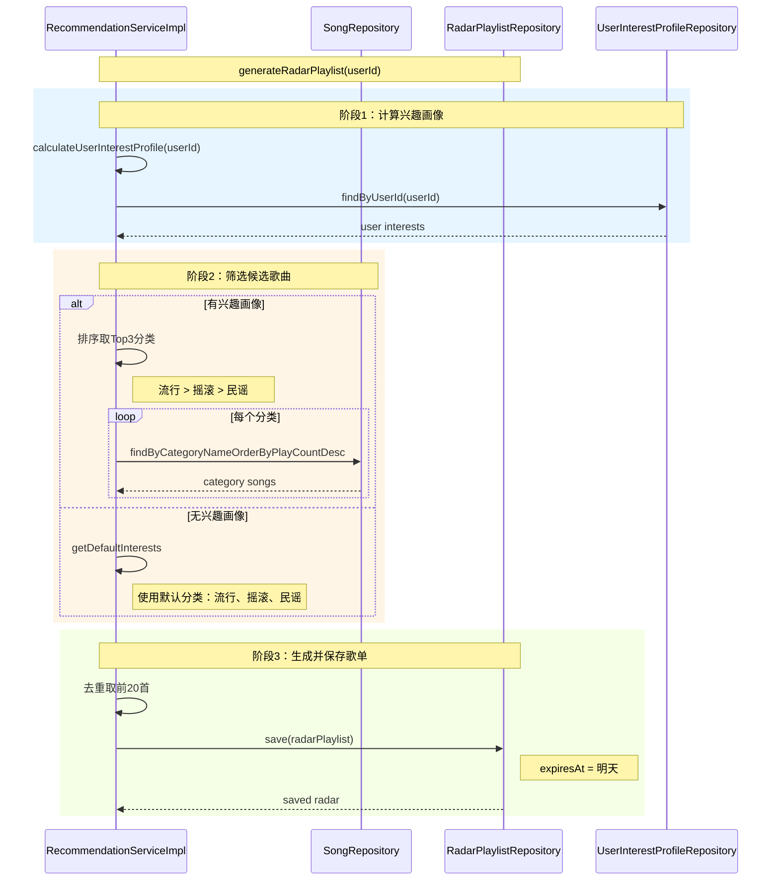
```mermaid
sequenceDiagram
    participant RecommendationServiceImpl
    participant SongRepository
    participant RadarPlaylistRepository
    participant UserInterestProfileRepository

    Note over RecommendationServiceImpl,RadarPlaylistRepository: generateRadarPlaylist(userId)

    rect rgb(230, 245, 255)
        Note over RecommendationServiceImpl,UserInterestProfileRepository: 阶段1：计算兴趣画像
        RecommendationServiceImpl->>RecommendationServiceImpl: calculateUserInterestProfile(userId)
        RecommendationServiceImpl->>UserInterestProfileRepository: findByUserId(userId)
        UserInterestProfileRepository-->>RecommendationServiceImpl: user interests
    end

    rect rgb(255, 245, 230)
        Note over RecommendationServiceImpl,SongRepository: 阶段2：筛选候选歌曲
        alt 有兴趣画像
            RecommendationServiceImpl->>RecommendationServiceImpl: 排序取Top3分类
            Note right of RecommendationServiceImpl: 流行 > 摇滚 > 民谣
            loop 每个分类
                RecommendationServiceImpl->>SongRepository: findByCategoryNameOrderByPlayCountDesc
                SongRepository-->>RecommendationServiceImpl: category songs
            end
        else 无兴趣画像
            RecommendationServiceImpl->>RecommendationServiceImpl: getDefaultInterests
            Note right of RecommendationServiceImpl: 使用默认分类：流行、摇滚、民谣
        end
    end

    rect rgb(245, 255, 230)
        Note over RecommendationServiceImpl,RadarPlaylistRepository: 阶段3：生成并保存歌单
        RecommendationServiceImpl->>RecommendationServiceImpl: 去重取前20首
        RecommendationServiceImpl->>RadarPlaylistRepository: save(radarPlaylist)
        Note right of RadarPlaylistRepository: expiresAt = 明天
        RadarPlaylistRepository-->>RecommendationServiceImpl: saved radar
    end
```

### 4.6 时序图 - 每日雷达歌单定时任务

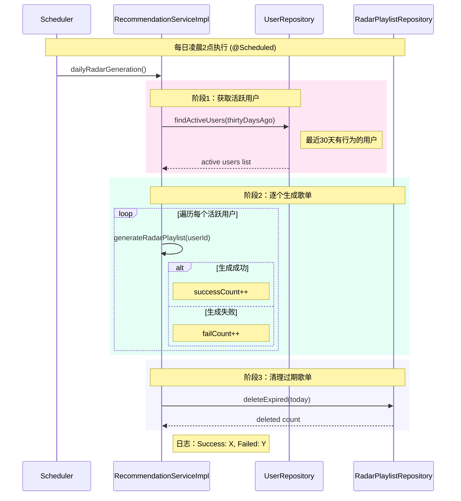
```mermaid
sequenceDiagram
    participant Scheduler
    participant RecommendationServiceImpl
    participant UserRepository
    participant RecommendationServiceImpl
    participant RadarPlaylistRepository

    Note over Scheduler,RadarPlaylistRepository: 每日凌晨2点执行 (@Scheduled)

    Scheduler->>RecommendationServiceImpl: dailyRadarGeneration()

    rect rgb(255, 230, 245)
        Note over RecommendationServiceImpl,UserRepository: 阶段1：获取活跃用户
        RecommendationServiceImpl->>UserRepository: findActiveUsers(thirtyDaysAgo)
        Note right of UserRepository: 最近30天有行为的用户
        UserRepository-->>RecommendationServiceImpl: active users list
    end

    rect rgb(230, 255, 245)
        Note over RecommendationServiceImpl,RadarPlaylistRepository: 阶段2：逐个生成歌单
        loop 遍历每个活跃用户
            RecommendationServiceImpl->>RecommendationServiceImpl: generateRadarPlaylist(userId)
            alt 生成成功
                Note right of RecommendationServiceImpl: successCount++
            else 生成失败
                Note right of RecommendationServiceImpl: failCount++
            end
        end
    end

    rect rgb(245, 245, 255)
        Note over RecommendationServiceImpl,RadarPlaylistRepository: 阶段3：清理过期歌单
        RecommendationServiceImpl->>RadarPlaylistRepository: deleteExpired(today)
        RadarPlaylistRepository-->>RecommendationServiceImpl: deleted count
    end

    Note right of RecommendationServiceImpl: 日志：Success: X, Failed: Y
```

---

## 5. AI 音乐模块

### 5.1 类图

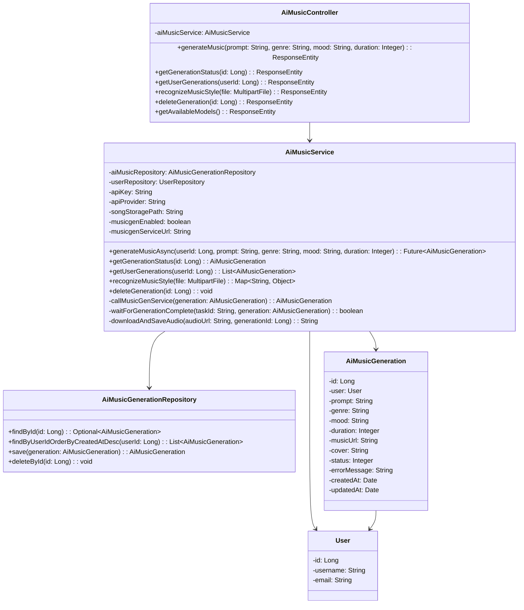
```mermaid
classDiagram
    class AiMusicController {
        -aiMusicService: AiMusicService
        +generateMusic(prompt: String, genre: String, mood: String, duration: Integer): ResponseEntity
        +getGenerationStatus(id: Long): ResponseEntity
        +getUserGenerations(userId: Long): ResponseEntity
        +recognizeMusicStyle(file: MultipartFile): ResponseEntity
        +deleteGeneration(id: Long): ResponseEntity
        +getAvailableModels(): ResponseEntity
    }

    class AiMusicService {
        -aiMusicRepository: AiMusicGenerationRepository
        -userRepository: UserRepository
        -apiKey: String
        -apiProvider: String
        -songStoragePath: String
        -musicgenEnabled: boolean
        -musicgenServiceUrl: String
        +generateMusicAsync(userId: Long, prompt: String, genre: String, mood: String, duration: Integer): Future~AiMusicGeneration~
        +getGenerationStatus(id: Long): AiMusicGeneration
        +getUserGenerations(userId: Long): List~AiMusicGeneration~
        +recognizeMusicStyle(file: MultipartFile): Map~String, Object~
        +deleteGeneration(id: Long): void
        -callMusicGenService(generation: AiMusicGeneration): AiMusicGeneration
        -waitForGenerationComplete(taskId: String, generation: AiMusicGeneration): boolean
        -downloadAndSaveAudio(audioUrl: String, generationId: Long): String
    }

    class AiMusicGenerationRepository {
        +findById(id: Long): Optional~AiMusicGeneration~
        +findByUserIdOrderByCreatedAtDesc(userId: Long): List~AiMusicGeneration~
        +save(generation: AiMusicGeneration): AiMusicGeneration
        +deleteById(id: Long): void
    }

    class AiMusicGeneration {
        -id: Long
        -user: User
        -prompt: String
        -genre: String
        -mood: String
        -duration: Integer
        -musicUrl: String
        -cover: String
        -status: Integer
        -errorMessage: String
        -createdAt: Date
        -updatedAt: Date
    }

    class User {
        -id: Long
        -username: String
        -email: String
    }

    AiMusicController --> AiMusicService
    AiMusicService --> AiMusicGenerationRepository
    AiMusicService --> AiMusicGeneration
    AiMusicService --> User
    AiMusicGeneration --> User
```

### 5.2 时序图 - AI 音乐生成（异步任务）

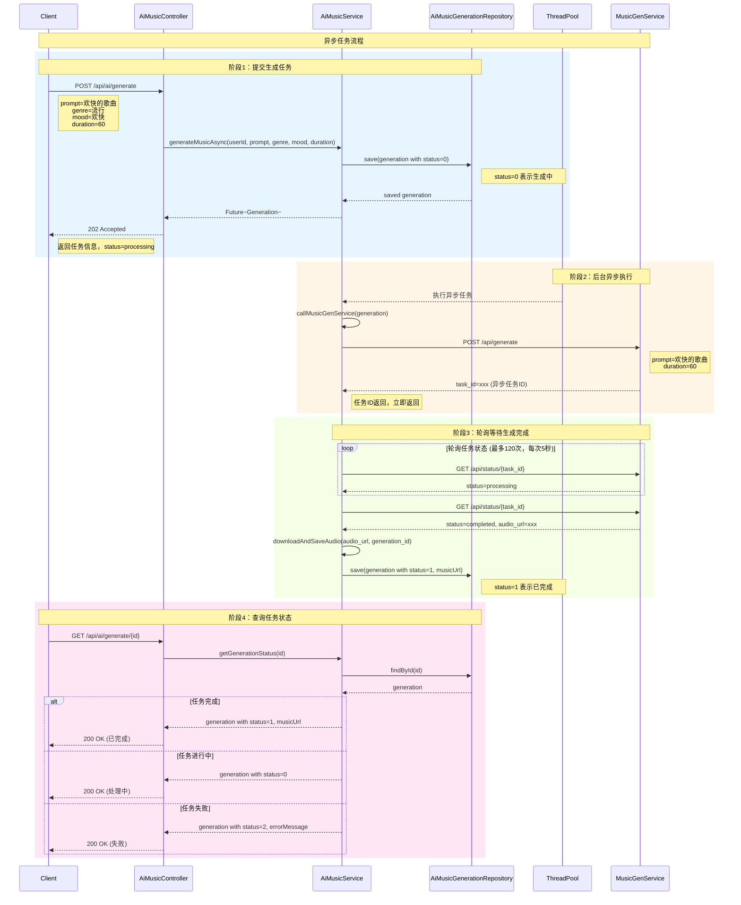
```mermaid
sequenceDiagram
    participant Client
    participant AiMusicController
    participant AiMusicService
    participant AiMusicGenerationRepository
    participant ThreadPool
    participant MusicGenService

    Note over Client,MusicGenService: 异步任务流程

    rect rgb(230, 245, 255)
        Note over Client,AiMusicGenerationRepository: 阶段1：提交生成任务
        Client->>AiMusicController: POST /api/ai/generate
        Note right of Client: prompt=欢快的歌曲<br/>genre=流行<br/>mood=欢快<br/>duration=60
        AiMusicController->>AiMusicService: generateMusicAsync(userId, prompt, genre, mood, duration)
        AiMusicService->>AiMusicGenerationRepository: save(generation with status=0)
        Note right of AiMusicGenerationRepository: status=0 表示生成中
        AiMusicGenerationRepository-->>AiMusicService: saved generation
        AiMusicService-->>AiMusicController: Future~Generation~
        AiMusicController-->>Client: 202 Accepted
        Note right of Client: 返回任务信息，status=processing
    end

    rect rgb(255, 245, 230)
        Note over ThreadPool,MusicGenService: 阶段2：后台异步执行
        ThreadPool-->>AiMusicService: 执行异步任务
        AiMusicService->>AiMusicService: callMusicGenService(generation)
        AiMusicService->>MusicGenService: POST /api/generate
        Note right of MusicGenService: prompt=欢快的歌曲<br/>duration=60
        MusicGenService-->>AiMusicService: task_id=xxx (异步任务ID)
        Note right of AiMusicService: 任务ID返回，立即返回
    end

    rect rgb(245, 255, 230)
        Note over AiMusicService,MusicGenService: 阶段3：轮询等待生成完成
        loop 轮询任务状态 (最多120次，每次5秒)
            AiMusicService->>MusicGenService: GET /api/status/{task_id}
            MusicGenService-->>AiMusicService: status=processing
        end
        AiMusicService->>MusicGenService: GET /api/status/{task_id}
        MusicGenService-->>AiMusicService: status=completed, audio_url=xxx
        AiMusicService->>AiMusicService: downloadAndSaveAudio(audio_url, generation_id)
        AiMusicService->>AiMusicGenerationRepository: save(generation with status=1, musicUrl)
        Note right of AiMusicGenerationRepository: status=1 表示已完成
    end

    rect rgb(255, 230, 245)
        Note over Client,AiMusicGenerationRepository: 阶段4：查询任务状态
        Client->>AiMusicController: GET /api/ai/generate/{id}
        AiMusicController->>AiMusicService: getGenerationStatus(id)
        AiMusicService->>AiMusicGenerationRepository: findById(id)
        AiMusicGenerationRepository-->>AiMusicService: generation
        alt 任务完成
            AiMusicService-->>AiMusicController: generation with status=1, musicUrl
            AiMusicController-->>Client: 200 OK (已完成)
        else 任务进行中
            AiMusicService-->>AiMusicController: generation with status=0
            AiMusicController-->>Client: 200 OK (处理中)
        else 任务失败
            AiMusicService-->>AiMusicController: generation with status=2, errorMessage
            AiMusicController-->>Client: 200 OK (失败)
        end
    end
```

### 5.3 时序图 - 曲风识别

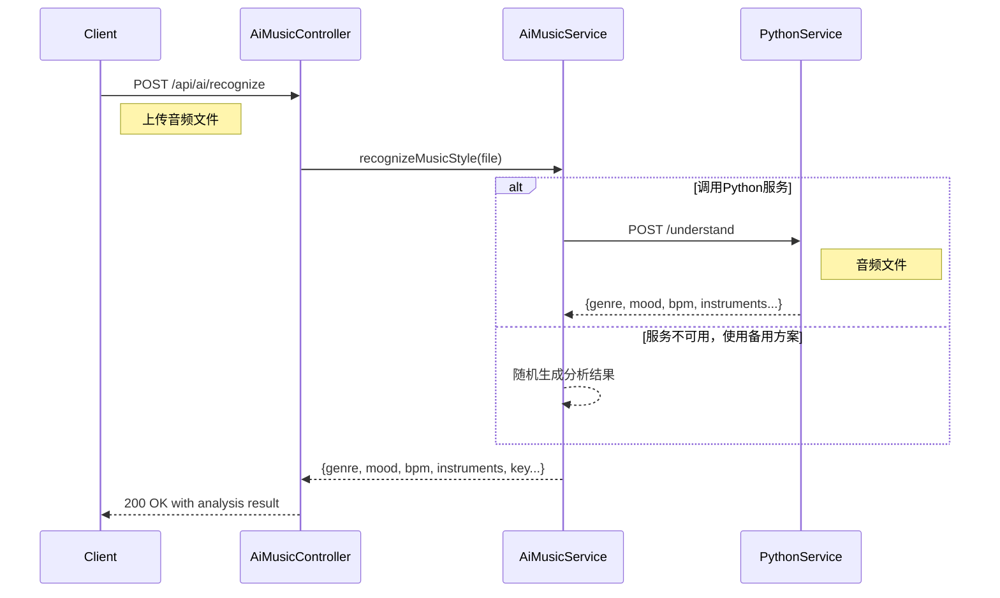
```mermaid
sequenceDiagram
    participant Client
    participant AiMusicController
    participant AiMusicService
    participant PythonService

    Client->>AiMusicController: POST /api/ai/recognize
    Note right of Client: 上传音频文件
    AiMusicController->>AiMusicService: recognizeMusicStyle(file)
    
    alt 调用Python服务
        AiMusicService->>PythonService: POST /understand
        Note right of PythonService: 音频文件
        PythonService-->>AiMusicService: {genre, mood, bpm, instruments...}
    else 服务不可用，使用备用方案
        AiMusicService-->>AiMusicService: 随机生成分析结果
    end
    
    AiMusicService-->>AiMusicController: {genre, mood, bpm, instruments, key...}
    AiMusicController-->>Client: 200 OK with analysis result
```

---

## 6. 社交模块

### 6.1 类图

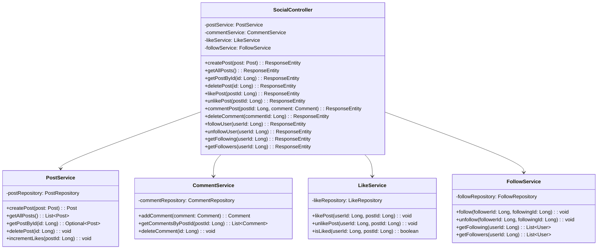
```mermaid
classDiagram
    class SocialController {
        -postService: PostService
        -commentService: CommentService
        -likeService: LikeService
        -followService: FollowService
        +createPost(post: Post): ResponseEntity
        +getAllPosts(): ResponseEntity
        +getPostById(id: Long): ResponseEntity
        +deletePost(id: Long): ResponseEntity
        +likePost(postId: Long): ResponseEntity
        +unlikePost(postId: Long): ResponseEntity
        +commentPost(postId: Long, comment: Comment): ResponseEntity
        +deleteComment(commentId: Long): ResponseEntity
        +followUser(userId: Long): ResponseEntity
        +unfollowUser(userId: Long): ResponseEntity
        +getFollowing(userId: Long): ResponseEntity
        +getFollowers(userId: Long): ResponseEntity
    }

    class PostService {
        -postRepository: PostRepository
        +createPost(post: Post): Post
        +getAllPosts(): List~Post~
        +getPostById(id: Long): Optional~Post~
        +deletePost(id: Long): void
        +incrementLikes(postId: Long): void
    }

    class CommentService {
        -commentRepository: CommentRepository
        +addComment(comment: Comment): Comment
        +getCommentsByPostId(postId: Long): List~Comment~
        +deleteComment(id: Long): void
    }

    class LikeService {
        -likeRepository: LikeRepository
        +likePost(userId: Long, postId: Long): void
        +unlikePost(userId: Long, postId: Long): void
        +isLiked(userId: Long, postId: Long): boolean
    }

    class FollowService {
        -followRepository: FollowRepository
        +follow(followerId: Long, followingId: Long): void
        +unfollow(followerId: Long, followingId: Long): void
        +getFollowing(userId: Long): List~User~
        +getFollowers(userId: Long): List~User~
    }

    SocialController --> PostService
    SocialController --> CommentService
    SocialController --> LikeService
    SocialController --> FollowService
```

---

## 7. 排行榜模块

### 7.1 类图

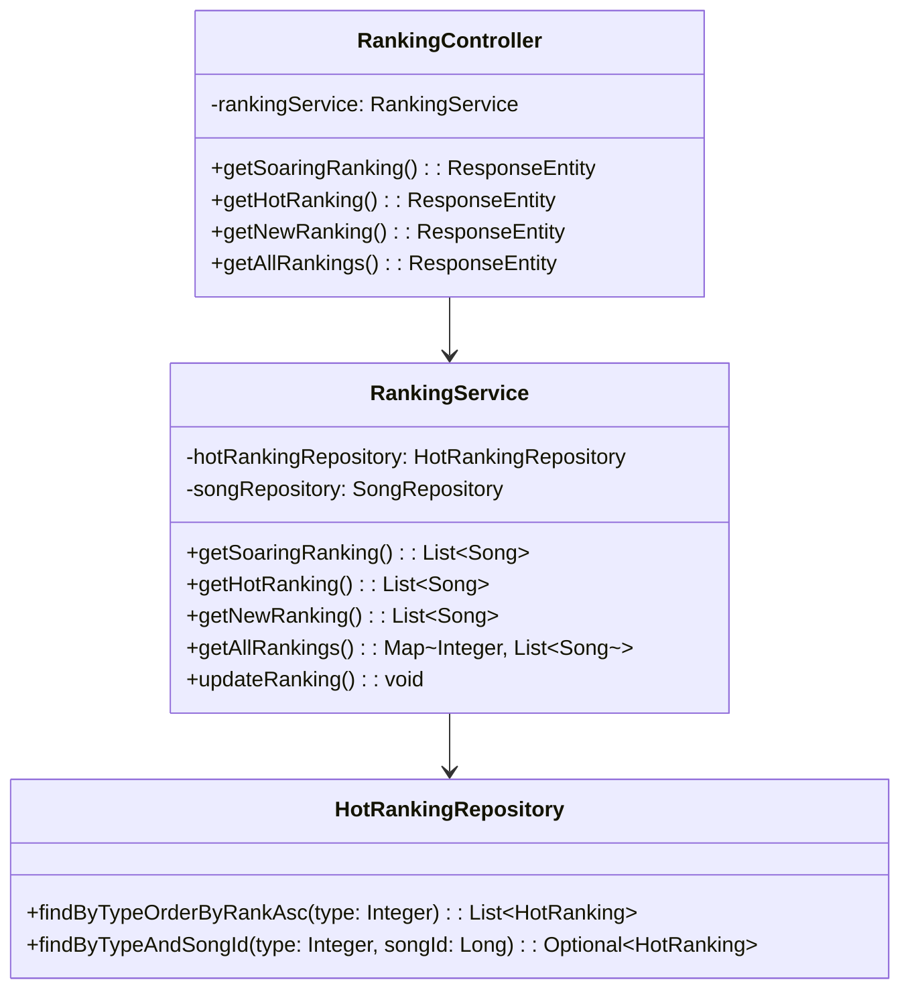
```mermaid
classDiagram
    class RankingController {
        -rankingService: RankingService
        +getSoaringRanking(): ResponseEntity
        +getHotRanking(): ResponseEntity
        +getNewRanking(): ResponseEntity
        +getAllRankings(): ResponseEntity
    }

    class RankingService {
        -hotRankingRepository: HotRankingRepository
        -songRepository: SongRepository
        +getSoaringRanking(): List~Song~
        +getHotRanking(): List~Song~
        +getNewRanking(): List~Song~
        +getAllRankings(): Map~Integer, List~Song~~
        +updateRanking(): void
    }

    class HotRankingRepository {
        +findByTypeOrderByRankAsc(type: Integer): List~HotRanking~
        +findByTypeAndSongId(type: Integer, songId: Long): Optional~HotRanking~
    }

    RankingController --> RankingService
    RankingService --> HotRankingRepository
```

---

## 8. 听歌报告模块

### 8.1 类图

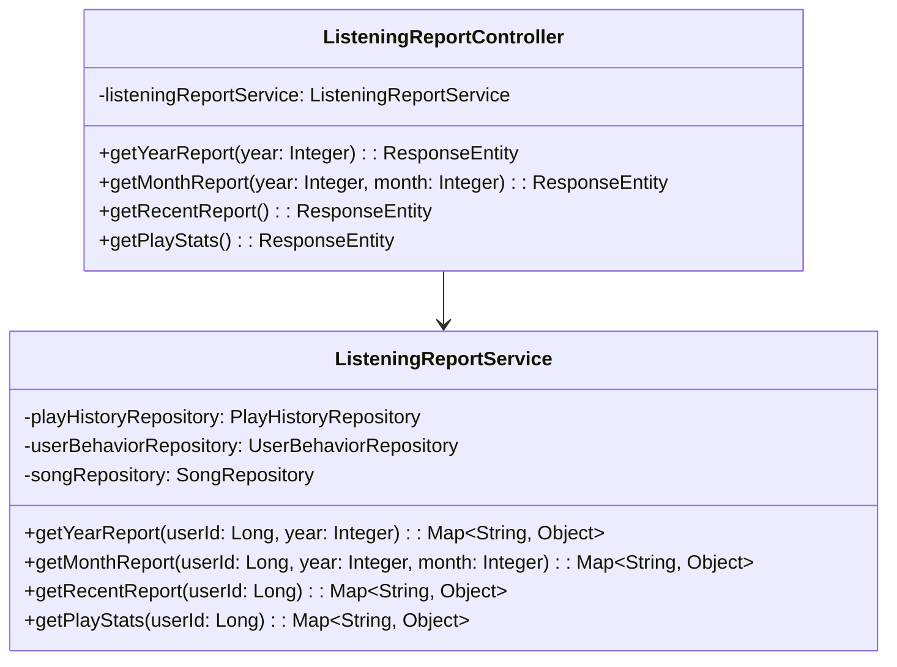
```mermaid
classDiagram
    class ListeningReportController {
        -listeningReportService: ListeningReportService
        +getYearReport(year: Integer): ResponseEntity
        +getMonthReport(year: Integer, month: Integer): ResponseEntity
        +getRecentReport(): ResponseEntity
        +getPlayStats(): ResponseEntity
    }

    class ListeningReportService {
        -playHistoryRepository: PlayHistoryRepository
        -userBehaviorRepository: UserBehaviorRepository
        -songRepository: SongRepository
        +getYearReport(userId: Long, year: Integer): Map~String, Object~
        +getMonthReport(userId: Long, year: Integer, month: Integer): Map~String, Object~
        +getRecentReport(userId: Long): Map~String, Object~
        +getPlayStats(userId: Long): Map~String, Object~
    }

    ListeningReportController --> ListeningReportService
```

---

## 9. 管理员模块

### 9.1 类图

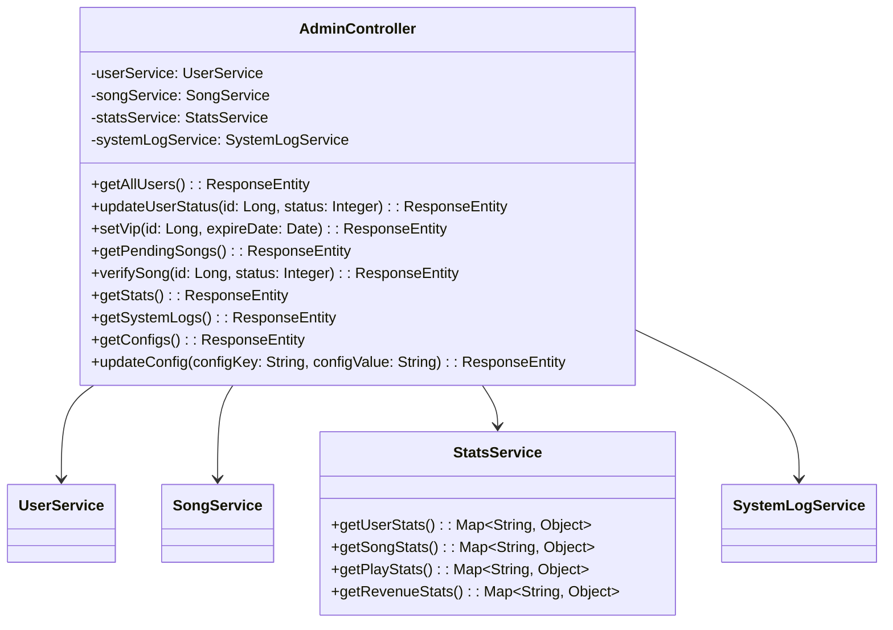
```mermaid
classDiagram
    class AdminController {
        -userService: UserService
        -songService: SongService
        -statsService: StatsService
        -systemLogService: SystemLogService
        +getAllUsers(): ResponseEntity
        +updateUserStatus(id: Long, status: Integer): ResponseEntity
        +setVip(id: Long, expireDate: Date): ResponseEntity
        +getPendingSongs(): ResponseEntity
        +verifySong(id: Long, status: Integer): ResponseEntity
        +getStats(): ResponseEntity
        +getSystemLogs(): ResponseEntity
        +getConfigs(): ResponseEntity
        +updateConfig(configKey: String, configValue: String): ResponseEntity
    }

    class StatsService {
        +getUserStats(): Map~String, Object~
        +getSongStats(): Map~String, Object~
        +getPlayStats(): Map~String, Object~
        +getRevenueStats(): Map~String, Object~
    }

    AdminController --> UserService
    AdminController --> SongService
    AdminController --> StatsService
    AdminController --> SystemLogService
```

---

**文档版本**：1.0
**更新日期**：2026-04-12