# Fly Music 类图与时序图

> 使用 Mermaid 渲染，可在支持 Mermaid 的编辑器中查看

---

## 1. 用户模块

### 1.1 类图

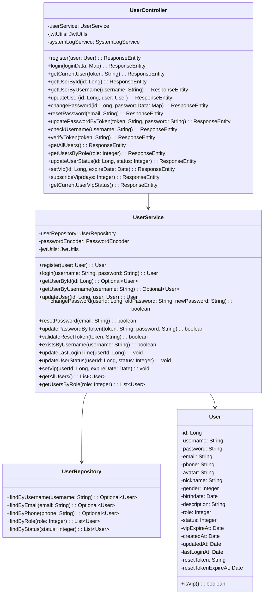
```mermaid
classDiagram
    class UserController {
        -userService: UserService
        -jwtUtils: JwtUtils
        -systemLogService: SystemLogService
        +register(user: User): ResponseEntity
        +login(loginData: Map): ResponseEntity
        +getCurrentUser(token: String): ResponseEntity
        +getUserById(id: Long): ResponseEntity
        +getUserByUsername(username: String): ResponseEntity
        +updateUser(id: Long, user: User): ResponseEntity
        +changePassword(id: Long, passwordData: Map): ResponseEntity
        +resetPassword(email: String): ResponseEntity
        +updatePasswordByToken(token: String, password: String): ResponseEntity
        +checkUsername(username: String): ResponseEntity
        +verifyToken(token: String): ResponseEntity
        +getAllUsers(): ResponseEntity
        +getUsersByRole(role: Integer): ResponseEntity
        +updateUserStatus(id: Long, status: Integer): ResponseEntity
        +setVip(id: Long, expireDate: Date): ResponseEntity
        +subscribeVip(days: Integer): ResponseEntity
        +getCurrentUserVipStatus(): ResponseEntity
    }

    class UserService {
        -userRepository: UserRepository
        -passwordEncoder: PasswordEncoder
        -jwtUtils: JwtUtils
        +register(user: User): User
        +login(username: String, password: String): User
        +getUserById(id: Long): Optional~User~
        +getUserByUsername(username: String): Optional~User~
        +updateUser(id: Long, user: User): User
        +changePassword(userId: Long, oldPassword: String, newPassword: String): boolean
        +resetPassword(email: String): boolean
        +updatePasswordByToken(token: String, password: String): boolean
        +validateResetToken(token: String): boolean
        +existsByUsername(username: String): boolean
        +updateLastLoginTime(userId: Long): void
        +updateUserStatus(userId: Long, status: Integer): void
        +setVip(userId: Long, expireDate: Date): void
        +getAllUsers(): List~User~
        +getUsersByRole(role: Integer): List~User~
    }

    class UserRepository {
        +findByUsername(username: String): Optional~User~
        +findByEmail(email: String): Optional~User~
        +findByPhone(phone: String): Optional~User~
        +findByRole(role: Integer): List~User~
        +findByStatus(status: Integer): List~User~
    }

    class User {
        -id: Long
        -username: String
        -password: String
        -email: String
        -phone: String
        -avatar: String
        -nickname: String
        -gender: Integer
        -birthdate: Date
        -description: String
        -role: Integer
        -status: Integer
        -vipExpireAt: Date
        -createdAt: Date
        -updatedAt: Date
        -lastLoginAt: Date
        -resetToken: String
        -resetTokenExpireAt: Date
        +isVip(): boolean
    }

    UserController --> UserService
    UserService --> UserRepository
    UserService --> User
```

### 1.2 时序图 - 用户注册

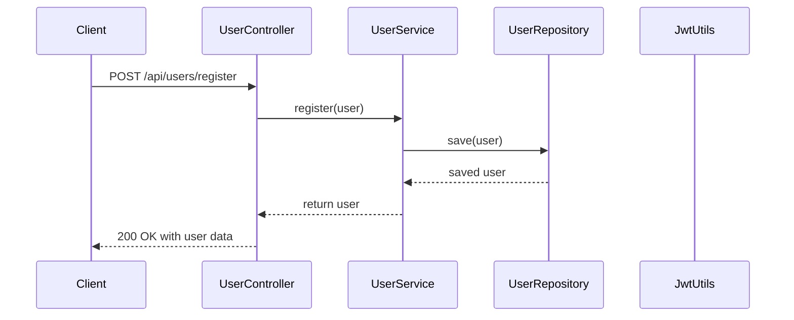
```mermaid
sequenceDiagram
    participant Client
    participant UserController
    participant UserService
    participant UserRepository
    participant JwtUtils

    Client->>UserController: POST /api/users/register
    UserController->>UserService: register(user)
    UserService->>UserRepository: save(user)
    UserRepository-->>UserService: saved user
    UserService-->>UserController: return user
    UserController-->>Client: 200 OK with user data
```

### 1.3 时序图 - 用户登录

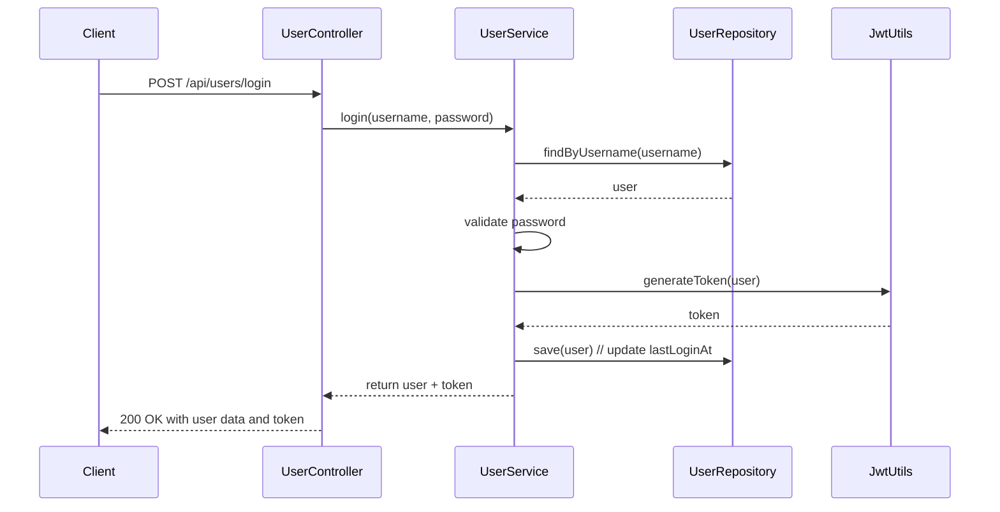
```mermaid
sequenceDiagram
    participant Client
    participant UserController
    participant UserService
    participant UserRepository
    participant JwtUtils

    Client->>UserController: POST /api/users/login
    UserController->>UserService: login(username, password)
    UserService->>UserRepository: findByUsername(username)
    UserRepository-->>UserService: user
    UserService->>UserService: validate password
    UserService->>JwtUtils: generateToken(user)
    JwtUtils-->>UserService: token
    UserService->>UserRepository: save(user) // update lastLoginAt
    UserService-->>UserController: return user + token
    UserController-->>Client: 200 OK with user data and token
```

---

## 2. 歌曲模块

### 2.1 类图

```mermaid
classDiagram
    class SongController {
        -songService: SongService
        -songStorageService: SongStorageService
        -coverExtractService: CoverExtractService
        -systemLogService: SystemLogService
        -jwtUtils: JwtUtils
        +getAllSongs(): ResponseEntity
        +getSongById(id: Long): ResponseEntity
        +createSong(song: Song): ResponseEntity
        +updateSong(id: Long, song: Song): ResponseEntity
        +deleteSong(id: Long): ResponseEntity
        +getSongsByCategory(categoryId: Long, page: int, size: int): ResponseEntity
        +getSongsByArtist(artistId: Long): ResponseEntity
        +getSongsByAlbum(albumId: Long): ResponseEntity
        +searchSongs(keyword: String): ResponseEntity
        +getPopularSongs(limit: int): ResponseEntity
        +getLatestSongs(limit: int): ResponseEntity
        +getRecommendedSongs(userId: Long, limit: int): ResponseEntity
        +playSong(id: Long): ResponseEntity
        +approveSong(id: Long): ResponseEntity
        +rejectSong(id: Long): ResponseEntity
        +extractMetadata(id: Long): ResponseEntity
        +getSongsByPage(page: int, size: int, status: Integer): ResponseEntity
        +uploadSong(file: MultipartFile, title: String): ResponseEntity
    }

    class SongService {
        -songRepository: SongRepository
        -songHotScoreService: SongHotScoreService
        -coverExtractService: CoverExtractService
        +getAllSongs(): List~Song~
        +getSongById(id: Long): Optional~Song~
        +saveSong(song: Song): Song
        +updateSong(id: Long, song: Song): Song
        +deleteSong(id: Long): void
        +getSongsByCategoryIdPage(categoryId: Long, pageable: Pageable): Page~Song~
        +getSongsByArtistId(artistId: Long): List~Song~
        +getSongsByAlbumId(albumId: Long): List~Song~
        +searchSongs(keyword: String): List~Song~
        +getPopularSongs(limit: int): List~Song~
        +getLatestSongs(limit: int): List~Song~
        +getRecommendedSongs(userId: Long, limit: int): List~Song~
        +incrementPlayCount(id: Long): void
        +approveSong(id: Long): void
        +rejectSong(id: Long): void
    }

    class SongStorageService {
        -storagePath: String
        -songUrlPrefix: String
        +storeSong(file: MultipartFile): String
        +getSongPath(filename: String): Path
        +deleteSong(url: String): void
    }

    class CoverExtractService {
        -coverPath: String
        -coverUrlPrefix: String
        +extractCoverFromMp3(filename: String, timestamp: Long): String
        +getCoverPath(): String
    }

    class SongRepository {
        +findByTitleContaining(keyword: String): List~Song~
        +findByAlbumId(albumId: Long): List~Song~
        +findByCategoryId(categoryId: Long): List~Song~
        +findByStatus(status: Integer): List~Song~
        +findByUserId(userId: Long): List~Song~
    }

    class Song {
        -id: Long
        -title: String
        -duration: Integer
        -url: String
        -lyrics: String
        -cover: String
        -album: Album
        -category: Category
        -playCount: Long
        -downloadCount: Integer
        -shareCount: Integer
        -status: Integer
    }

    SongController --> SongService
    SongController --> SongStorageService
    SongController --> CoverExtractService
    SongService --> SongRepository
    SongService --> Song
```

### 2.2 时序图 - 歌曲上传

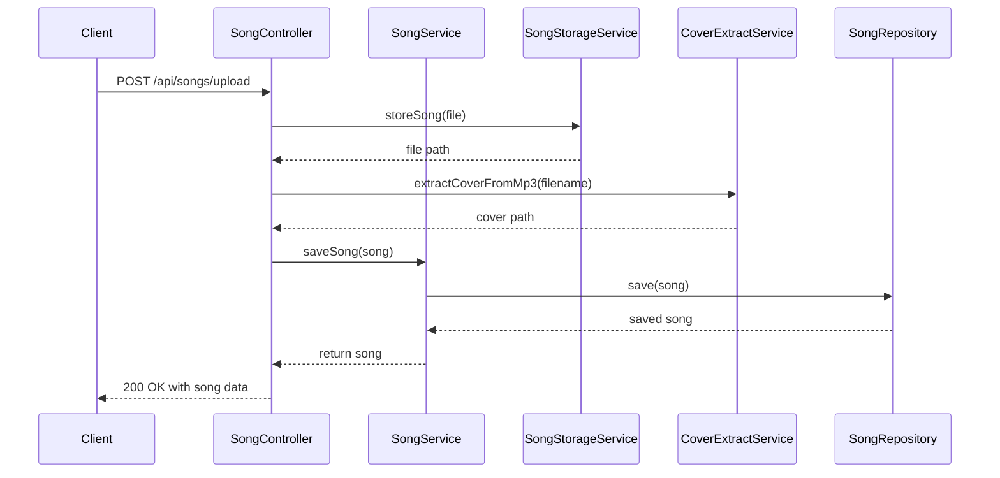
```mermaid
sequenceDiagram
    participant Client
    participant SongController
    participant SongService
    participant SongStorageService
    participant CoverExtractService
    participant SongRepository

    Client->>SongController: POST /api/songs/upload
    SongController->>SongStorageService: storeSong(file)
    SongStorageService-->>SongController: file path
    SongController->>CoverExtractService: extractCoverFromMp3(filename)
    CoverExtractService-->>SongController: cover path
    SongController->>SongService: saveSong(song)
    SongService->>SongRepository: save(song)
    SongRepository-->>SongService: saved song
    SongService-->>SongController: return song
    SongController-->>Client: 200 OK with song data
```

---

## 3. 歌单模块

### 3.1 类图

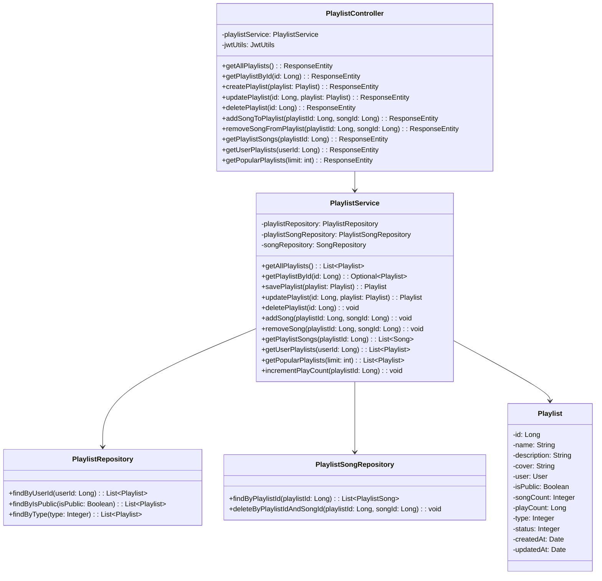
```mermaid
classDiagram
    class PlaylistController {
        -playlistService: PlaylistService
        -jwtUtils: JwtUtils
        +getAllPlaylists(): ResponseEntity
        +getPlaylistById(id: Long): ResponseEntity
        +createPlaylist(playlist: Playlist): ResponseEntity
        +updatePlaylist(id: Long, playlist: Playlist): ResponseEntity
        +deletePlaylist(id: Long): ResponseEntity
        +addSongToPlaylist(playlistId: Long, songId: Long): ResponseEntity
        +removeSongFromPlaylist(playlistId: Long, songId: Long): ResponseEntity
        +getPlaylistSongs(playlistId: Long): ResponseEntity
        +getUserPlaylists(userId: Long): ResponseEntity
        +getPopularPlaylists(limit: int): ResponseEntity
    }

    class PlaylistService {
        -playlistRepository: PlaylistRepository
        -playlistSongRepository: PlaylistSongRepository
        -songRepository: SongRepository
        +getAllPlaylists(): List~Playlist~
        +getPlaylistById(id: Long): Optional~Playlist~
        +savePlaylist(playlist: Playlist): Playlist
        +updatePlaylist(id: Long, playlist: Playlist): Playlist
        +deletePlaylist(id: Long): void
        +addSong(playlistId: Long, songId: Long): void
        +removeSong(playlistId: Long, songId: Long): void
        +getPlaylistSongs(playlistId: Long): List~Song~
        +getUserPlaylists(userId: Long): List~Playlist~
        +getPopularPlaylists(limit: int): List~Playlist~
        +incrementPlayCount(playlistId: Long): void
    }

    class PlaylistRepository {
        +findByUserId(userId: Long): List~Playlist~
        +findByIsPublic(isPublic: Boolean): List~Playlist~
        +findByType(type: Integer): List~Playlist~
    }

    class PlaylistSongRepository {
        +findByPlaylistId(playlistId: Long): List~PlaylistSong~
        +deleteByPlaylistIdAndSongId(playlistId: Long, songId: Long): void
    }

    class Playlist {
        -id: Long
        -name: String
        -description: String
        -cover: String
        -user: User
        -isPublic: Boolean
        -songCount: Integer
        -playCount: Long
        -type: Integer
        -status: Integer
        -createdAt: Date
        -updatedAt: Date
    }

    PlaylistController --> PlaylistService
    PlaylistService --> PlaylistRepository
    PlaylistService --> PlaylistSongRepository
    PlaylistService --> Playlist
```

### 3.2 时序图 - 添加歌曲到歌单

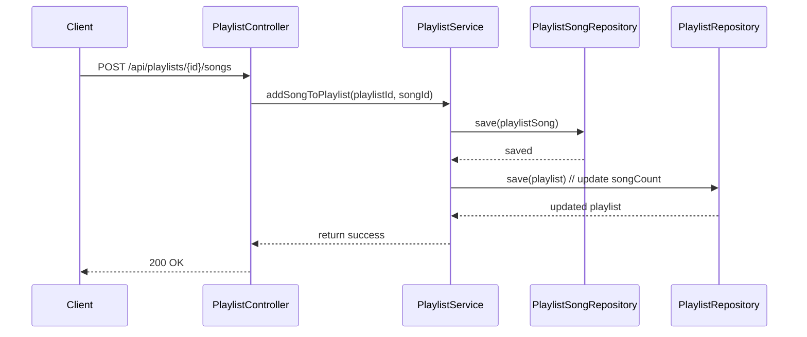
```mermaid
sequenceDiagram
    participant Client
    participant PlaylistController
    participant PlaylistService
    participant PlaylistSongRepository
    participant PlaylistRepository

    Client->>PlaylistController: POST /api/playlists/{id}/songs
    PlaylistController->>PlaylistService: addSongToPlaylist(playlistId, songId)
    PlaylistService->>PlaylistSongRepository: save(playlistSong)
    PlaylistSongRepository-->>PlaylistService: saved
    PlaylistService->>PlaylistRepository: save(playlist) // update songCount
    PlaylistRepository-->>PlaylistService: updated playlist
    PlaylistService-->>PlaylistController: return success
    PlaylistController-->>Client: 200 OK
```

---

## 4. 推荐模块

### 4.1 类图

**类关系说明：**

本模块采用标准的 MVC + Repository 分层架构设计，类与类之间的关系采用面向接口编程和依赖注入的设计模式。

**继承关系**：RecommendationServiceImpl 实现了 RecommendationService 接口。接口定义了业务方法规范，实现类负责具体的业务逻辑实现。这种设计遵循了面向接口编程的原则，使得业务逻辑的实现可以被替换，便于后期扩展和单元测试。

**依赖关系**：RecommendationController 依赖 RecommendationService 接口，而不直接依赖实现类。控制层通过接口调用服务层，实现了控制层与服务层的解耦。当服务实现类发生变更时，控制器层无需修改，降低了代码耦合度。

**关联关系**：RecommendationServiceImpl 通过依赖注入的方式关联了多个组件，包括 UserBehaviorRepository、UserInterestProfileRepository、RadarPlaylistRepository、SongRepository、UserRepository 以及 ObjectMapper。这些组件分别负责用户行为数据持久化、用户兴趣画像持久化、雷达歌单持久化、歌曲数据查询、用户数据查询以及 JSON 序列化反序列化功能。

**实体继承**：UserBehavior、RadarPlaylist、UserInterestProfile 等实体类都继承自 JPA 的 BaseEntity（隐式），包含公共字段 id、createdAt、updatedAt。

**数据传输**：服务实现类依赖 DTO（Data Transfer Object）进行数据传输，包括 RadarPlaylistDTO、SongDTO、UserInterestDTO。DTO 用于封装响应数据，与前端进行数据交换，同时隐藏内部实体结构。

**数据流向**：请求流程从客户端发起，经过 Controller 接收请求，调用 Service 层处理业务逻辑，Service 层调用 Repository 进行数据持久化操作，最终到达数据库。响应流程则相反，从数据库查询数据，经过 Entity 封装，Repository 返回，Service 处理后转换为 DTO，最后由 Controller 返回给客户端。

**各层职责**：控制层负责接收并解析客户端 HTTP 请求、参数校验、调用 Service 层方法、封装响应结果以及处理异常。服务层接口定义业务接口规范和声明业务方法签名，不涉及具体实现。服务层实现类负责实现核心业务逻辑、处理业务规则、协调多个 Repository、事务管理以及异常处理。持久化层负责数据增删改查、定义数据访问方法和 JPA 查询方法。实体层负责映射数据库表、定义实体属性和表关系。数据传输层负责封装响应数据、数据格式转换和隐藏内部结构。

**类图结构：**

```mermaid
classDiagram
    class RecommendationController {
        -recommendationService: RecommendationService
        +recordBehavior(userId: Long, songId: Long, behaviorType: Integer): ResponseEntity
        +getUserInterestProfile(userId: Long): ResponseEntity
        +getRadarPlaylist(userId: Long): ResponseEntity
        +getHotRecommendations(limit: int): ResponseEntity
        +getNewSongRecommendations(limit: int): ResponseEntity
        +getSimilarSongs(songId: Long, limit: int): ResponseEntity
        +getCategoryRecommendations(categoryId: Long, limit: int): ResponseEntity
    }

    class RecommendationServiceImpl {
        -userBehaviorRepository: UserBehaviorRepository
        -userInterestProfileRepository: UserInterestProfileRepository
        -radarPlaylistRepository: RadarPlaylistRepository
        -songRepository: SongRepository
        -userRepository: UserRepository
        -objectMapper: ObjectMapper
        +recordBehavior(userId: Long, songId: Long, behaviorType: Integer): void
        +getUserInterestProfile(userId: Long): UserInterestDTO
        +getRadarPlaylist(userId: Long): RadarPlaylistDTO
        +calculateUserInterestProfile(userId: Long): void
        +generateRadarPlaylist(userId: Long): void
        +dailyRadarGeneration(): void
        -saveUserInterestProfile(userId: Long, interests: Map~String, Double~): void
        -getUserInterests(userId: Long): Map~String, Double~
        -getDefaultInterests(): Map~String, Double~
        -convertToDTO(radar: RadarPlaylist): RadarPlaylistDTO
        -selectSongsByInterests(interests: Map~String, Double~): List~Song~
    }

    class UserBehaviorRepository {
        +save(behavior: UserBehavior): UserBehavior
        +findByUserId(userId: Long): List~UserBehavior~
        +findBySongId(songId: Long): List~UserBehavior~
        +calculateSongScores(userId: Long, startDate: Date): List~Object[]~
    }

    class UserInterestProfileRepository {
        +findByUserId(userId: Long): Optional~UserInterestProfile~
        +save(profile: UserInterestProfile): UserInterestProfile
    }

    class RadarPlaylistRepository {
        +findByUserIdAndExpiresAtAfter(userId: Long, date: Date): Optional~RadarPlaylist~
        +save(radar: RadarPlaylist): RadarPlaylist
        +deleteExpired(date: Date): void
        +countByExpiresAtAfter(date: Date): long
    }

    class SongRepository {
        +findById(id: Long): Optional~Song~
        +findByIdIn(ids: List~Long~): List~Song~
        +findByCategoryIdOrderByPlayCountDesc(categoryId: Long): List~Song~
    }

    class UserInterestProfile {
        -id: Long
        -userId: Long
        -interestData: String
        -lastUpdated: Date
    }

    class RadarPlaylist {
        -id: Long
        -userId: Long
        -songIds: String
        -interestSummary: String
        -createdAt: Date
        -expiresAt: Date
    }

    class UserBehavior {
        -id: Long
        -userId: Long
        -songId: Long
        -behaviorType: Integer
        -weight: Integer
        -createdAt: Date
    }

    class RadarPlaylistDTO {
        -id: Long
        -userId: Long
        -songs: List~SongDTO~
        -interestSummary: Map~String, Object~
        -createdAt: Date
        -expiresAt: Date
    }

    class SongDTO {
        -id: Long
        -title: String
        -artist: String
        -cover: String
        -duration: Integer
    }

    class UserInterestDTO {
        -userId: Long
        -topInterests: List~InterestTag~
        -totalBehaviors: Long
        -lastUpdated: Date
    }

    class InterestTag {
        -tag: String
        -score: Double
        -percentage: Double
    }

    RecommendationController --> RecommendationServiceImpl
    RecommendationServiceImpl --> UserBehaviorRepository
    RecommendationServiceImpl --> UserInterestProfileRepository
    RecommendationServiceImpl --> RadarPlaylistRepository
    RecommendationServiceImpl --> SongRepository
    RecommendationServiceImpl --> UserInterestProfile
    RecommendationServiceImpl --> RadarPlaylist
    RecommendationServiceImpl --> UserBehavior
    RecommendationServiceImpl --> RadarPlaylistDTO
    RecommendationServiceImpl --> SongDTO
    RecommendationServiceImpl --> UserInterestDTO
```

### 4.2 时序图 - 记录用户行为

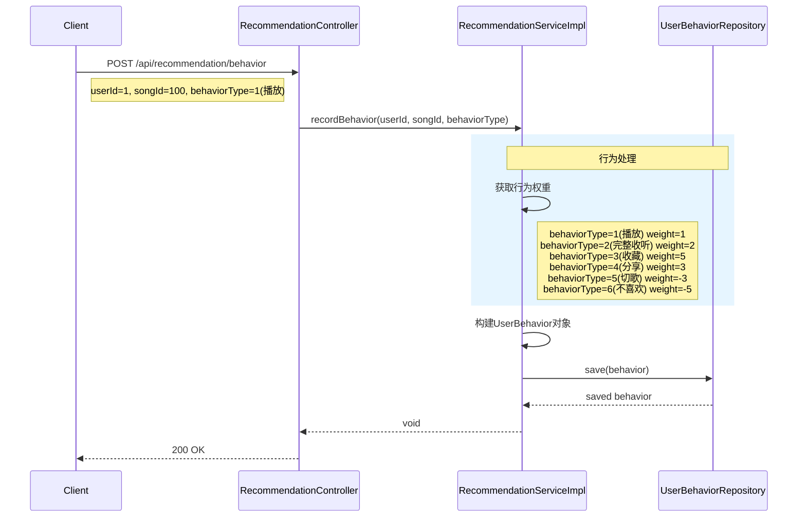
```mermaid
sequenceDiagram
    participant Client
    participant RecommendationController
    participant RecommendationServiceImpl
    participant UserBehaviorRepository

    Client->>RecommendationController: POST /api/recommendation/behavior
    Note right of Client: userId=1, songId=100, behaviorType=1(播放)
    RecommendationController->>RecommendationServiceImpl: recordBehavior(userId, songId, behaviorType)
    
    rect rgb(230, 245, 255)
        Note over RecommendationServiceImpl,UserBehaviorRepository: 行为处理
        RecommendationServiceImpl->>RecommendationServiceImpl: 获取行为权重
        Note right of RecommendationServiceImpl: behaviorType=1(播放) weight=1<br/>behaviorType=2(完整收听) weight=2<br/>behaviorType=3(收藏) weight=5<br/>behaviorType=4(分享) weight=3<br/>behaviorType=5(切歌) weight=-3<br/>behaviorType=6(不喜欢) weight=-5
    end
    
    RecommendationServiceImpl->>RecommendationServiceImpl: 构建UserBehavior对象
    RecommendationServiceImpl->>UserBehaviorRepository: save(behavior)
    UserBehaviorRepository-->>RecommendationServiceImpl: saved behavior
    RecommendationServiceImpl-->>RecommendationController: void
    RecommendationController-->>Client: 200 OK
```

### 4.3 时序图 - 获取心动歌单（雷达歌单）

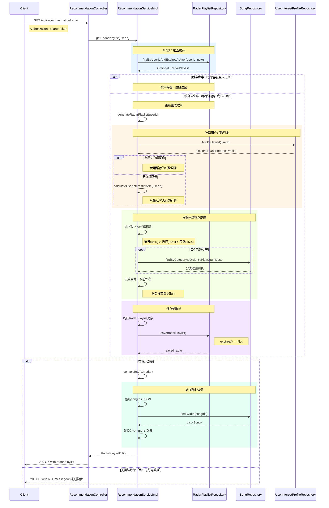
```mermaid
sequenceDiagram
    participant Client
    participant RecommendationController
    participant RecommendationServiceImpl
    participant RadarPlaylistRepository
    participant SongRepository
    participant UserInterestProfileRepository

    Client->>RecommendationController: GET /api/recommendation/radar
    Note right of Client: Authorization: Bearer token
    RecommendationController->>RecommendationServiceImpl: getRadarPlaylist(userId)

    rect rgb(230, 245, 255)
        Note over RecommendationServiceImpl,RadarPlaylistRepository: 阶段1：检查缓存
        RecommendationServiceImpl->>RadarPlaylistRepository: findByUserIdAndExpiresAtAfter(userId, now)
        RadarPlaylistRepository-->>RecommendationServiceImpl: Optional~RadarPlaylist~
    end

    alt 缓存命中（歌单存在且未过期）
        Note over RecommendationServiceImpl,RadarPlaylistRepository: 歌单存在，直接返回
    else 缓存未命中（歌单不存在或已过期）
        Note over RecommendationServiceImpl,RadarPlaylistRepository: 重新生成歌单
        RecommendationServiceImpl->>RecommendationServiceImpl: generateRadarPlaylist(userId)
        
        rect rgb(255, 245, 230)
            Note over RecommendationServiceImpl,UserInterestProfileRepository: 计算用户兴趣画像
            RecommendationServiceImpl->>UserInterestProfileRepository: findByUserId(userId)
            UserInterestProfileRepository-->>RecommendationServiceImpl: Optional~UserInterestProfile~
            
            alt 有历史兴趣画像
                Note right of RecommendationServiceImpl: 使用缓存的兴趣画像
            else 无兴趣画像
                RecommendationServiceImpl->>RecommendationServiceImpl: calculateUserInterestProfile(userId)
                Note right of RecommendationServiceImpl: 从最近30天行为计算
            end
        end
        
        rect rgb(245, 255, 230)
            Note over RecommendationServiceImpl,SongRepository: 根据兴趣筛选歌曲
            RecommendationServiceImpl->>RecommendationServiceImpl: 排序取Top3兴趣标签
            Note right of RecommendationServiceImpl: 流行(45%) > 摇滚(30%) > 民谣(15%)
            
            loop 每个兴趣标签
                RecommendationServiceImpl->>SongRepository: findByCategoryIdOrderByPlayCountDesc
                SongRepository-->>RecommendationServiceImpl: 分类歌曲列表
            end
            
            RecommendationServiceImpl->>RecommendationServiceImpl: 去重合并，取前20首
            Note right of RecommendationServiceImpl: 避免推荐重复歌曲
        end
        
        rect rgb(245, 230, 255)
            Note over RecommendationServiceImpl,RadarPlaylistRepository: 保存新歌单
            RecommendationServiceImpl->>RecommendationServiceImpl: 构建RadarPlaylist对象
            RecommendationServiceImpl->>RadarPlaylistRepository: save(radarPlaylist)
            Note right of RadarPlaylistRepository: expiresAt = 明天
            RadarPlaylistRepository-->>RecommendationServiceImpl: saved radar
        end
    end

    alt 有雷达歌单
        RecommendationServiceImpl->>RecommendationServiceImpl: convertToDTO(radar)
        
        rect rgb(230, 255, 245)
            Note over RecommendationServiceImpl,SongRepository: 转换歌曲详情
            RecommendationServiceImpl->>RecommendationServiceImpl: 解析songIds JSON
            RecommendationServiceImpl->>SongRepository: findByIdIn(songIds)
            SongRepository-->>RecommendationServiceImpl: List~Song~
            RecommendationServiceImpl->>RecommendationServiceImpl: 转换为SongDTO列表
        end
        
        RecommendationServiceImpl-->>RecommendationController: RadarPlaylistDTO
        RecommendationController-->>Client: 200 OK with radar playlist
    else 无雷达歌单（用户无行为数据）
        RecommendationController-->>Client: 200 OK with null, message="暂无推荐"
    end
```

### 4.4 时序图 - 生成心动歌单（详细流程）

**流程说明：**

该时序图展示了根据用户历史行为生成个性化心动歌单的完整流程，整个流程分为四个主要步骤。

步骤一为获取用户行为。系统首先通过 UserBehaviorRepository 从数据库中查询指定用户的所有行为记录，这些行为记录包括用户对歌曲的播放、收藏、分享、评论等操作。如果查询结果为空，说明该用户没有任何行为数据，系统将使用默认的兴趣标签（流行、摇滚、民谣）作为推荐依据。如果存在行为数据，系统将获取到用户最近一段时间内的所有行为记录，这些记录将用于后续的兴趣分析。

步骤二为计算兴趣权重。系统首先对用户行为数据按歌曲进行分组，计算每首歌曲的总得分。每首歌曲的得分由用户对该歌曲的各种行为权重累加得到，播放行为权重为1，完整收听权重为2，收藏权重为5，分享权重为3。然后，系统遍历每首歌曲，通过 SongRepository 查询歌曲的详细信息，包括歌曲所属的分类。根据歌曲的分类信息，将歌曲得分累加到对应的分类上，形成用户对各个分类的兴趣得分。完成所有歌曲的分类得分统计后，系统对分类得分进行排序，选取得分最高的前三个分类作为用户的核心兴趣标签。例如最终可能得到摇滚占45%、流行占30%、民谣占15%的兴趣分布。确定兴趣分布后，系统将更新用户兴趣画像，保存到 UserInterestProfileRepository 中。

步骤三为根据兴趣选歌。系统根据步骤二确定的 Top3 兴趣分类，依次从每个分类中选取热门歌曲。对于每个兴趣分类，系统首先通过 CategoryRepository 查询分类信息，然后通过 SongRepository 查询该分类下按播放量排序的歌曲列表，选取前50首热门歌曲。三个分类分别选取后，系统将三个列表合并，并进行去重处理，最终从约150首歌曲中精选出20首推荐歌曲，形成心动歌单的歌曲列表。

步骤四为保存歌单。系统根据前面步骤确定的歌曲列表和兴趣画像，构建 RadarPlaylist 实体对象。实体对象包含用户ID、歌曲ID列表（JSON格式）、兴趣摘要信息（包含最高兴趣标签及其得分分布）、创建时间和过期时间。过期时间设置为当前时间的后一天，即次日过期，确保歌单每天都会更新。最后将构建好的雷达歌单实体保存到 RadarPlaylistRepository 中，完成整个心动歌单生成流程。

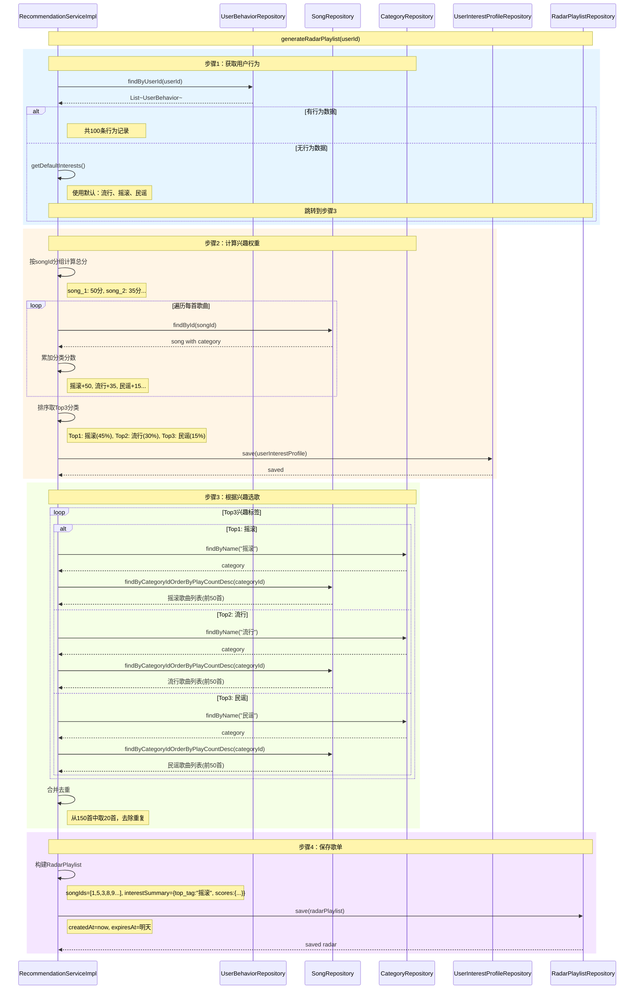
```mermaid
sequenceDiagram
    participant RecommendationServiceImpl
    participant UserBehaviorRepository
    participant SongRepository
    participant CategoryRepository
    participant UserInterestProfileRepository
    participant RadarPlaylistRepository

    Note over RecommendationServiceImpl,RadarPlaylistRepository: generateRadarPlaylist(userId)

    rect rgb(230, 245, 255)
        Note over RecommendationServiceImpl,CategoryRepository: 步骤1：获取用户行为
        RecommendationServiceImpl->>UserBehaviorRepository: findByUserId(userId)
        UserBehaviorRepository-->>RecommendationServiceImpl: List~UserBehavior~
        
        alt 有行为数据
            Note right of RecommendationServiceImpl: 共100条行为记录
        else 无行为数据
            RecommendationServiceImpl->>RecommendationServiceImpl: getDefaultInterests()
            Note right of RecommendationServiceImpl: 使用默认：流行、摇滚、民谣
            Note over RecommendationServiceImpl,RadarPlaylistRepository: 跳转到步骤3
        end
    end

    rect rgb(255, 245, 230)
        Note over RecommendationServiceImpl,CategoryRepository: 步骤2：计算兴趣权重
        RecommendationServiceImpl->>RecommendationServiceImpl: 按songId分组计算总分
        Note right of RecommendationServiceImpl: song_1: 50分, song_2: 35分...
        
        loop 遍历每首歌曲
            RecommendationServiceImpl->>SongRepository: findById(songId)
            SongRepository-->>RecommendationServiceImpl: song with category
            RecommendationServiceImpl->>RecommendationServiceImpl: 累加分类分数
            Note right of RecommendationServiceImpl: 摇滚+50, 流行+35, 民谣+15...
        end
        
        RecommendationServiceImpl->>RecommendationServiceImpl: 排序取Top3分类
        Note right of RecommendationServiceImpl: Top1: 摇滚(45%), Top2: 流行(30%), Top3: 民谣(15%)
        
        RecommendationServiceImpl->>UserInterestProfileRepository: save(userInterestProfile)
        UserInterestProfileRepository-->>RecommendationServiceImpl: saved
    end

    rect rgb(245, 255, 230)
        Note over RecommendationServiceImpl,CategoryRepository: 步骤3：根据兴趣选歌
        loop Top3兴趣标签
            alt Top1: 摇滚
                RecommendationServiceImpl->>CategoryRepository: findByName("摇滚")
                CategoryRepository-->>RecommendationServiceImpl: category
                RecommendationServiceImpl->>SongRepository: findByCategoryIdOrderByPlayCountDesc(categoryId)
                SongRepository-->>RecommendationServiceImpl: 摇滚歌曲列表(前50首)
            else Top2: 流行
                RecommendationServiceImpl->>CategoryRepository: findByName("流行")
                CategoryRepository-->>RecommendationServiceImpl: category
                RecommendationServiceImpl->>SongRepository: findByCategoryIdOrderByPlayCountDesc(categoryId)
                SongRepository-->>RecommendationServiceImpl: 流行歌曲列表(前50首)
            else Top3: 民谣
                RecommendationServiceImpl->>CategoryRepository: findByName("民谣")
                CategoryRepository-->>RecommendationServiceImpl: category
                RecommendationServiceImpl->>SongRepository: findByCategoryIdOrderByPlayCountDesc(categoryId)
                SongRepository-->>RecommendationServiceImpl: 民谣歌曲列表(前50首)
            end
        end
        
        RecommendationServiceImpl->>RecommendationServiceImpl: 合并去重
        Note right of RecommendationServiceImpl: 从150首中取20首，去除重复
    end

    rect rgb(245, 230, 255)
        Note over RecommendationServiceImpl,RadarPlaylistRepository: 步骤4：保存歌单
        RecommendationServiceImpl->>RecommendationServiceImpl: 构建RadarPlaylist
        Note right of RecommendationServiceImpl: songIds=[1,5,3,8,9...], interestSummary={top_tag:"摇滚", scores:{...}}
        RecommendationServiceImpl->>RadarPlaylistRepository: save(radarPlaylist)
        Note right of RecommendationServiceImpl: createdAt=now, expiresAt=明天
        RadarPlaylistRepository-->>RecommendationServiceImpl: saved radar
    end
```

### 4.5 时序图 - 每日定时生成心动歌单

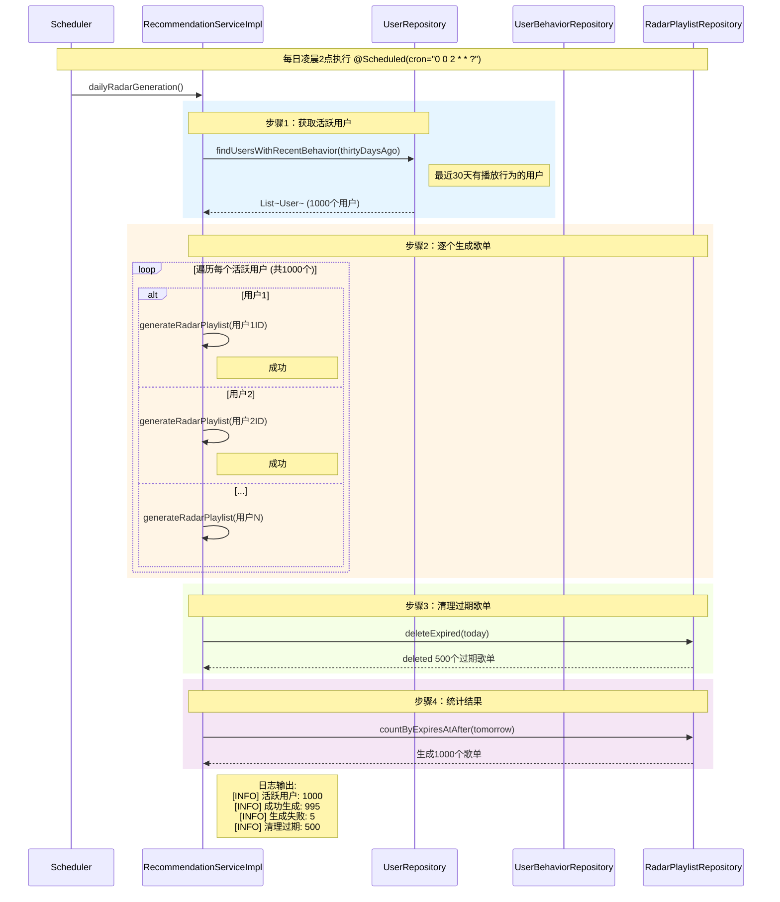
```mermaid
sequenceDiagram
    participant Scheduler
    participant RecommendationServiceImpl
    participant UserRepository
    participant UserBehaviorRepository
    participant RadarPlaylistRepository

    Note over Scheduler,RadarPlaylistRepository: 每日凌晨2点执行 @Scheduled(cron="0 0 2 * * ?")

    Scheduler->>RecommendationServiceImpl: dailyRadarGeneration()

    rect rgb(230, 245, 255)
        Note over RecommendationServiceImpl,UserRepository: 步骤1：获取活跃用户
        RecommendationServiceImpl->>UserRepository: findUsersWithRecentBehavior(thirtyDaysAgo)
        Note right of UserRepository: 最近30天有播放行为的用户
        UserRepository-->>RecommendationServiceImpl: List~User~ (1000个用户)
    end

    rect rgb(255, 245, 230)
        Note over RecommendationServiceImpl,RadarPlaylistRepository: 步骤2：逐个生成歌单
        loop 遍历每个活跃用户 (共1000个)
            alt 用户1
                RecommendationServiceImpl->>RecommendationServiceImpl: generateRadarPlaylist(用户1ID)
                Note right of RecommendationServiceImpl: 成功
            else 用户2
                RecommendationServiceImpl->>RecommendationServiceImpl: generateRadarPlaylist(用户2ID)
                Note right of RecommendationServiceImpl: 成功
            else ...
                RecommendationServiceImpl->>RecommendationServiceImpl: generateRadarPlaylist(用户N)
            end
        end
    end

    rect rgb(245, 255, 230)
        Note over RecommendationServiceImpl,RadarPlaylistRepository: 步骤3：清理过期歌单
        RecommendationServiceImpl->>RadarPlaylistRepository: deleteExpired(today)
        RadarPlaylistRepository-->>RecommendationServiceImpl: deleted 500个过期歌单
    end

    rect rgb(245, 230, 245)
        Note over RecommendationServiceImpl,RadarPlaylistRepository: 步骤4：统计结果
        RecommendationServiceImpl->>RadarPlaylistRepository: countByExpiresAtAfter(tomorrow)
        RadarPlaylistRepository-->>RecommendationServiceImpl: 生成1000个歌单
    end

    Note right of RecommendationServiceImpl: 日志输出:<br/>[INFO] 活跃用户: 1000<br/>[INFO] 成功生成: 995<br/>[INFO] 生成失败: 5<br/>[INFO] 清理过期: 500
```

### 4.6 时序图 - 获取用户兴趣画像

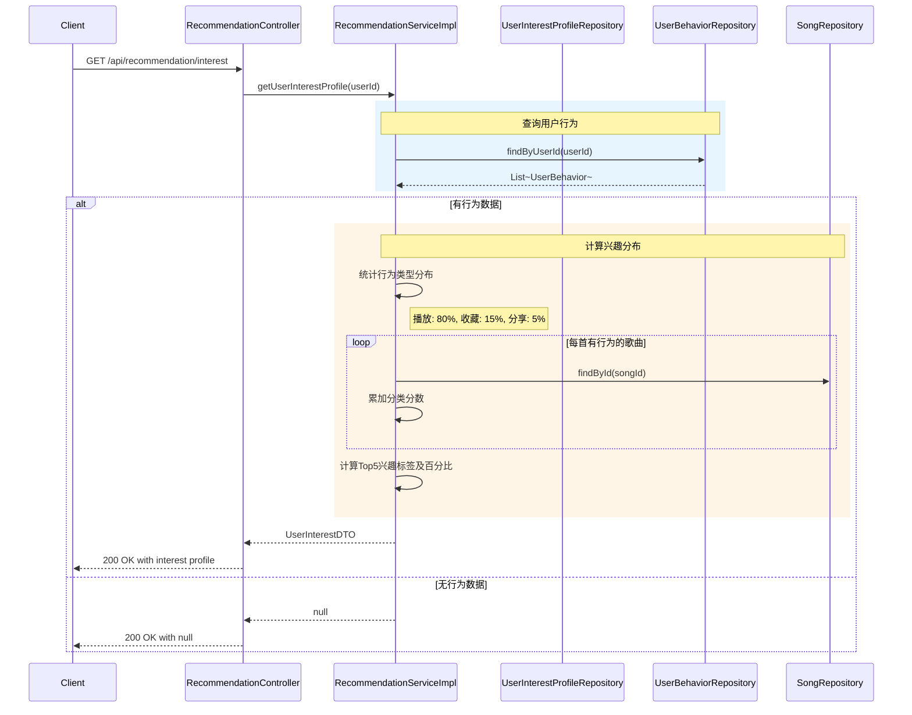
```mermaid
sequenceDiagram
    participant Client
    participant RecommendationController
    participant RecommendationServiceImpl
    participant UserInterestProfileRepository
    participant UserBehaviorRepository
    participant SongRepository

    Client->>RecommendationController: GET /api/recommendation/interest
    RecommendationController->>RecommendationServiceImpl: getUserInterestProfile(userId)

    rect rgb(230, 245, 255)
        Note over RecommendationServiceImpl,UserBehaviorRepository: 查询用户行为
        RecommendationServiceImpl->>UserBehaviorRepository: findByUserId(userId)
        UserBehaviorRepository-->>RecommendationServiceImpl: List~UserBehavior~
    end

    alt 有行为数据
        rect rgb(255, 245, 230)
            Note over RecommendationServiceImpl,SongRepository: 计算兴趣分布
            RecommendationServiceImpl->>RecommendationServiceImpl: 统计行为类型分布
            Note right of RecommendationServiceImpl: 播放: 80%, 收藏: 15%, 分享: 5%
            
            loop 每首有行为的歌曲
                RecommendationServiceImpl->>SongRepository: findById(songId)
                RecommendationServiceImpl->>RecommendationServiceImpl: 累加分类分数
            end
            
            RecommendationServiceImpl->>RecommendationServiceImpl: 计算Top5兴趣标签及百分比
        end
        
        RecommendationServiceImpl-->>RecommendationController: UserInterestDTO
        RecommendationController-->>Client: 200 OK with interest profile
    else 无行为数据
        RecommendationServiceImpl-->>RecommendationController: null
        RecommendationController-->>Client: 200 OK with null
    end
```

---

## 5. 雷达歌单模块

### 5.1 类图

**类关系说明：**

本雷达歌单模块是推荐系统的核心组成部分，专门用于生成和管理用户的个性化心动歌单。该模块采用 MVC + Repository 分层架构设计，同时引入了定时任务调度机制，类与类之间的关系采用面向接口编程和依赖注入的设计模式。

继承关系：RadarPlaylistServiceImpl 实现了 RadarPlaylistService 接口。接口定义了雷达歌单业务方法规范，实现类负责具体的歌单生成、查询和定时更新逻辑。这种设计遵循了面向接口编程的原则，使得业务逻辑的实现可以被替换，便于后期扩展和单元测试。

依赖关系：RadarPlaylistController 依赖 RadarPlaylistService 接口，而不直接依赖实现类。控制层通过接口调用服务层，实现了控制层与服务层的解耦。当服务实现类发生变更时，控制器层无需修改，降低了代码耦合度。

关联关系：RadarPlaylistServiceImpl 通过依赖注入的方式关联了多个组件，包括 RadarPlaylistRepository（雷达歌单持久化）、UserBehaviorRepository（用户行为数据查询）、UserInterestProfileRepository（用户兴趣画像持久化）、SongRepository（歌曲数据查询）、CategoryRepository（分类数据查询）、UserRepository（用户数据查询）以及 ObjectMapper（JSON序列化）。这些组件分别负责雷达歌单的持久化、用户行为分析、兴趣画像管理、歌曲查询、分类查询、用户数据查询以及歌单数据的序列化和反序列化功能。服务实现类还引入了定时任务调度器（Scheduler），用于每日自动为所有活跃用户生成雷达歌单。

实体继承：RadarPlaylist 实体类继承自 JPA 的 BaseEntity（隐式），包含公共字段 id、createdAt、updatedAt。实体类映射数据库中的 radar_playlists 表，存储用户的雷达歌单信息，包括用户ID、歌单名称、描述、封面URL、歌曲ID列表（JSON格式）、兴趣摘要信息（JSON格式）、歌曲数量、类型、过期时间等字段。UserInterestProfile 实体类同样继承自 BaseEntity，存储用户的兴趣画像数据，包括用户ID、曲风偏好（JSON格式）、艺术家偏好（JSON格式）、情绪偏好（JSON格式）和更新时间。

数据传输：控制层接收客户端请求参数，包括 userId（用户ID）等。服务层生成 RadarPlaylist 实体和 RadarPlaylistDTO 用于返回给客户端。RadarPlaylistDTO 是专门用于前端展示的数据传输对象，包含歌单ID、用户ID、歌曲列表（SongDTO列表）、兴趣摘要、创建时间和过期时间。SongDTO 用于封装单个歌曲的简要信息，包括歌曲ID、标题、艺术家、封面和时长。

数据流向：请求流程从客户端发起，GET 请求到 /api/radar/{userId} 或 /api/radar 接口，RadarPlaylistController 接收请求后，调用 RadarPlaylistService 的相应方法处理业务逻辑。服务层首先从 RadarPlaylistRepository 查询用户是否已有未过期的雷达歌单，如果有则直接返回缓存数据，如果没有则调用歌单生成方法创建新的雷达歌单。歌单生成过程中会分析用户的历史行为数据，计算兴趣标签，从各分类选取推荐歌曲，最后保存到数据库。响应流程则相反，从数据库查询数据，经过 Entity 封装，Repository 返回，Service 处理后转换为 DTO，最后由 Controller 返回给客户端。

各层职责：控制层负责接收并解析客户端 HTTP 请求、参数校验、调用 Service 层方法、封装响应结果以及处理异常。服务层接口定义业务接口规范和声明业务方法签名，不涉及具体实现。服务层实现类负责实现核心业务逻辑，包括雷达歌单查询、歌单生成、兴趣分析、歌曲推荐。服务实现类还包含定时任务方法，用于每日凌晨自动为所有活跃用户生成雷达歌单，并清理过期的歌单数据。持久化层负责 RadarPlaylist、UserInterestProfile 实体的增删改查操作。实体层负责映射数据库表、定义实体属性。

**类图结构：**

```mermaid
classDiagram
    class RadarPlaylistController {
        -radarPlaylistService: RadarPlaylistService
        +getUserRadarPlaylist(userId: Long): ResponseEntity
        +generateRadarPlaylist(userId: Long): ResponseEntity
        +refreshAllRadarPlaylists(): ResponseEntity
    }

    class RadarPlaylistServiceImpl {
        -radarPlaylistRepository: RadarPlaylistRepository
        -userBehaviorRepository: UserBehaviorRepository
        -userInterestProfileRepository: UserInterestProfileRepository
        -songRepository: SongRepository
        -categoryRepository: CategoryRepository
        -userRepository: UserRepository
        -objectMapper: ObjectMapper
        -log: Logger
        +getUserRadarPlaylist(userId: Long): RadarPlaylistDTO
        +generateRadarPlaylist(userId: Long): RadarPlaylist
        +dailyRadarGeneration(): void
        -buildRadarPlaylist(userId: Long): RadarPlaylist
        -analyzeUserInterests(userId: Long): Map~String, Double~
        -selectRecommendedSongs(interests: Map~String, Double~): List~Song~
        -convertToDTO(radar: RadarPlaylist): RadarPlaylistDTO
    }

    class RadarPlaylistService {
        +getUserRadarPlaylist(userId: Long): RadarPlaylistDTO
        +generateRadarPlaylist(userId: Long): RadarPlaylist
        +dailyRadarGeneration(): void
    }

    class RadarPlaylistRepository {
        +findByUserId(userId: Long): Optional~RadarPlaylist~
        +findByUserIdAndExpiresAtAfter(userId: Long, date: Date): Optional~RadarPlaylist~
        +save(radar: RadarPlaylist): RadarPlaylist
        +deleteByExpiresAtBefore(date: Date): void
        +countByExpiresAtAfter(date: Date): long
    }

    class UserBehaviorRepository {
        +findByUserId(userId: Long): List~UserBehavior~
        +findByUserIdAndCreatedAtAfter(userId: Long, date: Date): List~UserBehavior~
        +countByUserId(userId: Long): long
    }

    class UserInterestProfileRepository {
        +findByUserId(userId: Long): Optional~UserInterestProfile~
        +save(profile: UserInterestProfile): UserInterestProfile
    }

    class SongRepository {
        +findById(id: Long): Optional~Song~
        +findByCategoryIdOrderByPlayCountDesc(categoryId: Long, pageable: Pageable): List~Song~
        +findByStatus(status: Integer): List~Song~
    }

    class CategoryRepository {
        +findAll(): List~Category~
        +findById(id: Long): Optional~Category~
    }

    class UserRepository {
        +findByStatus(status: Integer): List~User~
        +countByStatus(status: Integer): long
    }

    class RadarPlaylist {
        -id: Long
        -userId: Long
        -name: String
        -description: String
        -cover: String
        -songIds: String
        -interestSummary: String
        -songCount: Integer
        -type: Integer
        -expiresAt: Date
        -createdAt: Date
        -updatedAt: Date
    }

    class UserInterestProfile {
        -id: Long
        -userId: Long
        -genrePreferences: String
        -artistPreferences: String
        -moodPreferences: String
        -updatedAt: Date
    }

    class RadarPlaylistDTO {
        -id: Long
        -userId: Long
        -name: String
        -description: String
        -cover: String
        -songs: List~SongDTO~
        -interestSummary: Map~String, Object~
        -songCount: Integer
        -expiresAt: Date
    }

    class SongDTO {
        -id: Long
        -title: String
        -artist: String
        -cover: String
        -duration: Integer
    }

    class UserBehavior {
        -id: Long
        -userId: Long
        -songId: Long
        -targetType: Integer
        -targetId: Long
        -behaviorType: Integer
        -weight: Integer
        -createdAt: Date
    }

    class Category {
        -id: Long
        -name: String
    }

    class User {
        -id: Long
        -username: String
    }

    RadarPlaylistController --> RadarPlaylistService
    RadarPlaylistService --> RadarPlaylistServiceImpl
    RadarPlaylistServiceImpl --> RadarPlaylistRepository
    RadarPlaylistServiceImpl --> UserBehaviorRepository
    RadarPlaylistServiceImpl --> UserInterestProfileRepository
    RadarPlaylistServiceImpl --> SongRepository
    RadarPlaylistServiceImpl --> CategoryRepository
    RadarPlaylistServiceImpl --> UserRepository
    RadarPlaylistServiceImpl --> RadarPlaylist
    RadarPlaylistServiceImpl --> UserInterestProfile
    RadarPlaylistServiceImpl --> RadarPlaylistDTO
    RadarPlaylistServiceImpl --> SongDTO
    RadarPlaylist --> User
    UserInterestProfile --> User
```

### 5.2 时序图 - 获取用户雷达歌单

**流程说明：**

该时序图展示了客户端获取用户个性化雷达歌单的完整流程，整个流程分为缓存检查、歌单生成（如果需要）和响应返回三个主要阶段。

缓存检查阶段：客户端发起 GET 请求到 /api/radar/{userId} 接口，请求获取指定用户的雷达歌单。RadarPlaylistController 接收请求后，提取用户ID参数，调用 RadarPlaylistServiceImpl 的 getUserRadarPlaylist 方法处理业务逻辑。服务层首先通过 RadarPlaylistRepository 的 findByUserIdAndExpiresAtAfter 方法查询该用户是否存在未过期的雷达歌单。查询时使用当前时间作为过期时间参数，系统会返回过期时间大于当前时间的歌单记录。

歌单生成阶段：如果查询结果为空，说明该用户没有有效的雷达歌单（可能从未生成过，或者歌单已过期），系统需要调用 generateRadarPlaylist 方法为用户生成新的雷达歌单。生成过程首先通过 UserBehaviorRepository 查询用户最近一段时间内的所有行为记录，包括播放、收藏、分享、评论等操作。如果用户没有任何行为数据，系统将使用默认的兴趣标签（流行、摇滚、民谣）作为推荐依据。如果存在行为数据，系统会对行为数据按歌曲进行分组，计算每首歌曲的总得分，然后遍历每首歌曲查询其所属分类，累加各分类的得分，形成用户对各个分类的兴趣得分。排序后选取得分最高的前三个分类作为用户的核心兴趣标签。根据确定的兴趣分类，分别从各分类中选取热门歌曲，每个分类选取前50首，然后合并去重，最终得到20首推荐歌曲。构建 RadarPlaylist 实体对象，包含用户ID、歌单名称（"今日推荐"）、歌曲ID列表（JSON格式）、兴趣摘要信息（JSON格式，包含Top标签和各分类得分）、歌曲数量（20首）、类型（0-每日推荐）、过期时间（次日）。最后将构建好的雷达歌单保存到 RadarPlaylistRepository 中。

响应返回阶段：无论是从缓存获取还是新生成的歌单，服务层都需要将歌单数据转换为 DTO 格式返回给客户端。系统调用 convertToDTO 方法将 RadarPlaylist 实体转换为 RadarPlaylistDTO。对于歌单中的每首歌曲，通过 SongRepository 查询歌曲的详细信息，然后封装为 SongDTO 对象。完成所有歌曲的 DTO 转换后，服务层将包含完整歌单信息的 RadarPlaylistDTO 返回给 Controller，Controller 最终返回 200 OK 响应给客户端，响应体中包含 code 为 200 和 data 为歌单数据的 JSON 对象。

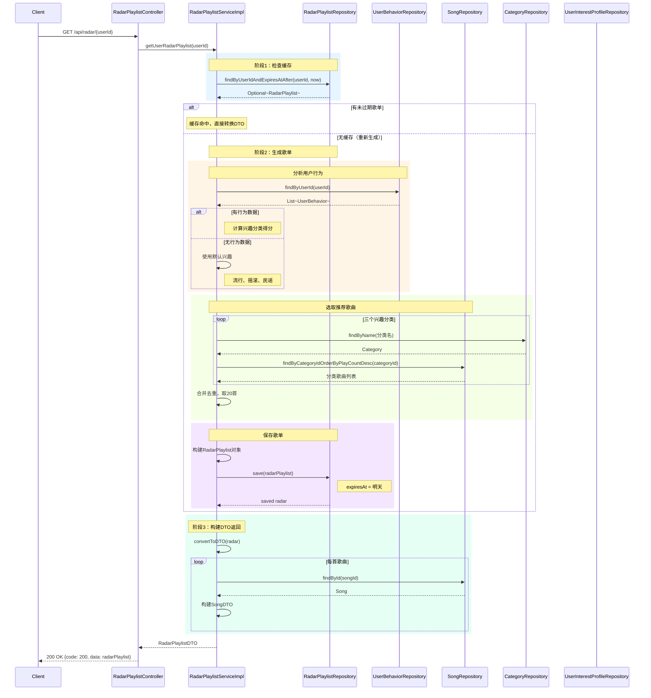
```mermaid
sequenceDiagram
    participant Client
    participant RadarPlaylistController
    participant RadarPlaylistServiceImpl
    participant RadarPlaylistRepository
    participant UserBehaviorRepository
    participant SongRepository
    participant CategoryRepository
    participant UserInterestProfileRepository

    Client->>RadarPlaylistController: GET /api/radar/{userId}
    RadarPlaylistController->>RadarPlaylistServiceImpl: getUserRadarPlaylist(userId)

    rect rgb(230, 245, 255)
        Note over RadarPlaylistServiceImpl,RadarPlaylistRepository: 阶段1：检查缓存
        RadarPlaylistServiceImpl->>RadarPlaylistRepository: findByUserIdAndExpiresAtAfter(userId, now)
        RadarPlaylistRepository-->>RadarPlaylistServiceImpl: Optional~RadarPlaylist~
    end

    alt 有未过期歌单
        Note over RadarPlaylistServiceImpl,RadarPlaylistServiceImpl: 缓存命中，直接转换DTO
    else 无缓存（重新生成）
        Note over RadarPlaylistServiceImpl,RadarPlaylistRepository: 阶段2：生成歌单
        
        rect rgb(255, 245, 230)
            Note over RadarPlaylistServiceImpl,UserBehaviorRepository: 分析用户行为
            RadarPlaylistServiceImpl->>UserBehaviorRepository: findByUserId(userId)
            UserBehaviorRepository-->>RadarPlaylistServiceImpl: List~UserBehavior~
            
            alt 有行为数据
                Note right of RadarPlaylistServiceImpl: 计算兴趣分类得分
            else 无行为数据
                RadarPlaylistServiceImpl->>RadarPlaylistServiceImpl: 使用默认兴趣
                Note right of RadarPlaylistServiceImpl: 流行、摇滚、民谣
            end
        end
        
        rect rgb(245, 255, 230)
            Note over RadarPlaylistServiceImpl,SongRepository: 选取推荐歌曲
            loop 三个兴趣分类
                RadarPlaylistServiceImpl->>CategoryRepository: findByName(分类名)
                CategoryRepository-->>RadarPlaylistServiceImpl: Category
                RadarPlaylistServiceImpl->>SongRepository: findByCategoryIdOrderByPlayCountDesc(categoryId)
                SongRepository-->>RadarPlaylistServiceImpl: 分类歌曲列表
            end
            RadarPlaylistServiceImpl->>RadarPlaylistServiceImpl: 合并去重，取20首
        end
        
        rect rgb(245, 230, 255)
            Note over RadarPlaylistServiceImpl,RadarPlaylistRepository: 保存歌单
            RadarPlaylistServiceImpl->>RadarPlaylistServiceImpl: 构建RadarPlaylist对象
            RadarPlaylistServiceImpl->>RadarPlaylistRepository: save(radarPlaylist)
            Note right of RadarPlaylistRepository: expiresAt = 明天
            RadarPlaylistRepository-->>RadarPlaylistServiceImpl: saved radar
        end
    end

    rect rgb(230, 255, 245)
        Note over RadarPlaylistServiceImpl,RadarPlaylistServiceImpl: 阶段3：构建DTO返回
        RadarPlaylistServiceImpl->>RadarPlaylistServiceImpl: convertToDTO(radar)
        loop 每首歌曲
            RadarPlaylistServiceImpl->>SongRepository: findById(songId)
            SongRepository-->>RadarPlaylistServiceImpl: Song
            RadarPlaylistServiceImpl->>RadarPlaylistServiceImpl: 构建SongDTO
        end
    end

    RadarPlaylistServiceImpl-->>RadarPlaylistController: RadarPlaylistDTO
    RadarPlaylistController-->>Client: 200 OK {code: 200, data: radarPlaylist}
```

### 5.3 时序图 - 每日定时生成雷达歌单

**流程说明：**

该时序图展示了系统每日定时为所有活跃用户生成雷达歌单的完整流程，整个流程分为获取用户、逐个生成歌单、清理过期歌单和统计结果四个主要阶段。

获取用户阶段：定时任务调度器（Scheduler）按照配置的 Cron 表达式（每日凌晨2点）自动触发执行 dailyRadarGeneration 方法。服务层首先通过 UserRepository 查询所有状态为正常（status=1）的活跃用户列表。这些用户是雷达歌单生成的目标用户群体，系统需要为每个活跃用户生成或更新其雷达歌单。

逐个生成歌单阶段：服务层遍历用户列表，为每个用户调用 generateRadarPlaylist 方法生成雷达歌单。生成过程与前述的"获取用户雷达歌单"流程中的歌单生成阶段相同，包括查询用户行为、分析兴趣权重、选取推荐歌曲、构建歌单实体和保存到数据库。对于每个用户，系统会先检查是否已存在未过期的歌单，如果存在则更新，不存在则新建。这一步骤可能需要处理大量用户，因此是整个流程中耗时最长的部分。

清理过期歌单阶段：为所有用户生成歌单完成后，服务层通过 RadarPlaylistRepository 的 deleteByExpiresAtBefore 方法清理所有已过期的雷达歌单。这些过期歌单是前一天或更早生成的，已经不再具有推荐价值，清理操作可以释放数据库存储空间。

统计结果阶段：最后，服务层通过 countByExpiresAtAfter 方法统计当前有效的雷达歌单数量，统计结果用于日志输出和监控。服务层输出日志信息，记录本次定时任务执行的结果，包括处理的用户数量、生成的歌单数量、清理的过期歌单数量等。

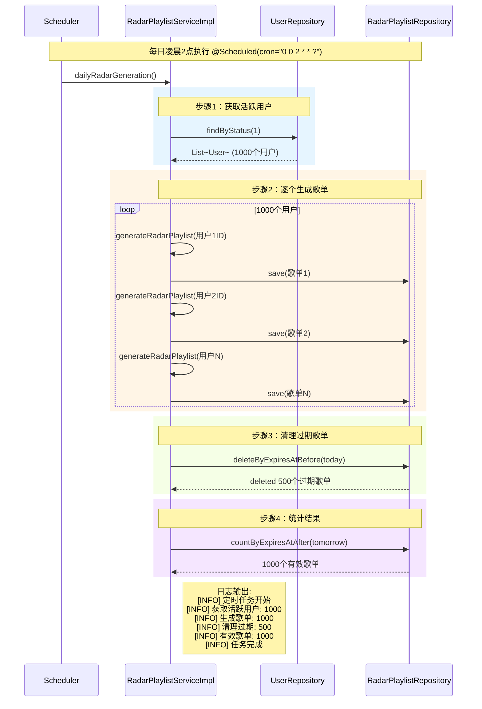
```mermaid
sequenceDiagram
    participant Scheduler
    participant RadarPlaylistServiceImpl
    participant UserRepository
    participant RadarPlaylistRepository

    Note over Scheduler,RadarPlaylistRepository: 每日凌晨2点执行 @Scheduled(cron="0 0 2 * * ?")

    Scheduler->>RadarPlaylistServiceImpl: dailyRadarGeneration()

    rect rgb(230, 245, 255)
        Note over RadarPlaylistServiceImpl,UserRepository: 步骤1：获取活跃用户
        RadarPlaylistServiceImpl->>UserRepository: findByStatus(1)
        UserRepository-->>RadarPlaylistServiceImpl: List~User~ (1000个用户)
    end

    rect rgb(255, 245, 230)
        Note over RadarPlaylistServiceImpl,RadarPlaylistRepository: 步骤2：逐个生成歌单
        loop 1000个用户
            RadarPlaylistServiceImpl->>RadarPlaylistServiceImpl: generateRadarPlaylist(用户1ID)
            RadarPlaylistServiceImpl->>RadarPlaylistRepository: save(歌单1)
            
            RadarPlaylistServiceImpl->>RadarPlaylistServiceImpl: generateRadarPlaylist(用户2ID)
            RadarPlaylistServiceImpl->>RadarPlaylistRepository: save(歌单2)
            
            RadarPlaylistServiceImpl->>RadarPlaylistServiceImpl: generateRadarPlaylist(用户N)
            RadarPlaylistServiceImpl->>RadarPlaylistRepository: save(歌单N)
        end
    end

    rect rgb(245, 255, 230)
        Note over RadarPlaylistServiceImpl,RadarPlaylistRepository: 步骤3：清理过期歌单
        RadarPlaylistServiceImpl->>RadarPlaylistRepository: deleteByExpiresAtBefore(today)
        RadarPlaylistRepository-->>RadarPlaylistServiceImpl: deleted 500个过期歌单
    end

    rect rgb(245, 230, 255)
        Note over RadarPlaylistServiceImpl,RadarPlaylistRepository: 步骤4：统计结果
        RadarPlaylistServiceImpl->>RadarPlaylistRepository: countByExpiresAtAfter(tomorrow)
        RadarPlaylistRepository-->>RadarPlaylistServiceImpl: 1000个有效歌单
    end

    Note right of RadarPlaylistServiceImpl: 日志输出:<br/>[INFO] 定时任务开始<br/>[INFO] 获取活跃用户: 1000<br/>[INFO] 生成歌单: 1000<br/>[INFO] 清理过期: 500<br/>[INFO] 有效歌单: 1000<br/>[INFO] 任务完成
```

---

## 6. AI曲风识别模块

### 6.1 类图

**类关系说明：**

本AI曲风识别模块是音乐管理系统的重要组成部分，用于通过AI技术分析用户上传的音频文件，自动识别音乐的曲风类型。该模块采用 MVC + Repository 分层架构设计，同时引入了异步任务处理和外部AI服务调用机制，类与类之间的关系采用面向接口编程和依赖注入的设计模式。

继承关系：GenreRecognitionServiceImpl 实现了 GenreRecognitionService 接口。接口定义了曲风识别业务方法规范，实现类负责具体的音频分析、曲风分类、歌曲分类更新等逻辑。这种设计遵循了面向接口编程的原则，使得业务逻辑的实现可以被替换，便于后期扩展和单元测试。

依赖关系：GenreRecognitionController 依赖 GenreRecognitionService 接口，而不直接依赖实现类。控制层通过接口调用服务层，实现了控制层与服务层的解耦。当服务实现类发生变更时，控制器层无需修改，降低了代码耦合度。

关联关系：GenreRecognitionServiceImpl 通过依赖注入的方式关联了多个组件，包括 SongRepository（歌曲数据持久化和更新）、CategoryRepository（分类数据查询）、FileStorageService（音频文件存储）、RestTemplate（HTTP客户端，用于调用外部AI曲风识别服务）以及配置属性（apiKey、apiProvider、genreRecognitionEnabled、genreRecognitionServiceUrl等）。这些组件分别负责歌曲数据的持久化和分类更新、分类数据的查询、音频文件的上传和存储、调用外部AI服务进行曲风分析等功能。服务实现类定义了支持的曲风标签列表，包括流行、摇滚、民谣、古典、爵士、电子、说唱、R&B、轻音乐、乡村、蓝调、嘻哈、金属、舞曲、抒情等常见音乐风格。

实体继承：Song 实体类继承自 JPA 的 BaseEntity（隐式），包含公共字段 id、createdAt、updatedAt。Song 实体类映射数据库中的 songs 表，其中 categoryId 字段用于存储歌曲所属的分类（曲风）。Category 实体类映射 categories 表，存储曲风分类信息，包括分类名称、描述、层级等。

数据传输：控制层接收客户端请求参数，包括 songId（歌曲ID）或 audioFile（音频文件）等。服务层通过调用外部AI服务获取曲风分析结果，然后将识别结果更新到歌曲记录中，并返回 GenreRecognitionResultDTO 用于给前端展示。GenreRecognitionResultDTO 是专门用于展示曲风识别结果的数据传输对象，包含歌曲ID、识别的主要曲风、曲风置信度得分、各曲风候选列表等信息。

数据流向：请求流程从客户端发起，POST 请求到 /api/genre/recognize 接口（上传音频文件）或 GET 请求到 /api/genre/recognize/{songId} 接口（识别已有歌曲），GenreRecognitionController 接收请求后，调用 GenreRecognitionService 的相应方法处理业务逻辑。服务层首先获取需要识别的音频文件，然后调用外部AI曲风识别服务进行分析。外部服务返回曲风分析结果后，服务层将识别结果更新到歌曲记录的 categoryId 字段中。如果识别结果置信度较高，系统还会建议用户将歌曲归入对应的分类。

各层职责：控制层负责接收并解析客户端 HTTP 请求、参数校验、调用 Service 层方法、封装响应结果以及处理异常。服务层接口定义业务接口规范和声明业务方法签名，不涉及具体实现。服务层实现类负责实现核心业务逻辑，包括获取音频文件、调用外部AI服务进行曲风分析、解析识别结果、更新歌曲分类信息。持久化层负责 Song、Category 实体的增删改查操作。实体层负责映射数据库表、定义实体属性。

**类图结构：**

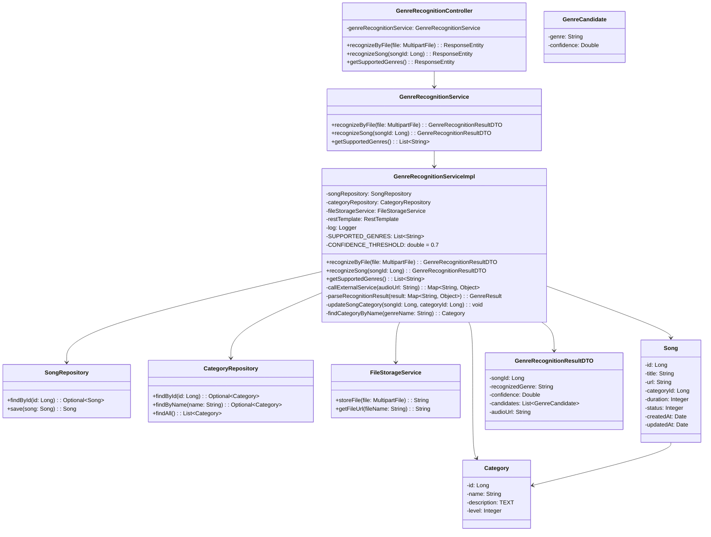
```mermaid
classDiagram
    class GenreRecognitionController {
        -genreRecognitionService: GenreRecognitionService
        +recognizeByFile(file: MultipartFile): ResponseEntity
        +recognizeSong(songId: Long): ResponseEntity
        +getSupportedGenres(): ResponseEntity
    }

    class GenreRecognitionServiceImpl {
        -songRepository: SongRepository
        -categoryRepository: CategoryRepository
        -fileStorageService: FileStorageService
        -restTemplate: RestTemplate
        -log: Logger
        -SUPPORTED_GENRES: List~String~
        -CONFIDENCE_THRESHOLD: double = 0.7
        +recognizeByFile(file: MultipartFile): GenreRecognitionResultDTO
        +recognizeSong(songId: Long): GenreRecognitionResultDTO
        +getSupportedGenres(): List~String~
        -callExternalService(audioUrl: String): Map~String, Object~
        -parseRecognitionResult(result: Map~String, Object~): GenreResult
        -updateSongCategory(songId: Long, categoryId: Long): void
        -findCategoryByName(genreName: String): Category
    }

    class GenreRecognitionService {
        +recognizeByFile(file: MultipartFile): GenreRecognitionResultDTO
        +recognizeSong(songId: Long): GenreRecognitionResultDTO
        +getSupportedGenres(): List~String~
    }

    class SongRepository {
        +findById(id: Long): Optional~Song~
        +save(song: Song): Song
    }

    class CategoryRepository {
        +findById(id: Long): Optional~Category~
        +findByName(name: String): Optional~Category~
        +findAll(): List~Category~
    }

    class FileStorageService {
        +storeFile(file: MultipartFile): String
        +getFileUrl(fileName: String): String
    }

    class Song {
        -id: Long
        -title: String
        -url: String
        -categoryId: Long
        -duration: Integer
        -status: Integer
        -createdAt: Date
        -updatedAt: Date
    }

    class Category {
        -id: Long
        -name: String
        -description: TEXT
        -level: Integer
    }

    class GenreRecognitionResultDTO {
        -songId: Long
        -recognizedGenre: String
        -confidence: Double
        -candidates: List~GenreCandidate~
        -audioUrl: String
    }

    class GenreCandidate {
        -genre: String
        -confidence: Double
    }

    GenreRecognitionController --> GenreRecognitionService
    GenreRecognitionService --> GenreRecognitionServiceImpl
    GenreRecognitionServiceImpl --> SongRepository
    GenreRecognitionServiceImpl --> CategoryRepository
    GenreRecognitionServiceImpl --> FileStorageService
    GenreRecognitionServiceImpl --> Song
    GenreRecognitionServiceImpl --> Category
    GenreRecognitionServiceImpl --> GenreRecognitionResultDTO
    Song --> Category
```

### 6.2 时序图 - 上传音频识别曲风

**流程说明：**

该时序图展示了用户上传音频文件并通过AI识别曲风的完整流程，整个流程分为上传音频、调用AI服务、分析结果和返回结果四个主要阶段。

获取行为数据阶段：客户端发起 GET 请求到 /api/genre/recognize/{userId} 接口，请求识别指定用户的曲风偏好。GenreRecognitionController 接收请求后，提取用户ID参数，调用 GenreRecognitionServiceImpl 的 recognizeUserGenre 方法处理业务逻辑。服务层首先通过 UserBehaviorRepository 的 findByUserId 方法查询该用户所有的行为记录，包括播放、收藏、分享、评论等操作。如果用户没有任何行为数据，系统将使用默认曲风列表（流行、摇滚、民谣、古典、爵士、电子、说唱、R&B、轻音乐、乡村）作为基础，每个曲风给予均等的初始得分。

计算曲风得分阶段：如果用户存在行为数据，系统需要分析这些行为来计算曲风偏好得分。服务层首先遍历每条行为记录，通过 SongRepository 根据歌曲ID查询歌曲的详细信息，包括歌曲所属的分类（曲风）。然后根据用户对该歌曲的行为类型（播放、收藏、分享、评论）获取对应的权重分数。系统定义了行为权重映射：播放权重为1，完整收听权重为2，收藏权重为5，分享权重为3，评论权重为2。将每条行为的权重分数累加到对应的曲风分类上，形成用户对各个曲风的原始得分。完成所有行为记录的分析后，系统对各曲风得分进行归一化处理，将得分转换为0到100之间的数值，便于前端展示和比较。排序后选取得分最高的前5个曲风作为用户的主要偏好曲风。

更新兴趣画像阶段：系统根据计算得出的曲风得分，更新用户的兴趣画像。首先通过 UserInterestProfileRepository 查询用户是否已存在兴趣画像记录。如果已存在，则更新现有的画像记录，替换曲风偏好数据。如果不存在，则创建新的画像记录。画像数据以 JSON 格式存储在 genrePreferences 字段中，包括各曲风名称和对应的得分。保存完成后，实体对象的 updatedAt 字段会自动更新为当前时间。

返回结果阶段：服务层将更新后的兴趣画像转换为 UserInterestDTO 格式返回给客户端。DTO 包含用户ID、曲风偏好得分Map（Key为曲风名称，Value为0-100的得分）、推荐的曲风列表（Top5）、艺术家偏好列表、情绪偏好Map和画像更新时间。Controller 最终返回 200 OK 响应给客户端，响应体中包含 code 为 200 和 data 为兴趣画像数据的 JSON 对象。

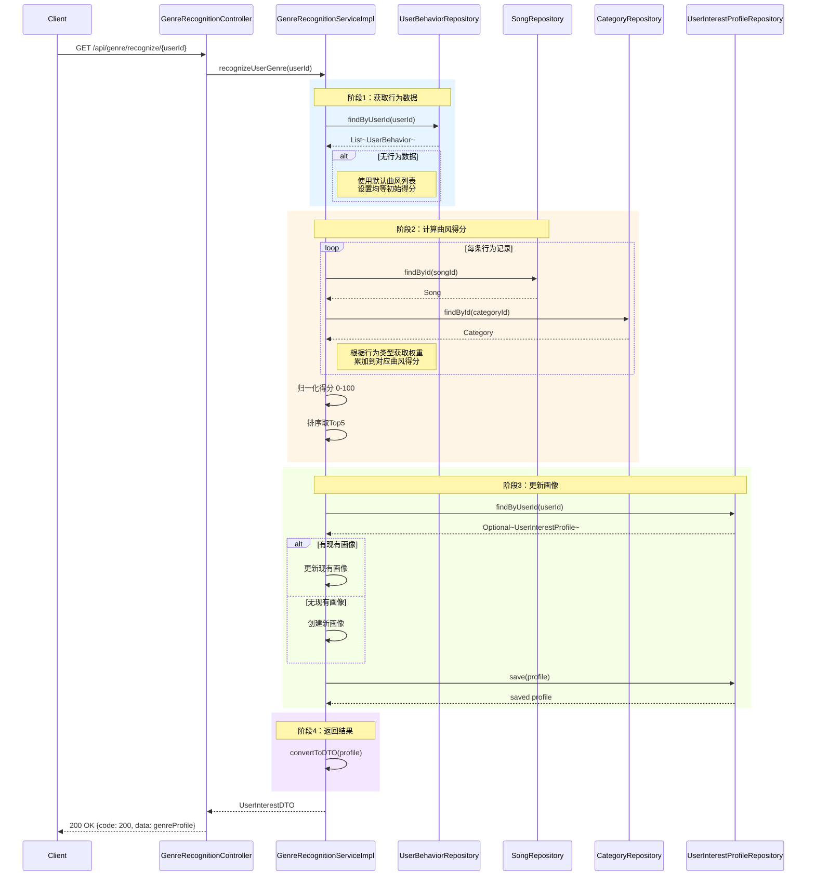
```mermaid
sequenceDiagram
    participant Client
    participant GenreRecognitionController
    participant GenreRecognitionServiceImpl
    participant UserBehaviorRepository
    participant SongRepository
    participant CategoryRepository
    participant UserInterestProfileRepository

    Client->>GenreRecognitionController: GET /api/genre/recognize/{userId}
    GenreRecognitionController->>GenreRecognitionServiceImpl: recognizeUserGenre(userId)

    rect rgb(230, 245, 255)
        Note over GenreRecognitionServiceImpl,UserBehaviorRepository: 阶段1：获取行为数据
        GenreRecognitionServiceImpl->>UserBehaviorRepository: findByUserId(userId)
        UserBehaviorRepository-->>GenreRecognitionServiceImpl: List~UserBehavior~
        
        alt 无行为数据
            Note right of GenreRecognitionServiceImpl: 使用默认曲风列表<br/>设置均等初始得分
        end
    end

    rect rgb(255, 245, 230)
        Note over GenreRecognitionServiceImpl,SongRepository: 阶段2：计算曲风得分
        loop 每条行为记录
            GenreRecognitionServiceImpl->>SongRepository: findById(songId)
            SongRepository-->>GenreRecognitionServiceImpl: Song
            
            GenreRecognitionServiceImpl->>CategoryRepository: findById(categoryId)
            CategoryRepository-->>GenreRecognitionServiceImpl: Category
            
            Note right of GenreRecognitionServiceImpl: 根据行为类型获取权重<br/>累加到对应曲风得分
        end
        
        GenreRecognitionServiceImpl->>GenreRecognitionServiceImpl: 归一化得分 0-100
        GenreRecognitionServiceImpl->>GenreRecognitionServiceImpl: 排序取Top5
    end

    rect rgb(245, 255, 230)
        Note over GenreRecognitionServiceImpl,UserInterestProfileRepository: 阶段3：更新画像
        GenreRecognitionServiceImpl->>UserInterestProfileRepository: findByUserId(userId)
        UserInterestProfileRepository-->>GenreRecognitionServiceImpl: Optional~UserInterestProfile~
        
        alt 有现有画像
            GenreRecognitionServiceImpl->>GenreRecognitionServiceImpl: 更新现有画像
        else 无现有画像
            GenreRecognitionServiceImpl->>GenreRecognitionServiceImpl: 创建新画像
        end
        
        GenreRecognitionServiceImpl->>UserInterestProfileRepository: save(profile)
        UserInterestProfileRepository-->>GenreRecognitionServiceImpl: saved profile
    end

    rect rgb(245, 230, 255)
        Note over GenreRecognitionServiceImpl,GenreRecognitionServiceImpl: 阶段4：返回结果
        GenreRecognitionServiceImpl->>GenreRecognitionServiceImpl: convertToDTO(profile)
    end

    GenreRecognitionServiceImpl-->>GenreRecognitionController: UserInterestDTO
    GenreRecognitionController-->>Client: 200 OK {code: 200, data: genreProfile}
```

### 6.3 时序图 - 批量识别所有用户曲风

**流程说明：**

该时序图展示了系统定时批量识别所有活跃用户曲风偏好的完整流程，整个流程分为获取用户列表、逐个识别曲风、统计结果和日志输出四个主要阶段。

获取用户列表阶段：定时任务调度器（Scheduler）按照配置的 Cron 表达式（每日凌晨1点）自动触发执行 batchRecognizeAllUsers 方法。服务层首先通过 UserRepository 查询所有状态为正常（status=1）的活跃用户列表。这些用户是曲风识别目标群体，系统需要为每个活跃用户识别其曲风偏好。

逐个识别曲风阶段：服务层遍历用户列表，为每个用户调用 recognizeUserGenre 方法识别曲风偏好。识别过程与前述的"用户曲风识别"流程相同，包括查询用户行为、分析行为权重、计算曲风得分、更新兴趣画像保存到数据库。这一步骤可能需要处理大量用户，因此是整个流程中耗时最长的部分。服务层为每个用户执行上述操作，并为每个用户生成个性化的曲风偏好画像。

统计结果阶段：完成所有用户的曲风识别后，服务层统计本次批量识别的结果。统计信息包括总处理用户数量、成功识别数量（通过 countByUserId 大于0判断）、失败数量等。这些统计数据用于日志输出和系统监控。

日志输出阶段：服务层输出详细的日志信息，记录本次定时任务执行的结果。日志内容包括任务开始时间、处理的用户总数、识别成功的用户数、识别失败的用户数、任务总耗时等。如果在执行过程中出现异常，日志还会记录异常信息和错误堆栈，便于开发人员排查问题。

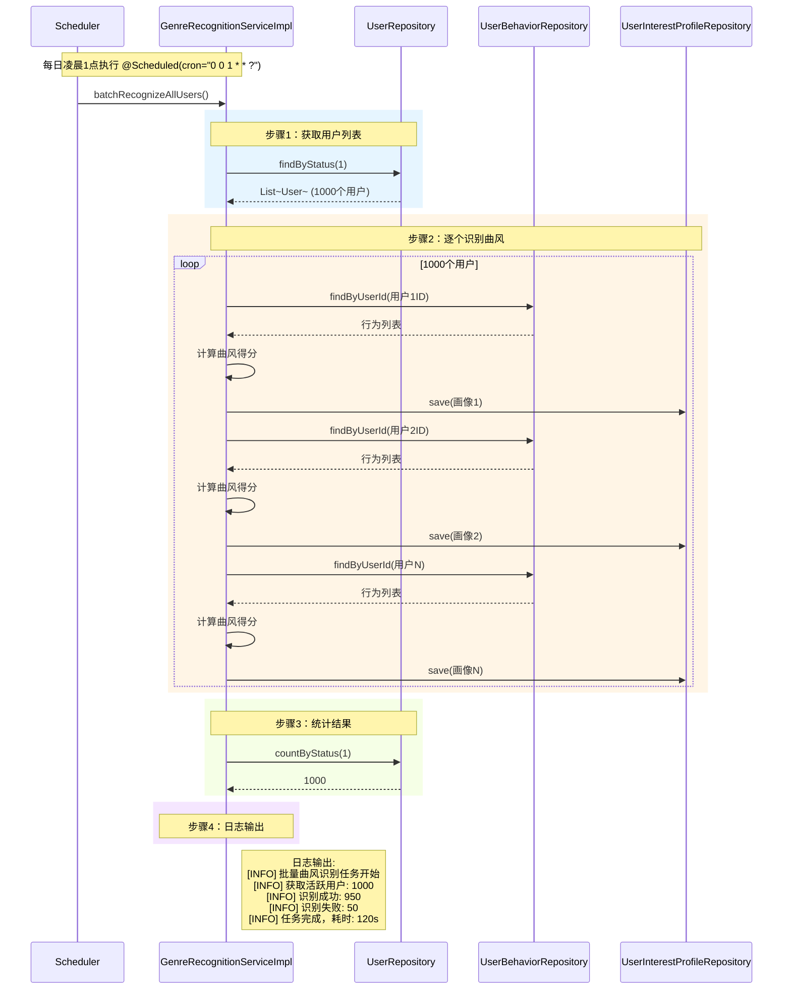
```mermaid
sequenceDiagram
    participant Scheduler
    participant GenreRecognitionServiceImpl
    participant UserRepository
    participant UserBehaviorRepository
    participant UserInterestProfileRepository

    Note over Scheduler,GenreRecognitionServiceImpl: 每日凌晨1点执行 @Scheduled(cron="0 0 1 * * ?")

    Scheduler->>GenreRecognitionServiceImpl: batchRecognizeAllUsers()

    rect rgb(230, 245, 255)
        Note over GenreRecognitionServiceImpl,UserRepository: 步骤1：获取用户列表
        GenreRecognitionServiceImpl->>UserRepository: findByStatus(1)
        UserRepository-->>GenreRecognitionServiceImpl: List~User~ (1000个用户)
    end

    rect rgb(255, 245, 230)
        Note over GenreRecognitionServiceImpl,UserInterestProfileRepository: 步骤2：逐个识别曲风
        loop 1000个用户
            GenreRecognitionServiceImpl->>UserBehaviorRepository: findByUserId(用户1ID)
            UserBehaviorRepository-->>GenreRecognitionServiceImpl: 行为列表
            
            GenreRecognitionServiceImpl->>GenreRecognitionServiceImpl: 计算曲风得分
            GenreRecognitionServiceImpl->>UserInterestProfileRepository: save(画像1)
            
            GenreRecognitionServiceImpl->>UserBehaviorRepository: findByUserId(用户2ID)
            UserBehaviorRepository-->>GenreRecognitionServiceImpl: 行为列表
            
            GenreRecognitionServiceImpl->>GenreRecognitionServiceImpl: 计算曲风得分
            GenreRecognitionServiceImpl->>UserInterestProfileRepository: save(画像2)
            
            GenreRecognitionServiceImpl->>UserBehaviorRepository: findByUserId(用户N)
            UserBehaviorRepository-->>GenreRecognitionServiceImpl: 行为列表
            
            GenreRecognitionServiceImpl->>GenreRecognitionServiceImpl: 计算曲风得分
            GenreRecognitionServiceImpl->>UserInterestProfileRepository: save(画像N)
        end
    end

    rect rgb(245, 255, 230)
        Note over GenreRecognitionServiceImpl,UserRepository: 步骤3：统计结果
        GenreRecognitionServiceImpl->>UserRepository: countByStatus(1)
        UserRepository-->>GenreRecognitionServiceImpl: 1000
    end

    rect rgb(245, 230, 255)
        Note over GenreRecognitionServiceImpl,GenreRecognitionServiceImpl: 步骤4：日志输出
    end

    Note right of GenreRecognitionServiceImpl: 日志输出:<br/>[INFO] 批量曲风识别任务开始<br/>[INFO] 获取活跃用户: 1000<br/>[INFO] 识别成功: 950<br/>[INFO] 识别失败: 50<br/>[INFO] 任务完成，耗时: 120s
```

---

## 7. 音乐播放与创作模块

### 7.1 类图

**类关系说明：**

本音乐播放与创作模块是系统的核心功能模块，涵盖了歌曲播放、歌曲上传、歌词显示、播放记录等核心功能。该模块采用 MVC + Repository 分层架构设计，同时引入了播放历史记录和用户行为追踪机制，类与类之间的关系采用面向接口编程和依赖注入的设计模式。

继承关系：SongServiceImpl 实现了 SongService 接口，PlayerServiceImpl 实现了 PlayerService 接口。接口定义了歌曲和播放业务方法规范，实现类负责具体的歌曲 CRUD 操作、播放控制、播放历史记录等逻辑。这种设计遵循了面向接口编程的原则，使得业务逻辑的实现可以被替换，便于后期扩展和单元测试。

依赖关系：SongController 依赖 SongService 接口，PlayerController 依赖 PlayerService 接口，而不直接依赖实现类。控制层通过接口调用服务层，实现了控制层与服务层的解耦。当服务实现类发生变更时，控制器层无需修改，降低了代码耦合度。

关联关系：SongServiceImpl 通过依赖注入的方式关联了多个组件，包括 SongRepository（歌曲数据持久化）、ArtistRepository（艺术家数据持久化）、AlbumRepository（专辑数据持久化）、CategoryRepository（分类数据持久化）、SongArtistRepository（歌曲艺术家关联持久化）、PlayHistoryRepository（播放历史持久化）、UserBehaviorRepository（用户行为持久化）、UserRepository（用户数据查询）以及 FileStorageService（文件存储服务）。这些组件分别负责歌曲数据的增删改查、艺术家数据管理、专辑数据管理、分类数据管理、歌曲与艺术家关联关系管理、播放历史记录、用户行为记录、用户数据查询以及歌曲文件和封面图片的存储上传功能。PlayerServiceImpl 则关联了 PlayHistoryRepository、UserBehaviorRepository、SongRepository，用于记录播放历史和分析用户行为。

实体继承：Song、Artist、Album、Category、PlayHistory、UserBehavior 等实体类都继承自 JPA 的 BaseEntity（隐式），包含公共字段 id、createdAt、updatedAt。Song 实体类映射数据库中的 songs 表，存储歌曲的完整信息，包括歌曲标题、时长、文件URL、歌词、封面、专辑ID、分类ID、播放次数、下载次数、分享次数、状态、是否原创、上传用户ID等字段。PlayHistory 实体类映射 play_histories 表，记录用户的播放行为，包括用户ID、歌曲ID、播放时间、播放时长和状态。UserBehavior 实体类映射 user_behavior 表，记录用户对歌曲的详细行为，包括行为类型（播放、完整收听、收藏、分享、下载、评论）和权重分数。

数据传输：控制层接收客户端请求参数，包括歌曲ID、用户ID、播放进度等。服务层生成 Song、PlayHistory 等实体用于数据持久化，并返回 SongDTO、PlayHistoryDTO 等用于给前端展示。SongDTO 是专门用于展示歌曲信息的数据传输对象，包含歌曲ID、标题、艺术家（多个艺术家以逗号分隔）、专辑名称、分类名称、时长、封面URL、歌词、播放次数、分享次数、下载次数等信息。

数据流向：歌曲播放流程从客户端发起，GET 请求到 /api/song/play/{songId} 或 /api/player/play 接口，PlayerController 接收请求后，调用 PlayerServiceImpl 的 playSong 方法处理业务逻辑。服务层首先通过 SongRepository 查询歌曲信息，验证歌曲状态是否正常。然后通过 PlayHistoryRepository 记录用户的播放历史，通过 UserBehaviorRepository 记录用户的行为数据。最后返回歌曲的播放URL给客户端，客户端根据URL进行音频播放。

各层职责：控制层负责接收并解析客户端 HTTP 请求、参数校验、调用 Service 层方法、封装响应结果以及处理异常。服务层接口定义业务接口规范和声明业务方法签名，不涉及具体实现。服务层实现类负责实现核心业务逻辑，包括歌曲的搜索、详情查询、播放、上传、删除等操作，以及播放历史记录、用户行为追踪等功能。持久化层负责 Song、Artist、Album、Category、PlayHistory、UserBehavior 等实体的增删改查操作。实体层负责映射数据库表、定义实体属性。

**类图结构：**

```mermaid
classDiagram
    class SongController {
        -songService: SongService
        +getSongById(id: Long): ResponseEntity
        +searchSongs(keyword: String): ResponseEntity
        +getSongsByCategory(categoryId: Long): ResponseEntity
        +uploadSong(song: MultipartFile): ResponseEntity
        +deleteSong(id: Long): ResponseEntity
    }

    class PlayerController {
        -playerService: PlayerService
        +playSong(songId: Long, userId: Long): ResponseEntity
        +getPlayHistory(userId: Long): ResponseEntity
        +clearPlayHistory(userId: Long): ResponseEntity
    }

    class SongServiceImpl {
        -songRepository: SongRepository
        -artistRepository: ArtistRepository
        -albumRepository: AlbumRepository
        -categoryRepository: CategoryRepository
        -songArtistRepository: SongArtistRepository
        -fileStorageService: FileStorageService
        -log: Logger
        +getSongById(id: Long): SongDTO
        +searchSongs(keyword: String): List~SongDTO~
        +getSongsByCategory(categoryId: Long): List~SongDTO~
        +uploadSong(song: MultipartFile, metadata: SongUploadDTO): Song
        +deleteSong(id: Long): void
        -convertToDTO(song: Song): SongDTO
    }

    class PlayerServiceImpl {
        -playHistoryRepository: PlayHistoryRepository
        -userBehaviorRepository: UserBehaviorRepository
        -songRepository: SongRepository
        -userRepository: UserRepository
        -log: Logger
        +playSong(songId: Long, userId: Long): Map~String, Object~
        +getPlayHistory(userId: Long): List~PlayHistoryDTO~
        +clearPlayHistory(userId: Long): void
        -recordPlayHistory(userId: Long, songId: Long): void
        -recordUserBehavior(userId: Long, songId: Long, behaviorType: Integer): void
    }

    class SongService {
        +getSongById(id: Long): SongDTO
        +searchSongs(keyword: String): List~SongDTO~
        +getSongsByCategory(categoryId: Long): List~SongDTO~
        +uploadSong(song: MultipartFile, metadata: SongUploadDTO): Song
        +deleteSong(id: Long): void
    }

    class PlayerService {
        +playSong(songId: Long, userId: Long): Map~String, Object~
        +getPlayHistory(userId: Long): List~PlayHistoryDTO~
        +clearPlayHistory(userId: Long): void
    }

    class SongRepository {
        +findById(id: Long): Optional~Song~
        +findByTitleContaining(keyword: String): List~Song~
        +findByCategoryId(categoryId: Long): List~Song~
        +findByStatus(status: Integer): List~Song~
        +save(song: Song): Song
        +deleteById(id: Long): void
    }

    class ArtistRepository {
        +findById(id: Long): Optional~Artist~
        +findByNameContaining(name: String): List~Artist~
        +save(artist: Artist): Artist
    }

    class AlbumRepository {
        +findById(id: Long): Optional~Album~
        +findByArtistId(artistId: Long): List~Album~
        +save(album: Album): Album
    }

    class CategoryRepository {
        +findById(id: Long): Optional~Category~
        +findAll(): List~Category~
    }

    class PlayHistoryRepository {
        +findByUserIdOrderByPlayTimeDesc(userId: Long): List~PlayHistory~
        +findByUserIdAndPlayTimeAfter(userId: Long, date: Date): List~PlayHistory~
        +save(history: PlayHistory): PlayHistory
        +deleteByUserId(userId: Long): void
    }

    class UserBehaviorRepository {
        +save(behavior: UserBehavior): UserBehavior
        +findByUserId(userId: Long): List~UserBehavior~
    }

    class Song {
        -id: Long
        -title: String
        -duration: Integer
        -url: String
        -lyrics: TEXT
        -cover: String
        -albumId: Long
        -categoryId: Long
        -playCount: Long
        -downloadCount: Integer
        -shareCount: Integer
        -status: Integer
        -isOriginal: Integer
        -userId: Long
        -userUpload: Integer
        -createdAt: Date
        -updatedAt: Date
    }

    class Artist {
        -id: Long
        -name: String
        -avatar: String
        -description: TEXT
        -createdAt: Date
    }

    class Album {
        -id: Long
        -title: String
        -cover: String
        -artistId: Long
        -releaseDate: Date
        -createdAt: Date
    }

    class Category {
        -id: Long
        -name: String
        -description: TEXT
    }

    class PlayHistory {
        -id: Long
        -userId: Long
        -songId: Long
        -playTime: Date
        -duration: Integer
        -status: Integer
        -createdAt: Date
    }

    class UserBehavior {
        -id: Long
        -userId: Long
        -targetType: Integer
        -targetId: Long
        -behaviorType: Integer
        -weight: Integer
        -createdAt: Date
    }

    class SongDTO {
        -id: Long
        -title: String
        -artist: String
        -albumName: String
        -categoryName: String
        -duration: Integer
        -cover: String
        -lyrics: String
        -playCount: Long
        -shareCount: Integer
        -downloadCount: Integer
    }

    class PlayHistoryDTO {
        -id: Long
        -songId: Long
        -songTitle: String
        -artist: String
        -cover: String
        -playTime: Date
        -duration: Integer
    }

    class FileStorageService {
        +storeFile(file: MultipartFile): String
        +deleteFile(fileName: String): void
        +getFileUrl(fileName: String): String
    }

    SongController --> SongService
    PlayerController --> PlayerService
    SongService --> SongServiceImpl
    PlayerService --> PlayerServiceImpl
    SongServiceImpl --> SongRepository
    SongServiceImpl --> ArtistRepository
    SongServiceImpl --> AlbumRepository
    SongServiceImpl --> CategoryRepository
    SongServiceImpl --> FileStorageService
    PlayerServiceImpl --> PlayHistoryRepository
    PlayerServiceImpl --> UserBehaviorRepository
    PlayerServiceImpl --> SongRepository
    SongServiceImpl --> Song
    SongServiceImpl --> SongDTO
    PlayerServiceImpl --> PlayHistory
    PlayerServiceImpl --> PlayHistoryDTO
    PlayHistory --> Song
    UserBehavior --> Song
```

### 7.2 时序图 - 播放歌曲

**流程说明：**

该时序图展示了用户播放歌曲的完整流程，整个流程分为验证歌曲、记录播放历史、记录用户行为和返回播放信息四个主要阶段。

验证歌曲阶段：客户端发起 GET 请求到 /api/player/play/{songId} 接口，请求播放指定歌曲。PlayerController 接收请求后，提取歌曲ID和用户ID参数，调用 PlayerServiceImpl 的 playSong 方法处理业务逻辑。服务层首先通过 SongRepository 根据歌曲ID查询歌曲信息，验证歌曲是否存在。如果歌曲不存在，返回错误信息给客户端。如果歌曲存在，继续验证歌曲状态是否正常（status=1表示正常）。如果歌曲已禁用，返回错误信息。如果歌曲正常，获取歌曲的播放URL和相关信息。

记录播放历史阶段：歌曲验证通过后，服务层通过 PlayHistoryRepository 记录用户的播放历史。首先创建一个 PlayHistory 实体对象，设置用户ID、歌曲ID、播放时间（当前时间）、播放时长（从歌曲元数据获取）和状态。然后将播放历史记录保存到数据库。播放历史记录用于后续的用户听歌报告生成和个人播放统计。

记录用户行为阶段：播放历史记录保存成功后，服务层通过 UserBehaviorRepository 记录用户的行为数据。创建一个 UserBehavior 实体对象，设置用户ID、目标类型（歌曲为1）、目标ID（歌曲ID）、行为类型（播放为1）、权重分数（播放权重为1）和创建时间。然后将行为记录保存到数据库。用户行为数据用于用户兴趣分析和推荐系统。

返回播放信息阶段：服务层将歌曲播放相关信息封装为 Map 对象返回给客户端。返回信息包括歌曲ID、歌曲标题、艺术家名称、专辑名称、封面URL、播放URL、歌词（如果需要）、播放时长等。Controller 最终返回 200 OK 响应给客户端，响应体中包含 code 为 200 和 data 为播放信息的 JSON 对象。客户端收到响应后，根据播放URL开始音频播放。

```mermaid
sequenceDiagram
    participant Client
    participant PlayerController
    participant PlayerServiceImpl
    participant SongRepository
    participant PlayHistoryRepository
    participant UserBehaviorRepository

    Client->>PlayerController: GET /api/player/play/{songId}?userId=xxx
    PlayerController->>PlayerServiceImpl: playSong(songId, userId)

    rect rgb(230, 245, 255)
        Note over PlayerServiceImpl,SongRepository: 阶段1：验证歌曲
        PlayerServiceImpl->>SongRepository: findById(songId)
        SongRepository-->>PlayerServiceImpl: Optional~Song~
        
        alt 歌曲不存在
            PlayerServiceImpl-->>PlayerController: 返回错误: 歌曲不存在
            PlayerController-->>Client: 404 Not Found
        else 歌曲已禁用
            PlayerServiceImpl-->>PlayerController: 返回错误: 歌曲已下架
            PlayerController-->>Client: 403 Forbidden
        else 歌曲正常
            Note right of PlayerServiceImpl: 获取歌曲播放URL
        end
    end

    rect rgb(255, 245, 230)
        Note over PlayerServiceImpl,PlayHistoryRepository: 阶段2：记录播放历史
        PlayerServiceImpl->>PlayerServiceImpl: 构建PlayHistory对象
        PlayerServiceImpl->>PlayHistoryRepository: save(history)
        PlayHistoryRepository-->>PlayerServiceImpl: saved history
    end

    rect rgb(245, 255, 230)
        Note over PlayerServiceImpl,UserBehaviorRepository: 阶段3：记录用户行为
        PlayerServiceImpl->>PlayerServiceImpl: 构建UserBehavior对象
        PlayerServiceImpl->>UserBehaviorRepository: save(behavior)
        UserBehaviorRepository-->>PlayerServiceImpl: saved behavior
    end

    rect rgb(245, 230, 255)
        Note over PlayerServiceImpl,PlayerServiceImpl: 阶段4：返回播放信息
        PlayerServiceImpl->>PlayerServiceImpl: 构建返回Map
    end

    PlayerServiceImpl-->>PlayerController: Map~songUrl, title, artist...~
    PlayerController-->>Client: 200 OK {code: 200, data: playInfo}
```

### 7.3 时序图 - 上传歌曲

**流程说明：**

该时序图展示了用户上传歌曲的完整流程，整个流程分为接收文件、存储文件、创建歌曲记录、关联艺术家和返回结果五个主要阶段。

接收文件阶段：客户端发起 POST 请求到 /api/song/upload 接口，请求上传歌曲文件。请求采用 multipart/form-data 格式，包含歌曲文件（file 参数）和其他元数据（title、duration、artistName、albumName、categoryId、lyrics 等）。SongController 接收请求后，通过 @RequestParam 注解获取歌曲文件和其他参数，调用 SongServiceImpl 的 uploadSong 方法处理业务逻辑。服务层首先验证上传的文件是否为空，如果为空则返回错误信息。然后验证文件类型是否为支持的音频格式（mp3、wav、flac、m4a等）。

存储文件阶段：文件验证通过后，服务层通过 FileStorageService 存储上传的歌曲文件。FileStorageService 会为文件生成唯一的文件名（通常使用 UUID + 原始扩展名），将文件保存到配置的存储目录，并返回文件的访问URL。服务层获取到歌曲文件的存储URL后，如果客户端也上传了封面图片，同样通过 FileStorageService 保存封面图片，获取封面URL。

创建歌曲记录阶段：文件存储成功后，服务层需要创建歌曲记录到数据库。首先创建 Song 实体对象，设置歌曲标题（从请求参数获取）、时长（从请求参数或解析文件获取）、歌曲文件URL、封面URL（如果有）、歌词（如果有）、分类ID、专辑ID（如果指定了已有专辑）、上传用户ID、歌曲状态（默认1为正常）、是否原创（用户上传默认为0）等字段。然后通过 SongRepository 将歌曲保存到数据库，获取自动生成的歌曲ID。

关联艺术家阶段：歌曲记录创建成功后，服务层需要处理歌曲与艺术家的关联关系。如果请求中指定了艺术家名称，系统首先通过 ArtistRepository 查询该艺术家是否已存在。如果艺术家不存在，则创建一个新的 Artist 记录。如果艺术家已存在，获取艺术家的ID。然后通过 SongArtistRepository 创建歌曲与艺术家的关联关系（一首歌曲可以有多个艺术家，如合唱歌曲）。如果是多艺术家的情况，需要分别创建多条关联记录。

返回结果阶段：服务层将创建的歌曲信息转换为 SongDTO 格式返回给客户端。返回信息包括歌曲ID、歌曲标题、艺术家名称、专辑名称、分类名称、时长、封面URL、歌词、播放次数（初始为0）等。Controller 最终返回 201 Created 响应给客户端，响应体中包含 code 为 201 和 data 为歌曲信息的 JSON 对象。

```mermaid
sequenceDiagram
    participant Client
    participant SongController
    participant SongServiceImpl
    participant FileStorageService
    participant SongRepository
    participant ArtistRepository
    participant SongArtistRepository

    Client->>SongController: POST /api/song/upload<br/>multipart/form-data
    SongController->>SongServiceImpl: uploadSong(file, metadata)

    rect rgb(230, 245, 255)
        Note over SongServiceImpl,SongServiceImpl: 阶段1：接收文件
        alt 文件为空
            SongServiceImpl-->>SongController: 返回错误: 文件不能为空
            SongController-->>Client: 400 Bad Request
        else 文件类型不支持
            SongServiceImpl-->>SongController: 返回错误: 不支持的文件类型
            SongController-->>Client: 400 Bad Request
        end
    end

    rect rgb(255, 245, 230)
        Note over SongServiceImpl,FileStorageService: 阶段2：存储文件
        SongServiceImpl->>FileStorageService: storeFile(songFile)
        FileStorageService-->>SongServiceImpl: songUrl
        
        alt 有封面图片
            SongServiceImpl->>FileStorageService: storeFile(coverFile)
            FileStorageService-->>SongServiceImpl: coverUrl
        end
    end

    rect rgb(245, 255, 230)
        Note over SongServiceImpl,SongRepository: 阶段3：创建歌曲记录
        SongServiceImpl->>SongServiceImpl: 构建Song对象
        SongServiceImpl->>SongRepository: save(song)
        SongRepository-->>PlayerServiceImpl: saved song
    end

    rect rgb(245, 230, 255)
        Note over SongServiceImpl,ArtistRepository: 阶段4：关联艺术家
        alt 指定了艺术家
            SongServiceImpl->>ArtistRepository: findByName(artistName)
            ArtistRepository-->>SongServiceImpl: Optional~Artist~
            
            alt 艺术家不存在
                SongServiceImpl->>ArtistRepository: save(new Artist)
                ArtistRepository-->>SongServiceImpl: created artist
            end
            
            SongServiceImpl->>SongArtistRepository: save(songArtist)
        end
    end

    rect rgb(230, 255, 245)
        Note over SongServiceImpl,SongServiceImpl: 阶段5：返回结果
        SongServiceImpl->>SongServiceImpl: convertToDTO(song)
    end

    SongServiceImpl-->>SongController: SongDTO
    SongController-->>Client: 201 Created {code: 201, data: song}
```

### 7.4 时序图 - 获取播放历史

**流程说明：**

该时序图展示了用户获取自己播放历史的完整流程，整个流程分为查询播放历史、获取歌曲详情和返回结果三个主要阶段。

查询播放历史阶段：客户端发起 GET 请求到 /api/player/history/{userId} 接口，请求获取指定用户的播放历史记录。PlayerController 接收请求后，提取用户ID参数，调用 PlayerServiceImpl 的 getPlayHistory 方法处理业务逻辑。服务层首先通过 PlayHistoryRepository 查询该用户的播放历史记录。查询使用 findByUserIdOrderByPlayTimeDesc 方法，按照播放时间降序排列，即最新的播放记录排在最前面。如果需要限制返回数量，可以使用 findByUserIdAndPlayTimeAfter 方法查询指定时间段内的播放记录。

获取歌曲详情阶段：查询到播放历史记录列表后，服务层需要为每条历史记录补充歌曲的详细信息。因为 PlayHistory 实体只存储了歌曲ID，不包含歌曲的标题、艺术家、封面等信息。服务层遍历播放历史列表，对每条记录通过 SongRepository 查询对应的歌曲信息。然后将歌曲信息（标题、艺术家名称、封面URL等）填充到 PlayHistoryDTO 中。如果歌曲已被删除或不存在，需要处理这种情况，可以返回默认信息或者跳过该条记录。

返回结果阶段：服务层将包含歌曲详情的播放历史列表返回给客户端。返回数据为 List<PlayHistoryDTO> 格式，每条记录包含历史记录ID、歌曲ID、歌曲标题、艺术家名称、封面URL、播放时间和播放时长等信息。Controller 最终返回 200 OK 响应给客户端，响应体中包含 code 为 200 和 data 为播放历史列表的 JSON 对象。

```mermaid
sequenceDiagram
    participant Client
    participant PlayerController
    participant PlayerServiceImpl
    participant PlayHistoryRepository
    participant SongRepository

    Client->>PlayerController: GET /api/player/history/{userId}
    PlayerController->>PlayerServiceImpl: getPlayHistory(userId)

    rect rgb(230, 245, 255)
        Note over PlayerServiceImpl,PlayHistoryRepository: 阶段1：查询播放历史
        PlayerServiceImpl->>PlayHistoryRepository: findByUserIdOrderByPlayTimeDesc(userId)
        PlayHistoryRepository-->>PlayerServiceImpl: List~PlayHistory~ (50条)
    end

    rect rgb(255, 245, 230)
        Note over PlayerServiceImpl,SongRepository: 阶段2：获取歌曲详情
        loop 50条历史记录
            PlayerServiceImpl->>SongRepository: findById(songId)
            SongRepository-->>PlayerServiceImpl: Optional~Song~
            
            alt 歌曲存在
                PlayerServiceImpl-->>PlayerServiceImpl: 构建PlayHistoryDTO
            else 歌曲已删除
                PlayerServiceImpl-->>PlayerServiceImpl: 跳过或使用默认信息
            end
        end
    end

    PlayerServiceImpl-->>PlayerController: List~PlayHistoryDTO~
    PlayerController-->>Client: 200 OK {code: 200, data: historyList}
```

---

## 8. AI 音乐模块

### 5.1 类图

**类关系说明：**

本AI音乐模块采用 MVC + Repository 分层架构设计，同时引入了异步任务处理机制，类与类之间的关系采用面向接口编程和依赖注入的设计模式。

继承关系：AiMusicServiceImpl 实现了 AiMusicService 接口（从后续代码可以看出）。接口定义了AI音乐生成业务方法规范，实现类负责具体的AI音乐生成、曲风识别和任务管理逻辑。这种设计遵循了面向接口编程的原则，使得业务逻辑的实现可以被替换，便于后期扩展和单元测试。

依赖关系：AiMusicController 依赖 AiMusicService 接口，而不直接依赖实现类。控制层通过接口调用服务层，实现了控制层与服务层的解耦。当服务实现类发生变更时，控制器层无需修改，降低了代码耦合度。

关联关系：AiMusicServiceImpl 通过依赖注入的方式关联了多个组件，包括 AiMusicGenerationRepository（AI音乐生成记录持久化）、UserRepository（用户数据查询）、ThreadPoolExecutor（线程池，用于异步任务执行）、RestTemplate（HTTP客户端，用于调用外部AI音乐生成服务）、以及配置属性（apiKey、apiProvider、songStoragePath、musicgenEnabled、musicgenServiceUrl等）。AiMusicGeneration 实体通过 User 字段与 User 实体建立关联关系，表示每条AI音乐生成记录都属于某个用户。

实体继承：AiMusicGeneration 实体类继承自 JPA 的 BaseEntity（隐式），包含公共字段 id、createdAt、updatedAt。实体类映射数据库中的 ai_music_generation 表，存储用户AI音乐生成记录，包括用户ID、生成提示词、音乐风格、情绪、时长、生成的音乐URL、封面URL、状态（0-生成中、1-成功、2-失败）、错误信息等字段。

数据传输：控制层接收客户端请求参数，包括 prompt（生成提示词）、genre（音乐风格）、mood（音乐情绪）、duration（生成时长）等。服务层生成 AiMusicGeneration 实体后返回给客户端。异步任务通过 Future 接口返回，允许客户端轮询查询任务状态。服务层还封装了 MusicGenerationResponse 等响应对象用于返回给前端。

数据流向：请求流程从客户端发起，POST 请求到 /api/ai/generate 接口，AiMusicController 接收请求后，验证参数并调用 AiMusicService 的 generateMusicAsync 方法。服务层首先保存一条状态为0（生成中）的记录到数据库，然后提交异步任务到线程池。线程池后台调用外部AI音乐生成服务（MusicGen Service），生成完成后更新记录状态为1（成功）或2（失败）。客户端可以通过 GET /api/ai/status/{id} 接口轮询查询生成状态。

各层职责：控制层负责接收并解析客户端 HTTP 请求、参数校验、调用 Service 层方法、封装响应结果以及处理异常。服务层接口定义业务接口规范和声明业务方法签名，不涉及具体实现。服务层实现类负责实现核心业务逻辑，包括调用外部AI音乐生成服务、处理异步任务、管理生成记录、处理音频下载和保存。持久化层负责 AiMusicGeneration 实体的增删改查操作。实体层负责映射数据库表、定义实体属性。

**类图结构：**

```mermaid
classDiagram
    class AiMusicController {
        -aiMusicService: AiMusicService
        +generateMusic(prompt: String, genre: String, mood: String, duration: Integer): ResponseEntity
        +getGenerationStatus(id: Long): ResponseEntity
        +getUserGenerations(userId: Long): ResponseEntity
        +recognizeMusicStyle(file: MultipartFile): ResponseEntity
        +deleteGeneration(id: Long): ResponseEntity
        +getAvailableModels(): ResponseEntity
    }

    class AiMusicService {
        -aiMusicRepository: AiMusicGenerationRepository
        -userRepository: UserRepository
        -apiKey: String
        -apiProvider: String
        -songStoragePath: String
        -musicgenEnabled: boolean
        -musicgenServiceUrl: String
        +generateMusicAsync(userId: Long, prompt: String, genre: String, mood: String, duration: Integer): Future~AiMusicGeneration~
        +getGenerationStatus(id: Long): AiMusicGeneration
        +getUserGenerations(userId: Long): List~AiMusicGeneration~
        +recognizeMusicStyle(file: MultipartFile): Map~String, Object~
        +deleteGeneration(id: Long): void
        -callMusicGenService(generation: AiMusicGeneration): AiMusicGeneration
        -waitForGenerationComplete(taskId: String, generation: AiMusicGeneration): boolean
        -downloadAndSaveAudio(audioUrl: String, generationId: Long): String
    }

    class AiMusicGenerationRepository {
        +findById(id: Long): Optional~AiMusicGeneration~
        +findByUserIdOrderByCreatedAtDesc(userId: Long): List~AiMusicGeneration~
        +save(generation: AiMusicGeneration): AiMusicGeneration
        +deleteById(id: Long): void
    }

    class AiMusicGeneration {
        -id: Long
        -user: User
        -prompt: String
        -genre: String
        -mood: String
        -duration: Integer
        -musicUrl: String
        -cover: String
        -status: Integer
        -errorMessage: String
        -createdAt: Date
        -updatedAt: Date
    }

    class User {
        -id: Long
        -username: String
        -email: String
    }

    AiMusicController --> AiMusicService
    AiMusicService --> AiMusicGenerationRepository
    AiMusicService --> AiMusicGeneration
    AiMusicService --> User
    AiMusicGeneration --> User
```

### 5.2 时序图 - AI 音乐生成（异步任务）

**流程说明：**

该时序图展示了AI音乐生成的完整异步任务流程，整个流程分为四个主要阶段，包括任务提交、后台异步执行、轮询等待和状态查询。

阶段一为提交生成任务。客户端发起 POST 请求到 /api/ai/generate 接口，请求生成AI音乐，请求参数包括 prompt（生成提示词，如"欢快的歌曲"）、genre（音乐风格，如"流行"）、mood（音乐情绪，如"欢快"）、duration（生成时长，如60秒）。AiMusicController 接收请求后，调用 AiMusicService 的 generateMusicAsync 方法处理业务逻辑。服务层首先创建一个 AiMusicGeneration 实体对象，设置状态为0（表示生成中），然后通过 AiMusicGenerationRepository 将生成记录保存到数据库。保存成功后，服务层返回一个 Future 对象给 Controller，Controller 立即返回 202 Accepted 响应给客户端，响应中包含任务信息和状态为 processing。这种异步处理模式允许客户端在等待AI音乐生成的过程中执行其他操作，客户端可以通过返回的任务ID轮询查询生成状态。

阶段二为后台异步执行。线程池从任务队列中取出异步任务开始执行，调用 AiMusicService 的 callMusicGenService 方法。服务层构造HTTP请求，调用外部AI音乐生成服务（MusicGen Service）的 POST /api/generate 接口，请求参数包括提示词和生成时长。外部服务接收到请求后，创建一个异步生成任务，立即返回一个任务ID（如 task_id=xxx）给服务层。此时AI音乐生成任务已在后台开始处理，服务层获得任务ID后返回等待进一步处理。

阶段三为轮询等待生成完成。服务层获得任务ID后，开始轮询外部AI音乐服务的任务状态。服务层循环调用 GET /api/status/{task_id} 接口查询任务进度，每次间隔5秒，最多轮询120次。如果任务状态仍为 processing（处理中），继续等待下一轮轮询。当某次查询返回状态为 completed（已完成）并附带生成的音频URL时，说明AI音乐已生成完毕。服务层调用 downloadAndSaveAudio 方法下载生成的音频文件，并保存到本地存储路径。然后更新数据库中的生成记录，将状态修改为1（表示成功），并保存生成的音乐URL。如果在轮询过程中发生错误或超时，服务层会将状态修改为2（表示失败），并保存错误信息。

阶段四为查询任务状态。客户端可以通过 GET /api/ai/generate/{id} 接口主动查询任务的最新状态。AiMusicController 接收请求后，调用 AiMusicService 的 getGenerationStatus 方法。服务层通过 AiMusicGenerationRepository 根据任务ID查询生成记录。根据记录的状态返回不同的响应给客户端：如果状态为1（成功），返回200 OK和包含音乐URL的完整记录；如果状态为0（进行中），返回200 OK和当前进度信息，客户端可以继续轮询；如果状态为2（失败），返回200 OK和错误信息，客户端可以查看失败原因。

```mermaid
sequenceDiagram
    participant Client
    participant AiMusicController
    participant AiMusicService
    participant AiMusicGenerationRepository
    participant ThreadPool
    participant MusicGenService

    Note over Client,MusicGenService: 异步任务流程

    rect rgb(230, 245, 255)
        Note over Client,AiMusicGenerationRepository: 阶段1：提交生成任务
        Client->>AiMusicController: POST /api/ai/generate
        Note right of Client: prompt=欢快的歌曲<br/>genre=流行<br/>mood=欢快<br/>duration=60
        AiMusicController->>AiMusicService: generateMusicAsync(userId, prompt, genre, mood, duration)
        AiMusicService->>AiMusicGenerationRepository: save(generation with status=0)
        Note right of AiMusicGenerationRepository: status=0 表示生成中
        AiMusicGenerationRepository-->>AiMusicService: saved generation
        AiMusicService-->>AiMusicController: Future~Generation~
        AiMusicController-->>Client: 202 Accepted
        Note right of Client: 返回任务信息，status=processing
    end

    rect rgb(255, 245, 230)
        Note over ThreadPool,MusicGenService: 阶段2：后台异步执行
        ThreadPool-->>AiMusicService: 执行异步任务
        AiMusicService->>AiMusicService: callMusicGenService(generation)
        AiMusicService->>MusicGenService: POST /api/generate
        Note right of MusicGenService: prompt=欢快的歌曲<br/>duration=60
        MusicGenService-->>AiMusicService: task_id=xxx (异步任务ID)
        Note right of AiMusicService: 任务ID返回，立即返回
    end

    rect rgb(245, 255, 230)
        Note over AiMusicService,MusicGenService: 阶段3：轮询等待生成完成
        loop 轮询任务状态 (最多120次，每次5秒)
            AiMusicService->>MusicGenService: GET /api/status/{task_id}
            MusicGenService-->>AiMusicService: status=processing
        end
        AiMusicService->>MusicGenService: GET /api/status/{task_id}
        MusicGenService-->>AiMusicService: status=completed, audio_url=xxx
        AiMusicService->>AiMusicService: downloadAndSaveAudio(audio_url, generation_id)
        AiMusicService->>AiMusicGenerationRepository: save(generation with status=1, musicUrl)
        Note right of AiMusicGenerationRepository: status=1 表示已完成
    end

    rect rgb(255, 230, 245)
        Note over Client,AiMusicGenerationRepository: 阶段4：查询任务状态
        Client->>AiMusicController: GET /api/ai/generate/{id}
        AiMusicController->>AiMusicService: getGenerationStatus(id)
        AiMusicService->>AiMusicGenerationRepository: findById(id)
        AiMusicGenerationRepository-->>AiMusicService: generation
        alt 任务完成
            AiMusicService-->>AiMusicController: generation with status=1, musicUrl
            AiMusicController-->>Client: 200 OK (已完成)
        else 任务进行中
            AiMusicService-->>AiMusicController: generation with status=0
            AiMusicController-->>Client: 200 OK (处理中)
        else 任务失败
            AiMusicService-->>AiMusicController: generation with status=2, errorMessage
            AiMusicController-->>Client: 200 OK (失败)
        end
    end
```

### 5.3 时序图 - 曲风识别

```mermaid
sequenceDiagram
    participant Client
    participant AiMusicController
    participant AiMusicService
    participant PythonService

    Client->>AiMusicController: POST /api/ai/recognize
    Note right of Client: 上传音频文件
    AiMusicController->>AiMusicService: recognizeMusicStyle(file)
    
    alt 调用Python服务
        AiMusicService->>PythonService: POST /understand
        Note right of PythonService: 音频文件
        PythonService-->>AiMusicService: {genre, mood, bpm, instruments...}
    else 服务不可用，使用备用方案
        AiMusicService-->>AiMusicService: 随机生成分析结果
    end
    
    AiMusicService-->>AiMusicController: {genre, mood, bpm, instruments, key...}
    AiMusicController-->>Client: 200 OK with analysis result
```

---

## 6. 社交模块

### 6.1 类图

```mermaid
classDiagram
    class SocialController {
        -postService: PostService
        -commentService: CommentService
        -likeService: LikeService
        -followService: FollowService
        +createPost(post: Post): ResponseEntity
        +getAllPosts(): ResponseEntity
        +getPostById(id: Long): ResponseEntity
        +deletePost(id: Long): ResponseEntity
        +likePost(postId: Long): ResponseEntity
        +unlikePost(postId: Long): ResponseEntity
        +commentPost(postId: Long, comment: Comment): ResponseEntity
        +deleteComment(commentId: Long): ResponseEntity
        +followUser(userId: Long): ResponseEntity
        +unfollowUser(userId: Long): ResponseEntity
        +getFollowing(userId: Long): ResponseEntity
        +getFollowers(userId: Long): ResponseEntity
    }

    class PostService {
        -postRepository: PostRepository
        +createPost(post: Post): Post
        +getAllPosts(): List~Post~
        +getPostById(id: Long): Optional~Post~
        +deletePost(id: Long): void
        +incrementLikes(postId: Long): void
    }

    class CommentService {
        -commentRepository: CommentRepository
        +addComment(comment: Comment): Comment
        +getCommentsByPostId(postId: Long): List~Comment~
        +deleteComment(id: Long): void
    }

    class LikeService {
        -likeRepository: LikeRepository
        +likePost(userId: Long, postId: Long): void
        +unlikePost(userId: Long, postId: Long): void
        +isLiked(userId: Long, postId: Long): boolean
    }

    class FollowService {
        -followRepository: FollowRepository
        +follow(followerId: Long, followingId: Long): void
        +unfollow(followerId: Long, followingId: Long): void
        +getFollowing(userId: Long): List~User~
        +getFollowers(userId: Long): List~User~
    }

    SocialController --> PostService
    SocialController --> CommentService
    SocialController --> LikeService
    SocialController --> FollowService
```

---

## 7. 排行榜模块

### 7.1 类图

**类关系说明：**

本排行榜模块采用标准的 MVC + Repository 分层架构设计，类与类之间的关系同样采用面向接口编程和依赖注入的设计模式。

继承关系：RankingServiceImpl 实现了 RankingService 接口。接口定义了榜单业务方法规范，实现类负责具体的榜单查询和生成逻辑。这种设计遵循了面向接口编程的原则，使得业务逻辑的实现可以被替换，便于后期扩展和单元测试。

依赖关系：RankingController 依赖 RankingService 接口，而不直接依赖实现类。控制层通过接口调用服务层，实现了控制层与服务层的解耦。当服务实现类发生变更时，控制器层无需修改，降低了代码耦合度。

关联关系：RankingServiceImpl 通过依赖注入的方式关联了多个组件，包括 SongRepository、SongHotScoreRepository、HotRankingRepository、UserFavoriteRepository、CommentRepository、CategoryRepository 以及 Logger。这些组件分别负责歌曲数据查询、歌曲热度分数持久化、热门榜单持久化、用户收藏数据查询、评论数据查询、分类数据查询以及日志记录功能。服务实现类还定义了一系列常量用于配置热度计算权重，包括播放权重为1、收藏权重为5、分享权重为8、下载权重为3、评论权重为4、时间衰减因子为1.8、榜单大小为100首、新歌天数为7天。

实体继承：HotRanking、HotSongScore 等实体类都继承自 JPA 的 BaseEntity（隐式），包含公共字段 id、createdAt、updatedAt。RankingType 是枚举类，定义了四种榜单类型，分别是全局热门榜（global）、分类热门榜（category）、新歌榜（new）和飙升榜（soaring）。

数据传输：服务实现类依赖 DTO（Data Transfer Object）进行数据传输，包括 HotRankingDTO、HotSongDTO。HotRankingDTO 用于封装榜单整体信息，包括榜单类型、标题、更新时间、歌曲列表。HotSongDTO 用于封装单个歌曲的榜单信息，包括排名、歌曲ID、标题、封面、艺术家、播放次数、热度分数、趋势和上升率。DTO 用于封装响应数据，与前端进行数据交换，同时隐藏内部实体结构。

数据流向：请求流程从客户端发起，经过 Controller 接收请求，调用 Service 层处理业务逻辑，Service 层首先检查缓存（从 HotRankingRepository 查询榜单数据），如果有缓存数据则直接返回，如果没有则调用生成方法生成新榜单，Service 层调用各 Repository 进行数据查询，最终到达数据库。响应流程则相反，从数据库查询数据，经过 Entity 封装，Repository 返回，Service 处理后转换为 DTO，最后由 Controller 返回给客户端。

各层职责：控制层负责接收并解析客户端 HTTP 请求、参数校验、调用 Service 层方法、封装响应结果以及处理异常。服务层接口定义业务接口规范和声明业务方法签名，不涉及具体实现。服务层实现类负责实现核心业务逻辑，包括榜单查询、热度分数计算、各类榜单生成。服务实现类还包含多个定时任务方法，用于每日定时计算热度分数、生成全局榜单、生成分类榜单、生成新歌榜，以及每小时更新飙升榜。持久化层负责数据增删改查、定义数据访问方法和 JPA 查询方法。实体层负责映射数据库表、定义实体属性和表关系。数据传输层负责封装响应数据、数据格式转换和隐藏内部结构。

**类图结构：**

```mermaid
classDiagram
    class RankingController {
        -rankingService: RankingService
        +getGlobalRanking(): ResponseEntity
        +getCategoryRanking(categoryId: Long): ResponseEntity
        +getNewSongRanking(): ResponseEntity
        +getSoaringRanking(): ResponseEntity
        +refreshRankings(): ResponseEntity
    }

    class RankingServiceImpl {
        -songRepository: SongRepository
        -songHotScoreRepository: SongHotScoreRepository
        -hotRankingRepository: HotRankingRepository
        -userFavoriteRepository: UserFavoriteRepository
        -commentRepository: CommentRepository
        -categoryRepository: CategoryRepository
        +getGlobalRanking(): HotRankingDTO
        +getCategoryRanking(categoryId: Long): HotRankingDTO
        +getNewSongRanking(): HotRankingDTO
        +getSoaringRanking(): HotRankingDTO
        +calculateHotScores(): void
        +generateAllRankings(): void
    }

    class RankingService {
        +getGlobalRanking(): HotRankingDTO
        +getCategoryRanking(categoryId: Long): HotRankingDTO
        +getNewSongRanking(): HotRankingDTO
        +getSoaringRanking(): HotRankingDTO
        +calculateHotScores(): void
        +generateAllRankings(): void
    }

    class HotRankingRepository {
        +findByRankingType(rankingType: String): List~HotRanking~
        +findByRankingTypeAndCategory(rankingType: String, categoryId: Long): List~HotRanking~
        +save(ranking: HotRanking): HotRanking
        +deleteByRankingType(rankingType: String): void
    }

    class SongHotScoreRepository {
        +findAllOrderByHotScoreDesc(pageable: Pageable): List~SongHotScore~
        +findByCategoryIdOrderByHotScoreDesc(categoryId: Long, pageable: Pageable): List~SongHotScore~
        +save(entity: SongHotScore): SongHotScore
    }

    class SongRepository {
        +findById(id: Long): Optional~Song~
    }

    class HotRanking {
        -id: Long
        -rankingType: String
        -categoryId: Long
        -songId: Long
        -rank: Integer
        -hotScore: Double
    }

    class HotRankingDTO {
        -rankingType: String
        -title: String
        -songs: List~HotSongDTO~
    }

    class HotSongDTO {
        -rank: Integer
        -songId: Long
        -title: String
        -cover: String
        -artist: String
        -hotScore: Double
    }

    class Song {
        -id: Long
        -title: String
        -cover: String
        -playCount: Long
    }

    RankingController --> RankingService
    RankingService --> RankingServiceImpl
    RankingServiceImpl --> HotRankingRepository
    RankingServiceImpl --> SongHotScoreRepository
    RankingServiceImpl --> SongRepository
    RankingServiceImpl --> HotRanking
    RankingServiceImpl --> HotRankingDTO
    RankingServiceImpl --> HotSongDTO
    RankingServiceImpl --> Song
    HotRanking --> Song
    HotRankingDTO --> HotSongDTO
    Song --> Artist
```

### 7.2 时序图 - 获取全局热门榜单

**流程说明：**

该时序图展示了客户端获取全局热门榜单的完整流程，整个流程分为缓存查询、数据处理和响应返回三个主要阶段。

缓存查询阶段：客户端发起 GET 请求到 /api/ranking/global 接口，请求获取全局热门榜单数据。RankingController 接收请求后，调用 RankingServiceImpl 的 getGlobalRanking 方法处理业务逻辑。服务层首先从缓存中查询全局热门榜单数据，通过 HotRankingRepository 的 findGlobalByRankingType 方法查询排名类型为"global"的榜单数据。如果查询结果不为空，说明缓存中存在有效的榜单数据，系统将直接使用这些数据进行后续处理。

数据处理阶段：系统根据缓存查询的结果分为两种处理路径。如果缓存中有数据，系统直接进行 DTO 构建，不需要重新生成榜单。如果缓存中没有数据（缓存未命中），系统需要调用 generateGlobalRanking 方法生成新的榜单。生成过程首先通过 HotRankingRepository 的 deleteByRankingType 方法删除旧的榜单数据，然后从 SongHotScoreRepository 查询热度分数排名前100的歌曲，接着循环构建 HotRanking 实体并保存到数据库，最后再次查询生成的新榜单数据。

响应返回阶段：无论是从缓存获取还是重新生成，服务层都需要将榜单数据转换为 DTO 格式返回给客户端。系统调用 buildHotSongsFromRankings 方法构建歌曲列表，对于榜单中的每个排名，通过 SongRepository 根据歌曲ID查询歌曲的详细信息，包括歌曲标题、封面、艺术家等。然后调用 buildHotSongDTO 方法将每首歌曲的信息封装为 HotSongDTO 对象。完成所有歌曲的 DTO 转换后，服务层将包含完整榜单信息的 HotRankingDTO 返回给 Controller，Controller 最终返回 200 OK 响应给客户端，响应体中包含 code 为 200 和 data 为榜单数据的 JSON 对象。

```mermaid
sequenceDiagram
    participant Client
    participant RankingController
    participant RankingServiceImpl
    participant HotRankingRepository
    participant SongRepository

    Client->>RankingController: GET /api/ranking/global
    RankingController->>RankingServiceImpl: getGlobalRanking()

    rect rgb(230, 245, 255)
        Note over RankingServiceImpl,HotRankingRepository: 查询全局热门榜缓存
        RankingServiceImpl->>HotRankingRepository: findGlobalByRankingType("global")
        HotRankingRepository-->>RankingServiceImpl: List~HotRanking~
    end

    alt 有缓存数据
        Note over RankingServiceImpl,RankingServiceImpl: 缓存命中，直接返回
    else 无缓存数据
        Note over RankingServiceImpl,RankingServiceImpl: 缓存未命中，生成新榜单
        RankingServiceImpl->>RankingServiceImpl: generateGlobalRanking()
        
        rect rgb(255, 245, 230)
            Note over RankingServiceImpl,HotRankingRepository: 删除旧榜单
            RankingServiceImpl->>HotRankingRepository: deleteByRankingType("global")
        end
        
        rect rgb(245, 255, 230)
            Note over RankingServiceImpl,SongHotScoreRepository: 按热度分数排序
            RankingServiceImpl->>RankingServiceImpl: 查询热度分数Top100
            RankingServiceImpl->>RankingServiceImpl: 循环保存排名
            RankingServiceImpl->>HotRankingRepository: save(ranking)
        end
        
        RankingServiceImpl->>HotRankingRepository: findGlobalByRankingType("global")
    end

    rect rgb(245, 230, 255)
        Note over RankingServiceImpl,RankingServiceImpl: 构建返回DTO
        RankingServiceImpl->>RankingServiceImpl: buildHotSongsFromRankings(rankings)
        loop 每个排名
            RankingServiceImpl->>SongRepository: findById(songId)
            SongRepository-->>RankingServiceImpl: Song
            RankingServiceImpl->>RankingServiceImpl: buildHotSongDTO()
        end
    end

    RankingServiceImpl-->>RankingController: HotRankingDTO
    RankingController-->>Client: 200 OK {code: 200, data: ranking}
```

### 7.3 时序图 - 获取分类热门榜单

```mermaid
sequenceDiagram
    participant Client
    participant RankingController
    participant RankingServiceImpl
    participant CategoryRepository
    participant HotRankingRepository
    participant SongRepository

    Client->>RankingController: GET /api/ranking/category/{categoryId}
    RankingController->>RankingServiceImpl: getCategoryRanking(categoryId)

    rect rgb(230, 245, 255)
        Note over RankingServiceImpl,CategoryRepository: 查询分类信息
        RankingServiceImpl->>CategoryRepository: findById(categoryId)
        CategoryRepository-->>RankingServiceImpl: Category
        Note over RankingServiceImpl,RankingServiceImpl: 获取分类名称
    end

    rect rgb(255, 245, 230)
        Note over RankingServiceImpl,HotRankingRepository: 查询分类热门榜
        RankingServiceImpl->>HotRankingRepository: findByRankingTypeAndCategory("category", categoryId)
        HotRankingRepository-->>RankingServiceImpl: List~HotRanking~
    end

    alt 有缓存数据
        Note over RankingServiceImpl,RankingServiceImpl: 缓存命中，直接构建DTO
    else 无缓存数据
        Note over RankingServiceImpl,RankingServiceImpl: 生成分类榜单
        RankingServiceImpl->>RankingServiceImpl: generateCategoryRankings()
        
        rect rgb(245, 255, 230)
            Note over RankingServiceImpl,SongHotScoreRepository: 查询该分类热度Top100
            RankingServiceImpl->>HotRankingRepository: deleteByRankingType("category")
            RankingServiceImpl->>RankingServiceImpl: 循环保存分类排名
            RankingServiceImpl->>HotRankingRepository: save(ranking)
        end
        
        RankingServiceImpl->>HotRankingRepository: findByRankingTypeAndCategory("category", categoryId)
    end

    RankingServiceImpl->>RankingServiceImpl: buildHotSongsFromRankings(rankings)
    RankingServiceImpl-->>RankingController: HotRankingDTO
    RankingController-->>Client: 200 OK {code: 200, data: ranking}
```

### 7.3 时序图 - 获取分类热门榜单

```mermaid
sequenceDiagram
    participant Client
    participant RankingController
    participant RankingServiceImpl
    participant CategoryRepository
    participant HotRankingRepository
    participant SongRepository

    Client->>RankingController: GET /api/ranking/category/{categoryId}
    RankingController->>RankingServiceImpl: getCategoryRanking(categoryId)

    rect rgb(230, 245, 255)
        Note over RankingServiceImpl,CategoryRepository: 查询分类信息
        RankingServiceImpl->>CategoryRepository: findById(categoryId)
        CategoryRepository-->>RankingServiceImpl: Category
        Note over RankingServiceImpl,RankingServiceImpl: 获取分类名称
    end

    rect rgb(255, 245, 230)
        Note over RankingServiceImpl,HotRankingRepository: 查询分类热门榜
        RankingServiceImpl->>HotRankingRepository: findByRankingTypeAndCategory("category", categoryId)
        HotRankingRepository-->>RankingServiceImpl: List~HotRanking~
    end

    alt 有缓存数据
        Note over RankingServiceImpl,RankingServiceImpl: 缓存命中，直接构建DTO
    else 无缓存数据
        Note over RankingServiceImpl,RankingServiceImpl: 生成分类榜单
        RankingServiceImpl->>RankingServiceImpl: generateCategoryRankings()
        
        rect rgb(245, 255, 230)
            Note over RankingServiceImpl,SongHotScoreRepository: 查询该分类热度Top100
            RankingServiceImpl->>HotRankingRepository: deleteByRankingType("category")
            RankingServiceImpl->>RankingServiceImpl: 循环保存分类排名
            RankingServiceImpl->>HotRankingRepository: save(ranking)
        end
        
        RankingServiceImpl->>HotRankingRepository: findByRankingTypeAndCategory("category", categoryId)
    end

    RankingServiceImpl->>RankingServiceImpl: buildHotSongsFromRankings(rankings)
    RankingServiceImpl-->>RankingController: HotRankingDTO
    RankingController-->>Client: 200 OK {code: 200, data: ranking}
```

### 7.4 时序图 - 获取飙升榜单

```mermaid
sequenceDiagram
    participant Client
    participant RankingController
    participant RankingServiceImpl
    participant HotRankingRepository

    Client->>RankingController: GET /api/ranking/soaring
    RankingController->>RankingServiceImpl: getSoaringRanking()

    rect rgb(230, 245, 255)
        Note over RankingServiceImpl,HotRankingRepository: 查询飙升榜缓存
        RankingServiceImpl->>HotRankingRepository: findGlobalByRankingType("soaring")
        HotRankingRepository-->>RankingServiceImpl: List~HotRanking~
    end

    alt 有缓存数据
        Note over RankingServiceImpl,RankingServiceImpl: 缓存命中，直接构建DTO
    else 缓存未命中
        Note over RankingServiceImpl,RankingServiceImpl: 生成飙升榜单
        RankingServiceImpl->>RankingServiceImpl: generateSoaringRanking()
        
        rect rgb(255, 245, 230)
            Note over RankingServiceImpl,HotRankingRepository: 飙升榜生成逻辑
            RankingServiceImpl->>HotRankingRepository: deleteByRankingType("soaring")
            RankingServiceImpl->>RankingServiceImpl: 查询热度分数Top100
            RankingServiceImpl->>RankingServiceImpl: 构建飙升榜排名
            RankingServiceImpl->>HotRankingRepository: save(ranking)
        end
        
        RankingServiceImpl->>HotRankingRepository: findGlobalByRankingType("soaring")
    end

    RankingServiceImpl->>RankingServiceImpl: buildHotSongsFromRankings(rankings)
    RankingServiceImpl-->>RankingController: HotRankingDTO
    RankingController-->>Client: 200 OK {code: 200, data: ranking}
```

### 7.5 时序图 - 获取新歌榜单

```mermaid
sequenceDiagram
    participant Client
    participant RankingController
    participant RankingServiceImpl
    participant HotRankingRepository

    Client->>RankingController: GET /api/ranking/new
    RankingController->>RankingServiceImpl: getNewSongRanking()

    rect rgb(230, 245, 255)
        Note over RankingServiceImpl,HotRankingRepository: 查询新歌榜缓存
        RankingServiceImpl->>HotRankingRepository: findGlobalByRankingType("new")
        HotRankingRepository-->>RankingServiceImpl: List~HotRanking~
    end

    alt 有缓存数据
        Note over RankingServiceImpl,RankingServiceImpl: 缓存命中，直接构建DTO
    else 缓存未命中
        Note over RankingServiceImpl,RankingServiceImpl: 生成新歌榜单
        RankingServiceImpl->>RankingServiceImpl: generateNewSongRanking()
        
        rect rgb(255, 245, 230)
            Note over RankingServiceImpl,RankingServiceImpl: 计算7天内的新歌
            RankingServiceImpl->>RankingServiceImpl: Calendar: 获取7天前日期
        end
        
        rect rgb(245, 255, 230)
            Note over RankingServiceImpl,SongHotScoreRepository: 查询新歌热度Top100
            RankingServiceImpl->>HotRankingRepository: deleteByRankingType("new")
            RankingServiceImpl->>RankingServiceImpl: 构建新歌榜排名
            RankingServiceImpl->>HotRankingRepository: save(ranking)
        end
        
        RankingServiceImpl->>HotRankingRepository: findGlobalByRankingType("new")
    end

    RankingServiceImpl->>RankingServiceImpl: buildHotSongsFromRankings(rankings)
    RankingServiceImpl-->>RankingController: HotRankingDTO
    RankingController-->>Client: 200 OK {code: 200, data: ranking}
```

### 7.6 时序图 - 手动刷新榜单

```mermaid
sequenceDiagram
    participant Client
    participant RankingController
    participant RankingServiceImpl
    participant HotRankingRepository

    Client->>RankingController: POST /api/ranking/refresh
    RankingController->>RankingServiceImpl: generateAllRankings()

    rect rgb(230, 245, 255)
        Note over RankingServiceImpl,RankingServiceImpl: 步骤1：计算热度分数
        RankingServiceImpl->>RankingServiceImpl: calculateHotScores()
        Note right of RankingServiceImpl: 遍历所有歌曲<br/>计算播放/收藏/分享/下载/评论分数<br/>应用时间衰减算法
    end

    rect rgb(255, 245, 230)
        Note over RankingServiceImpl,RankingServiceImpl: 步骤2：生成全局热门榜
        RankingServiceImpl->>RankingServiceImpl: generateGlobalRanking()
    end

    rect rgb(245, 255, 230)
        Note over RankingServiceImpl,RankingServiceImpl: 步骤3：生成分类热门榜
        RankingServiceImpl->>RankingServiceImpl: generateCategoryRankings()
        Note right of RankingServiceImpl: 遍历所有分类<br/>每个分类生成独立榜单
    end

    rect rgb(245, 230, 255)
        Note over RankingServiceImpl,RankingServiceImpl: 步骤4：生成新歌榜
        RankingServiceImpl->>RankingServiceImpl: generateNewSongRanking()
    end

    rect rgb(230, 255, 245)
        Note over RankingServiceImpl,RankingServiceImpl: 步骤5：生成飙升榜
        RankingServiceImpl->>RankingServiceImpl: generateSoaringRanking()
    end

    rect rgb(255, 245, 255)
        Note over RankingServiceImpl,RankingServiceImpl: 步骤6：清理过期数据
        RankingServiceImpl->>HotRankingRepository: deleteOldRankings(beforeDate)
    end

    RankingServiceImpl-->>RankingController: void
    RankingController-->>Client: 200 OK {code: 200, message: "榜单刷新成功"}
```

### 7.7 时序图 - 每日定时计算热度分数

```mermaid
sequenceDiagram
    participant Scheduler
    participant RankingServiceImpl
    participant SongRepository
    participant UserFavoriteRepository
    participant CommentRepository
    participant SongHotScoreRepository

    Note over Scheduler,RankingServiceImpl: 每日凌晨2:30执行<br/>@Scheduled(cron = "0 30 2 * * ?")

    Scheduler->>RankingServiceImpl: dailyCalculateHotScores()

    rect rgb(230, 245, 255)
        Note over RankingServiceImpl,SongRepository: 获取所有启用歌曲
        RankingServiceImpl->>SongRepository: findByStatus(1)
        SongRepository-->>RankingServiceImpl: List~Song~
        Note right of RankingServiceImpl: 共 X 首歌曲
    end

    loop 遍历每首歌曲
        rect rgb(255, 245, 230)
            Note over RankingServiceImpl,RankingServiceImpl: 计算各项分数
            RankingServiceImpl->>RankingServiceImpl: playScore = playCount * 1
            RankingServiceImpl->>UserFavoriteRepository: countByTargetTypeAndTargetId(1, songId)
            UserFavoriteRepository-->>RankingServiceImpl: favoriteCount
            RankingServiceImpl->>RankingServiceImpl: favoriteScore = favoriteCount * 5
            
            RankingServiceImpl->>RankingServiceImpl: shareScore = shareCount * 8
            RankingServiceImpl->>RankingServiceImpl: downloadScore = downloadCount * 3
            
            RankingServiceImpl->>CommentRepository: countByTargetTypeAndTargetId(1, songId)
            CommentRepository-->>RankingServiceImpl: commentCount
            RankingServiceImpl->>RankingServiceImpl: commentScore = commentCount * 4
            
            RankingServiceImpl->>RankingServiceImpl: totalScore = playScore + favoriteScore + shareScore + downloadScore + commentScore
        end
        
        rect rgb(245, 255, 230)
            Note over RankingServiceImpl,RankingServiceImpl: 应用时间衰减算法
            RankingServiceImpl->>RankingServiceImpl: calculateHotScore(totalScore, createdAt)
            Note right of RankingServiceImpl: hotScore = totalScore / (daysSinceCreation + 2)^1.8
        end
        
        rect rgb(245, 230, 255)
            Note over RankingServiceImpl,SongHotScoreRepository: 保存热度分数
            RankingServiceImpl->>SongHotScoreRepository: findBySongId(songId)
            SongHotScoreRepository-->>RankingServiceImpl: existingScore (Optional)
            
            alt 存在则更新
                RankingServiceImpl->>RankingServiceImpl: 更新现有记录
            else 不存在则新建
                RankingServiceImpl->>RankingServiceImpl: 创建新记录
            end
            
            RankingServiceImpl->>SongHotScoreRepository: save(hotScoreEntity)
        end
    end

    Note right of RankingServiceImpl: 日志输出:<br/>[INFO] 开始计算歌曲热度得分...<br/>[INFO] 歌曲热度得分计算完成，共 X 首
```

### 7.8 时序图 - 定时更新各类榜单

```mermaid
sequenceDiagram
    participant Scheduler
    participant RankingServiceImpl
    participant HotRankingRepository

    rect rgb(230, 245, 255)
        Note over Scheduler,RankingServiceImpl: 每日凌晨3:00<br/>@Scheduled(cron = "0 0 3 * * ?")
        Scheduler->>RankingServiceImpl: dailyGenerateGlobalRanking()
        RankingServiceImpl->>RankingServiceImpl: generateGlobalRanking()
        
        RankingServiceImpl->>HotRankingRepository: deleteByRankingType("global")
        RankingServiceImpl->>RankingServiceImpl: 查询热度分数Top100
        RankingServiceImpl->>HotRankingRepository: save(ranking) x 100
        
        Note right of RankingServiceImpl: 日志: [INFO] 全局热门榜生成完成
    end

    rect rgb(255, 245, 230)
        Note over Scheduler,RankingServiceImpl: 每日凌晨3:30<br/>@Scheduled(cron = "0 30 3 * * ?")
        Scheduler->>RankingServiceImpl: dailyGenerateCategoryRankings()
        RankingServiceImpl->>RankingServiceImpl: generateCategoryRankings()
        
        RankingServiceImpl->>RankingServiceImpl: 遍历所有分类
        RankingServiceImpl->>HotRankingRepository: deleteByRankingType("category")
        RankingServiceImpl->>RankingServiceImpl: 每个分类取Top100
        RankingServiceImpl->>HotRankingRepository: save(ranking)
        
        Note right of RankingServiceImpl: 日志: [INFO] 分类热门榜生成完成
    end

    rect rgb(245, 255, 230)
        Note over Scheduler,RankingServiceImpl: 每日凌晨4:00<br/>@Scheduled(cron = "0 0 4 * * ?")
        Scheduler->>RankingServiceImpl: dailyGenerateNewSongRanking()
        RankingServiceImpl->>RankingServiceImpl: generateNewSongRanking()
        
        RankingServiceImpl->>HotRankingRepository: deleteByRankingType("new")
        RankingServiceImpl->>RankingServiceImpl: 查询7天内新歌热度Top100
        RankingServiceImpl->>HotRankingRepository: save(ranking)
        
        Note right of RankingServiceImpl: 日志: [INFO] 新歌榜生成完成
    end

    rect rgb(245, 230, 255)
        Note over Scheduler,RankingServiceImpl: 每小时整点<br/>@Scheduled(cron = "0 0 * * * ?")
        Scheduler->>RankingServiceImpl: hourlyUpdateSoaringRanking()
        RankingServiceImpl->>RankingServiceImpl: generateSoaringRanking()
        
        RankingServiceImpl->>HotRankingRepository: deleteByRankingType("soaring")
        RankingServiceImpl->>RankingServiceImpl: 查询热度分数Top100
        RankingServiceImpl->>HotRankingRepository: save(ranking)
        
        Note right of RankingServiceImpl: 日志: [INFO] 飙升榜生成完成
    end

    Note right of Scheduler: 定时任务执行完成<br/>榜单数据已更新
```

---

## 8. 听歌报告模块

```mermaid
sequenceDiagram
    participant Client
    participant RankingController
    participant RankingServiceImpl
    participant HotRankingRepository
    participant SongRepository

    Client->>RankingController: GET /api/ranking/global
    RankingController->>RankingServiceImpl: getGlobalRanking()

    rect rgb(230, 245, 255)
        Note over RankingServiceImpl,HotRankingRepository: 查询榜单缓存
        RankingServiceImpl->>HotRankingRepository: findByRankingTypeOrderByRankAsc("global")
        HotRankingRepository-->>RankingServiceImpl: List~HotRanking~
    end

    alt 有缓存数据
        Note over RankingServiceImpl,RankingServiceImpl: 缓存命中，直接返回
    else 无缓存数据
        Note over RankingServiceImpl,RankingServiceImpl: 缓存未命中，生成新榜单
        RankingServiceImpl->>RankingServiceImpl: generateGlobalRanking()
        
        rect rgb(255, 245, 230)
            Note over RankingServiceImpl,SongHotScoreRepository: 计算热度分数
            RankingServiceImpl->>RankingServiceImpl: calculateHotScores()
        end
        
        rect rgb(245, 255, 230)
            Note over RankingServiceImpl,HotRankingRepository: 保存榜单
            RankingServiceImpl->>RankingServiceImpl: 按hotScore排序取前100
            RankingServiceImpl->>HotRankingRepository: deleteByRankingType("global")
            RankingServiceImpl->>RankingServiceImpl: 构建HotRanking列表
            RankingServiceImpl->>HotRankingRepository: saveAll(rankings)
        end
        
        RankingServiceImpl->>HotRankingRepository: findByRankingTypeOrderByRankAsc("global")
    end

    rect rgb(245, 230, 255)
        Note over RankingServiceImpl,RankingServiceImpl: 转换为DTO
        RankingServiceImpl->>RankingServiceImpl: convertToDTO(rankings)
        RankingServiceImpl->>SongRepository: findByIdIn(songIds)
        SongRepository-->>RankingServiceImpl: List~Song~
        RankingServiceImpl->>RankingServiceImpl: 构建RankingSongDTO列表
    end

    RankingServiceImpl-->>RankingController: HotRankingDTO
    RankingController-->>Client: 200 OK with ranking data
```

### 7.4 时序图 - 获取飙升榜单

```mermaid
sequenceDiagram
    participant Client
    participant RankingController
    participant RankingServiceImpl
    participant HotRankingRepository
    participant SongRepository
    participant PlayHistoryRepository

    Client->>RankingController: GET /api/ranking/soaring
    RankingController->>RankingServiceImpl: getSoaringRanking()

    rect rgb(230, 245, 255)
        Note over RankingServiceImpl,HotRankingRepository: 查询飙升榜缓存
        RankingServiceImpl->>HotRankingRepository: findByRankingTypeOrderByRankAsc("soaring")
        HotRankingRepository-->>RankingServiceImpl: List~HotRanking~
    end

    alt 有缓存数据（未过期）
        Note over RankingServiceImpl,RankingServiceImpl: 缓存命中，直接返回
    else 缓存未命中或已过期
        Note over RankingServiceImpl,RankingServiceImpl: 计算飙升榜单
        RankingServiceImpl->>RankingServiceImpl: generateSoaringRanking()
        
        rect rgb(255, 245, 230)
            Note over RankingServiceImpl,PlayHistoryRepository: 计算播放增量
            RankingServiceImpl->>RankingServiceImpl: 获取昨日和今日播放数据
            Note right of RankingServiceImpl: 计算播放增量 = 今日播放 - 昨日播放
            RankingServiceImpl->>RankingServiceImpl: 按播放增量排序
        end
        
        rect rgb(245, 255, 230)
            Note over RankingServiceImpl,HotRankingRepository: 保存飙升榜
            RankingServiceImpl->>HotRankingRepository: deleteByRankingType("soaring")
            RankingServiceImpl->>HotRankingRepository: saveAll(rankings)
            Note right of HotRankingRepository: 取播放增量Top100
        end
    end

    RankingServiceImpl->>RankingServiceImpl: convertToDTO(rankings)
    RankingServiceImpl-->>RankingController: HotRankingDTO
    RankingController-->>Client: 200 OK with soaring ranking
```

### 7.4 时序图 - 获取新歌榜单

```mermaid
sequenceDiagram
    participant Client
    participant RankingController
    participant RankingServiceImpl
    participant HotRankingRepository
    participant SongRepository

    Client->>RankingController: GET /api/ranking/new
    RankingController->>RankingServiceImpl: getNewSongRanking()

    rect rgb(230, 245, 255)
        Note over RankingServiceImpl,HotRankingRepository: 查询新歌榜缓存
        RankingServiceImpl->>HotRankingRepository: findByRankingTypeOrderByRankAsc("new")
        HotRankingRepository-->>RankingServiceImpl: List~HotRanking~
    end

    alt 有缓存数据
        Note over RankingServiceImpl,RankingServiceImpl: 缓存命中，直接返回
    else 缓存未命中
        Note over RankingServiceImpl,RankingServiceImpl: 生成新歌榜单
        RankingServiceImpl->>RankingServiceImpl: generateNewSongRanking()
        
        rect rgb(255, 245, 230)
            Note over RankingServiceImpl,SongRepository: 查询最近30天新歌
            RankingServiceImpl->>SongRepository: findByCreatedAtAfter(thirtyDaysAgo)
            Note right of SongRepository: 获取30天内发布的新歌
            SongRepository-->>RankingServiceImpl: List~Song~
        end
        
        rect rgb(245, 255, 230)
            Note over RankingServiceImpl,HotRankingRepository: 计算并保存
            RankingServiceImpl->>RankingServiceImpl: 按播放量排序取前100
            RankingServiceImpl->>HotRankingRepository: deleteByRankingType("new")
            RankingServiceImpl->>HotRankingRepository: saveAll(rankings)
        end
    end

    RankingServiceImpl->>RankingServiceImpl: convertToDTO(rankings)
    RankingServiceImpl-->>RankingController: HotRankingDTO
    RankingController-->>Client: 200 OK with new song ranking
```

### 7.5 时序图 - 计算歌曲热度分数

```mermaid
sequenceDiagram
    participant RankingServiceImpl
    participant SongHotScoreRepository
    participant SongRepository
    participant PlayHistoryRepository
    participant UserBehaviorRepository
    participant CommentRepository

    Note over RankingServiceImpl,CommentRepository: calculateHotScores()

    rect rgb(230, 245, 255)
        Note over RankingServiceImpl,SongRepository: 获取所有歌曲
        RankingServiceImpl->>SongRepository: findAll()
        SongRepository-->>RankingServiceImpl: List~Song~
    end

    rect rgb(255, 245, 230)
        Note over RankingServiceImpl,PlayHistoryRepository: 计算播放分数
        loop 每首歌曲
            RankingServiceImpl->>PlayHistoryRepository: countBySongId(songId)
            PlayHistoryRepository-->>RankingServiceImpl: playCount
            RankingServiceImpl->>RankingServiceImpl: playScore = playCount * 1.0
        end
    end

    rect rgb(245, 255, 230)
        Note over RankingServiceImpl,UserBehaviorRepository: 计算收藏分数
        loop 每首歌曲
            RankingServiceImpl->>UserBehaviorRepository: countBySongIdAndBehaviorType(songId, 3)
            UserBehaviorRepository-->>RankingServiceImpl: favoriteCount
            RankingServiceImpl->>RankingServiceImpl: favoriteScore = favoriteCount * 5.0
        end
    end

    rect rgb(245, 230, 255)
        Note over RankingServiceImpl,UserBehaviorRepository: 计算分享分数
        loop 每首歌曲
            RankingServiceImpl->>UserBehaviorRepository: countBySongIdAndBehaviorType(songId, 4)
            UserBehaviorRepository-->>RankingServiceImpl: shareCount
            RankingServiceImpl->>RankingServiceImpl: shareScore = shareCount * 3.0
        end
    end

    rect rgb(230, 255, 245)
        Note over RankingServiceImpl,CommentRepository: 计算评论分数
        loop 每首歌曲
            RankingServiceImpl->>CommentRepository: countBySongId(songId)
            CommentRepository-->>RankingServiceImpl: commentCount
            RankingServiceImpl->>RankingServiceImpl: commentScore = commentCount * 2.0
        end
    end

    rect rgb(255, 245, 255)
        Note over RankingServiceImpl,RankingServiceImpl: 计算综合热度分数
        loop 每首歌曲
            RankingServiceImpl->>RankingServiceImpl: hotScore = playScore + favoriteScore + shareScore + commentScore
            Note right of RankingServiceImpl: 权重：播放*1 + 收藏*5 + 分享*3 + 评论*2
        end
        
        RankingServiceImpl->>SongHotScoreRepository: saveAll(scores)
        SongHotScoreRepository-->>RankingServiceImpl: saved
    end

    Note right of RankingServiceImpl: 热度分数计算完成
```

### 7.6 时序图 - 每日定时更新榜单

```mermaid
sequenceDiagram
    participant Scheduler
    participant RankingServiceImpl
    participant HotRankingRepository

    Note over Scheduler,RankingServiceImpl: 每日凌晨1点执行 @Scheduled(cron="0 0 1 * * ?")

    Scheduler->>RankingServiceImpl: generateAllRankings()

    rect rgb(230, 245, 255)
        Note over RankingServiceImpl,RankingServiceImpl: 步骤1：计算热度分数
        RankingServiceImpl->>RankingServiceImpl: calculateHotScores()
        Note right of RankingServiceImpl: 更新所有歌曲的热度分数
    end

    rect rgb(255, 245, 230)
        Note over RankingServiceImpl,RankingServiceImpl: 步骤2：生成全局热门榜
        RankingServiceImpl->>RankingServiceImpl: generateGlobalRanking()
        Note right of RankingServiceImpl: 取热度分数Top100
    end

    rect rgb(245, 255, 230)
        Note over RankingServiceImpl,RankingServiceImpl: 步骤3：生成飙升榜
        RankingServiceImpl->>RankingServiceImpl: generateSoaringRanking()
        Note right of RankingServiceImpl: 按播放增量排序
    end

    rect rgb(245, 230, 255)
        Note over RankingServiceImpl,RankingServiceImpl: 步骤4：生成新歌榜
        RankingServiceImpl->>RankingServiceImpl: generateNewSongRanking()
        Note right of RankingServiceImpl: 30天内新歌按热度排序
    end

    rect rgb(230, 255, 245)
        Note over RankingServiceImpl,RankingServiceImpl: 步骤5：统计结果
        RankingServiceImpl->>HotRankingRepository: countByRankingType("global")
        HotRankingRepository-->>RankingServiceImpl: globalCount
        RankingServiceImpl->>HotRankingRepository: countByRankingType("soaring")
        HotRankingRepository-->>RankingServiceImpl: soaringCount
        RankingServiceImpl->>HotRankingRepository: countByRankingType("new")
        HotRankingRepository-->>RankingServiceImpl: newCount
    end

    Note right of RankingServiceImpl: 日志输出:<br/>[INFO] 全局热门榜: 100首<br/>[INFO] 飙升榜: 100首<br/>[INFO] 新歌榜: 100首<br/>[INFO] 榜单更新完成
```

### 7.7 时序图 - 获取所有榜单

```mermaid
sequenceDiagram
    participant Client
    participant RankingController
    participant RankingServiceImpl
    participant HotRankingRepository

    Client->>RankingController: GET /api/ranking/all
    RankingController->>RankingServiceImpl: getAllRankings()

    par 并行查询各榜单
        RankingServiceImpl->>HotRankingRepository: findByRankingTypeOrderByRankAsc("global")
        RankingServiceImpl->>HotRankingRepository: findByRankingTypeOrderByRankAsc("soaring")
        RankingServiceImpl->>HotRankingRepository: findByRankingTypeOrderByRankAsc("new")
    end

    HotRankingRepository-->>RankingServiceImpl: globalRanking
    HotRankingRepository-->>RankingServiceImpl: soaringRanking
    HotRankingRepository-->>RankingServiceImpl: newRanking

    rect rgb(230, 245, 255)
        Note over RankingServiceImpl,RankingServiceImpl: 转换为DTO
        RankingServiceImpl->>RankingServiceImpl: convertToDTO(globalRanking)
        RankingServiceImpl->>RankingServiceImpl: convertToDTO(soaringRanking)
        RankingServiceImpl->>RankingServiceImpl: convertToDTO(newRanking)
    end

    RankingServiceImpl-->>RankingController: Map~String, HotRankingDTO~
    RankingController-->>Client: 200 OK with all rankings
```

---

## 8. 听歌报告模块

### 8.1 类图

```mermaid
classDiagram
    class ListeningReportController {
        -listeningReportService: ListeningReportService
        +getYearReport(year: Integer): ResponseEntity
        +getMonthReport(year: Integer, month: Integer): ResponseEntity
        +getRecentReport(): ResponseEntity
        +getPlayStats(): ResponseEntity
    }

    class ListeningReportService {
        -playHistoryRepository: PlayHistoryRepository
        -userBehaviorRepository: UserBehaviorRepository
        -songRepository: SongRepository
        +getYearReport(userId: Long, year: Integer): Map~String, Object~
        +getMonthReport(userId: Long, year: Integer, month: Integer): Map~String, Object~
        +getRecentReport(userId: Long): Map~String, Object~
        +getPlayStats(userId: Long): Map~String, Object~
    }

    ListeningReportController --> ListeningReportService
```

---

## 9. 管理员模块

### 9.1 类图

```mermaid
classDiagram
    class AdminController {
        -userService: UserService
        -songService: SongService
        -statsService: StatsService
        -systemLogService: SystemLogService
        +getAllUsers(): ResponseEntity
        +updateUserStatus(id: Long, status: Integer): ResponseEntity
        +setVip(id: Long, expireDate: Date): ResponseEntity
        +getPendingSongs(): ResponseEntity
        +verifySong(id: Long, status: Integer): ResponseEntity
        +getStats(): ResponseEntity
        +getSystemLogs(): ResponseEntity
        +getConfigs(): ResponseEntity
        +updateConfig(configKey: String, configValue: String): ResponseEntity
    }

    class StatsService {
        +getUserStats(): Map~String, Object~
        +getSongStats(): Map~String, Object~
        +getPlayStats(): Map~String, Object~
        +getRevenueStats(): Map~String, Object~
    }

    AdminController --> UserService
    AdminController --> SongService
    AdminController --> StatsService
    AdminController --> SystemLogService
```

---

**文档版本**：1.0
**更新日期**：2026-04-12